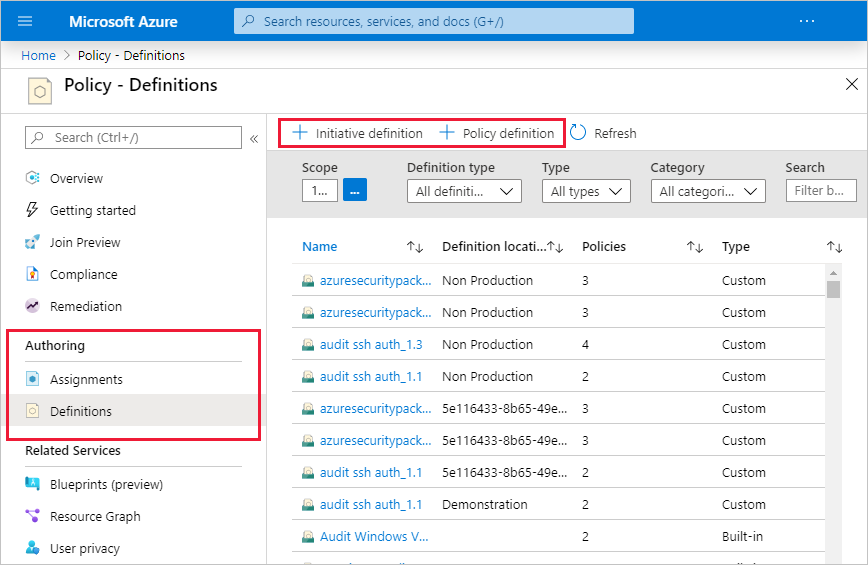

## Azure Policy

[Azure Policy](https://azure.microsoft.com/services/azure-policy?azure-portal=true) is a service in Azure that you use to create, assign, and, manage policies. These policies enforce different rules and effects over your resources, so those resources stay compliant with your corporate standards and service-level agreements (SLAs).

Azure Policy does this by using policies and initiatives. It runs evaluations of your resources and scans for those not compliant with the policies you have created. For example, you can have a policy to allow only a certain stock keeping unit (SKU) size of virtual machines (VMs) in your environment. Once you implement this policy, it will evaluate resources when you create new ones or update existing ones. It will also evaluate your existing resources. 

Azure Policy comes with a number of built-in policy and initiative definitions that you can use, under categories such as Storage, Networking, Compute, Security Center, and Monitoring.

Azure Policy can also integrate with Azure DevOps, by applying any continuous integration and delivery pipeline policies that apply to the pre-deployment and post-deployment of your applications.

Azure Policy also can automatically remediate resources and configurations that are deemed non-compliant, thus ensuring the integrity of the state of the resources.

There are three steps to creating an implementing an Azure policy.

## Create a policy definition

A policy definition expresses what to evaluate and what action to take. For example, you could prevent VMs from being deployed if they are exposed to a public IP address. You also could prevent a hard disk from being used when deploying VMs to control costs.

Every policy definition has conditions under which it is enforced. And, it has an accompanying effect that takes place if the conditions are met. Here are some example policy definitions:

- **Allowed storage account SKUs**. This policy definition has a set of conditions/rules that determine whether a storage account that is being deployed is within a set of SKU sizes. Its effect is to deny all storage accounts that do not adhere to the set of defined SKU sizes.
- **Allowed resource type**. This policy definition has a set of conditions/rules to specify the resource types that your organization can deploy. Its effect is to deny all resources that are not part of the defined list.
- **Allowed locations**. This policy enables you to restrict the locations that your organization can specify when deploying resources. Its effect is used to enforce your geographic compliance requirements.
- **Allowed Virtual Machine SKUs**. This policy enables you to specify a set of VM SKUs that your organization can deploy.

More sample policies are available on the [Azure policy samples](https://docs.microsoft.com/azure/governance/policy/samples?azure-portal=true) page.

## Assign a definition to a scope of resources

To implement your policy definitions, you assign them to resources. A policy assignment is a policy definition that has been assigned to take place within a specific scope. This specific scope could range from a management group to a resource group. Policy assignments are inherited by all child resources. This means that if a policy is applied to a resource group, it is applied to all the resources within that resource group. However, you can exclude a subscope from the policy assignment.

## Review the policy evaluation results

When a condition is evaluated against your existing resources it is marked compliant or non-compliant. You can review the non-compliant policy results and take any action that is needed.

Policy evaluation happens about once an hour, which means that if you make changes to your policy definition and create a policy assignment then it will be re-evaluated over your resources within the hour.

## Initiative definitions

An initiative definition is a set of policy definitions to help track your compliance state for a larger goal. Initiative assignments reduce the need to make several initiative definitions for each scope.

For example, you could create an initiative named *Enable Monitoring in Azure Security Center*, with a goal to monitor all the available security recommendations in your Azure Security Center.

Under this initiative, you would have the following policy definitions:

+ *Monitor unencrypted SQL Database in Security Center* – For monitoring unencrypted SQL databases and servers.
+ *Monitor OS vulnerabilities in Security Center* – For monitoring servers that do not satisfy the configured baseline.
+ *Monitor missing Endpoint Protection in Security Center* – For monitoring servers without an installed endpoint protection agent.

## Initiative assignments

Like a policy assignment, an initiative assignment is an initiative definition assigned to a specific scope. Initiative assignments reduce the need to make several initiative definitions for each scope. This scope could also range from a management group to a resource group.

You can define initiatives using the Azure portal, or command-line tools. In the portal, you use the "Authoring" section.

Even if you have a single policy, we recommend using initiatives if you anticipate increasing the number of policies over time.

