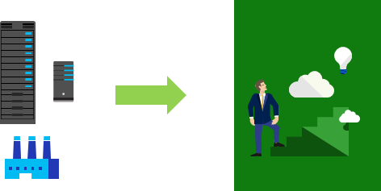

## What are some cloud computing advantages?

There are several advantages that a cloud environment has over a physical environment that Tailwind Traders can utilize following its migration to Azure.

- **High Availability** - depending on the service-level agreement (SLA) that you choose, your cloud-based applications can provide a continuous user experience with no apparent downtime even when things go wrong

- **Scalability** - applications in the cloud can be scaled two ways:

   - *Vertically* - computing capacity can be increased by adding additional RAM or CPUs to a virtual machine
   - *Horizontally* - computing capacity can be increased by adding instances of a resource, such as adding additional virtual machines to your configuration

- **Elasticity** - cloud-based applications can be configured to take advantage of autoscaling, so your applications will always have the resources they need

- **Agility** - cloud-based resources can be deployed and configured quickly as your application requirements change

- **Geo-distribution** - applications and data can be deployed to regional datacenters around the globe, thereby ensuring that your customers always have the best performance in their region

- **Disaster Recovery** - by taking advantage of cloud-based backup services, data replication, and geo-distribution, you can deploy your applications with the confidence that comes from knowing that your data is safe in the event that disaster should occur

## Cloud computing is a consumption-based model

Cloud service providers operate on a **consumption-based model**, which means that end users only pay for the resources that they use. Whatever they use is what they pay for.

A consumption-based model has many benefits, including:

- No upfront costs.

- No need to purchase and manage costly infrastructure that they may or may not use to its fullest.

- The ability to pay for additional resources when they are needed.

- The ability to stop paying for resources that are no longer needed.

## Capital expenses versus operating expenses

There are two different types of expenses that you should consider:

- **Capital Expenditure (CapEx)**: This is the up front spending of money on physical infrastructure, and then deducting that up front expense over time. The up front cost from CapEx has a value that reduces over time.

- **Operational Expenditure (OpEx)**: This is spending money on services or products now and being billed for them now. You can deduct this expense in the same year you spend it. There is no up front cost, as you pay for a service or product as you use it.

In other words, when Tailwind Traders owns its infrastructure, it buys equipment that goes onto its balance sheets as assets. Because a capital investment was made, accountants categorize this transaction as a _Capital Expense_ (CapEx). Over time, to account for the assets' limited useful lifespan, assets are depreciated or amortized.

Cloud services, on the other hand, are categorized as an _Operating Expense_ (OpEx), because of their consumption model. Under this scheme, there is no asset for Tailwind Traders to amortize, and its cloud service provider (Azure) manages the costs that are associated with the purchase and lifespan of the physical equipment. As a result, OpEx has a direct impact on net profit, taxable income, and the associated expenses on the balance sheet.

To summarize, CapEx requires significant up-front financial costs, as well ongoing maintainence and support expenditures. Whereas OpEx is a consumption based model, so Tailwind Traders is only responsible for the cost of the computing resources that it uses.