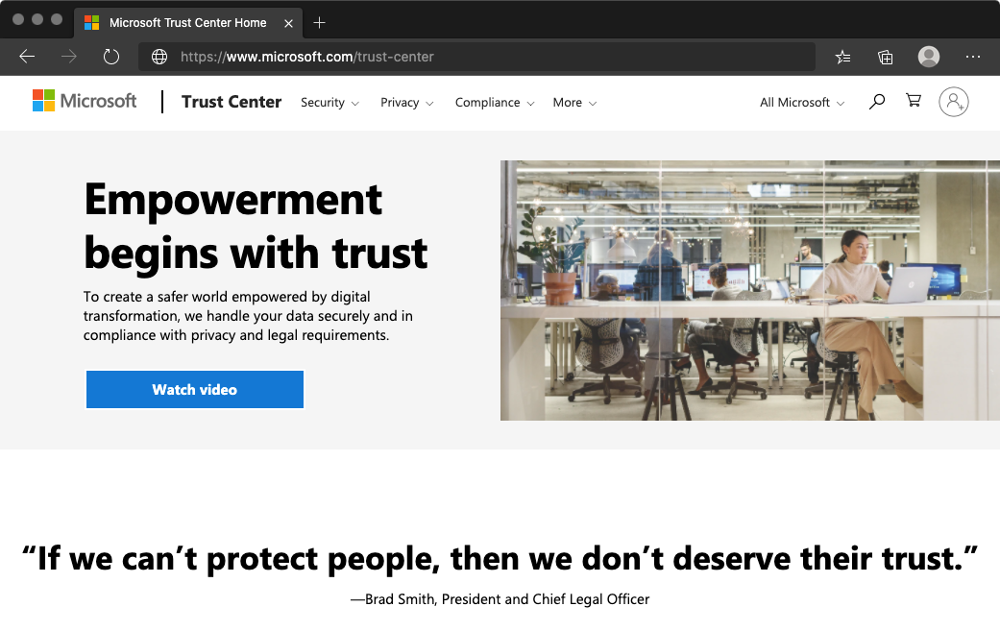

The [Trust Center](https://www.microsoft.com/trustcenter?azure-portal=true) is a website showcasing Microsoft's principles for maintaining data integrity in the cloud and how Microsoft implements and supports security, privacy, compliance, and transparency in all Microsoft cloud products and services. The Trust Center is an important part of the Microsoft Trusted Cloud Initiative and provides support and resources for the legal and compliance community.

TODO: Screenshot is out of date re GDPR heading, and is fuzzy. New page is unlikely to date except COVID-19 banner (can we edit out?) 

The Trust Center site provides:

+ In-depth information about security, privacy, compliance offerings, policies, features, and practices across Microsoft cloud products.
+ Recommended resources in the form of a curated list of the most applicable and widely used resources for each topic.
+ Links to the security, privacy and compliance blogs, as well as upcoming related events.

The Trust Center is a great resource for other people in your organization who may play a role in security, privacy and compliance, including business managers, risk assessment and privacy officers and legal compliance teams. It does not require an Azure subscription or a Microsoft account. 

## Exercise - Explore the Trust Center
This exercise is optional and does not require an Azure subscription.

1. In a browser, access the [Microsoft Trust Center compliance offerings](https://docs.microsoft.com/microsoft-365/compliance/offering-home?azure-portal=true) page.

2. Notice the offerings are grouped into **Global**, **US Government**, **Industry**, and **Regional**.

3. In the **Global** group, click **ISO 27001**. 

    > [!NOTE]
    > The ISO 27001 Information Security Management Standards page is typical of the type of complaince information we provide.

4. Notice there is an overview of the standard; in-scope cloud services; audits, reports and certificates; assessments and reports; FAQs; resources; and white papers. 

5. Browse through any content of interest to you. 

