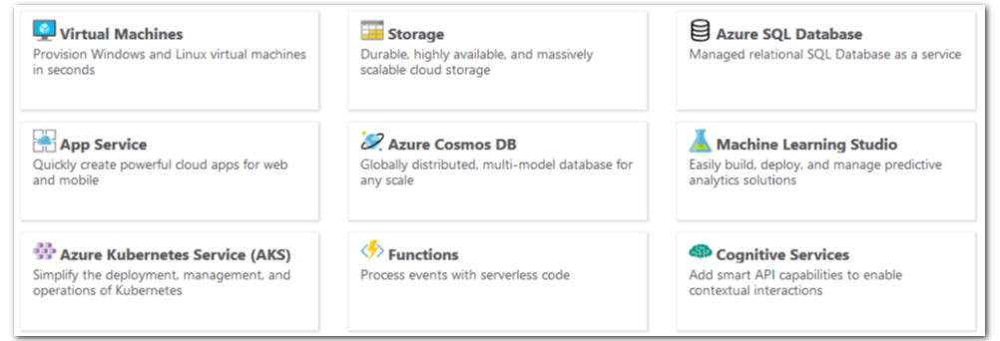
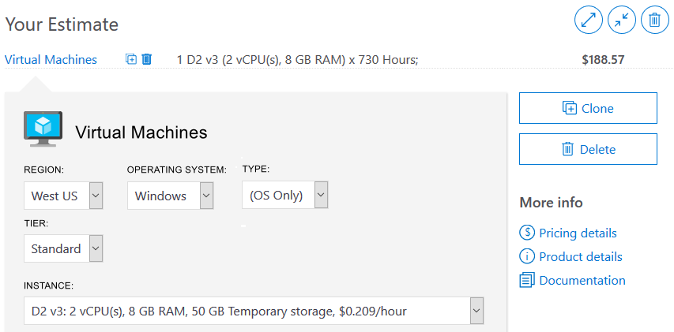

TODO: Tom is currently working on this page.

TODO: In this part, you'll ...

## How do I purchase Azure services?

There are three main ways to purchase services on Azure. They are:

- **Through an Enterprise Agreement**. Enterprise customers sign an Enterprise Agreement with Azure that commits them to spending a predetermined amount on Azure services, which is typically paid annually. As an enterprise customer, you can receive customized pricing based on the kinds and the amount of services you plan on using.

- **Directly from the web**. Here, you pay standard prices for Azure resources. You're billed monthly and make payments through the Azure website.

- **Through a Cloud Solution Provider**. A Cloud Solution Provider (CSP) is a Microsoft partner that you hire to build solutions on top of Azure. You're typically billed for Azure usage directly through your CSP.

TODO: Diagram doesn't match above bullets. And do we even need a graphic?

You can bring up, or _provision_, Azure resources from the Azure portal or from the command line. The Azure portal arranges products and services by category. You simply select the services that fit your needs, and your account is billed according to Azure's "pay for what you use" model.

TODO: Update image - it's blurry.

TODO: Do we need to clarify - End of each calendar month? Date from when you signed up?

At the end of each month, you're billed for what you use. At any time, you can check the billing page in the Azure portal to get a summary of your current usage and review invoices from prior months.

The point is, you're always charged based on what you use. As a brief example, consider what happens when you deallocate a virtual machine (VM).

TODO: Not sure I like this, but I rewrote what was there to make it more of a digestible story.

When you deallocate a VM, you still keep the VM, but the VM is not assigned to a CPU or network in Azure's datacenter. However, the associated hard disks remain with your data, and the resource is present in your Azure subscription. It's similar to turning off your physical computer. While the VM is deallocated,, you're not billed for compute time or for the VM's private IP address; you're billed only for your disk storage. Deallocating a VM when you don't plan on using it for some time is just one example of how to minimize costs.

## Which factors affect the final cost?

TODO: I'm not done, but this is about where I ended. Feel free to pick up or let me work on it more later this evening.

When you provision an Azure resource, Azure creates one or more meter instances for that resource. The meters track the resources' usage, and each meter generates a usage record that is used to calculate your bill.

### Usage meters

For example, a single virtual machine that you provision in Azure might have the following meters tracking its usage:

- Compute Hours
- IP Address Hours
- Data Transfer In
- Data Transfer Out
- Standard Managed Disk
- Standard Managed Disk Operations
- Standard IO-Disk
- Standard IO-Block Blob Read
- Standard IO-Block Blob Write
- Standard IO-Block Blob Delete

The following sections describe the main factors that affect Azure costs, including resource type, services, and the user's location.

### Resource type

Costs are resource-specific, so the usage that a meter tracks and the number of meters associated with a resource depend on the resource type.

> [!NOTE]
> Each meter tracks a specific type of usage.  For example, a meter might track bandwidth usage (ingress or egress network traffic in bits-per-second), number of operations, size (storage capacity in bytes), or similar items.

The usage that a meter tracks correlates to a quantity of billable units. Those are charged to your account for each billing period, and the rate per billable unit depends on the resource type you are using.

### Services

Azure usage rates and billing periods can differ between Enterprise, Web Direct, and Cloud Solution Provider (CSP) customers. Some subscription types also include usage allowances, which affect costs.

The Azure team develops and offers first-party products and services, while products and services from third-party vendors are available in the **Azure Marketplace**.  Different billing structures apply to each of these categories.

### Location

The Azure infrastructure is globally distributed, and usage costs might vary between locations that offer Azure products, services, and resources.

For example, you might want to build your Azure solution by provisioning resources in locations that offer the lowest prices, but this would require transferring data between locations, if dependent resources and their users are located in different parts of the world. If there are meters tracking the volume of data that transfers between the resources you provision, any potential savings you make from choosing the cheapest location could be offset by the additional cost of transferring data between those resources.

> [!NOTE]
> For more information about Azure usage charges, refer to [Understand terms on your Microsoft Azure invoice](https://docs.microsoft.com/azure/billing/billing-understand-your-invoice?azure-portal=true).

## Identify zones for billing purposes

Billing zones help determine the cost of services you are using.

[Bandwidth](https://azure.microsoft.com/pricing/details/bandwidth?azure-portal=true) refers to data moving in and out of Azure datacenters. Some inbound data transfers, such as data going into Azure datacenters, are free. For outbound data transfers, such as data going out of Azure datacenters, data transfer pricing is based on **Zones**.

A Zone is a geographical grouping of Azure Regions for billing purposes. the following Zones exist and include the sample regions as listed below:

+ **Zone 1** – West US, East US, Canada West, West Europe, France Central and others

+ **Zone 2** – Australia Central, Japan West, Central India, Korea South and others

+ **Zone 3** - Brazil South

+ **DE Zone 1** - Germany Central, Germany Northeast

> [!div class="checklist"]
> * To avoid confusion, be aware that a *Zone for billing purposes* is not the same as an *Availability Zone*. In Azure, the term *Zone* is for billing purposes only, and the full-term *Availability Zone* refers to the failure protection that Azure provides for datacenters.

## Explore the Pricing Calculator

The [Pricing Calculator](https://azure.microsoft.com/pricing/calculator?azure-portal=true) is a tool that helps you estimate the cost of Azure products. It displays Azure products in categories, and you choose the Azure products you need and configure them according to your specific requirements.  Azure then provides a detailed estimate of the costs associated with your selections and configurations.

Get a new estimate from the Pricing Calculator by adding, removing, or reconfiguring your selected products. You also can access pricing details, product details, and documentation for each product from the Pricing Calculator.

The options that you can configure in the Pricing Calculator vary between products, but basic configuration options include:

+ **Region**. Lists the regions from which you can provision a product. Southeast Asia, central Canada, the western United States, and Northern Europe are among the possible regions available for some resources.

+ **Tier**. Sets the type of tier you wish to allocate to a selected resource, such as Free Tier, Basic Tier, etc.

+ **Billing Options**. Highlights the billing options available to different types of customer and subscriptions for a chosen product.

+ **Support Options**: Allows you to pick from included or paid support pricing options for a selected product.

+ **Programs and Offers**. Allows you to choose from available price offerings according to your customer or subscription type.

+ **Azure Dev/Test Pricing**. Lists the available development and test prices for a product. Dev/Test pricing applies only when you run resources within an Azure subscription that is based on a Dev/Test offer.

✔️ The Pricing Calculator provides estimates, *not* actual price quotes. Actual prices may vary depending upon the date of purchase, the payment currency you are using, and the type of Azure customer you are.
