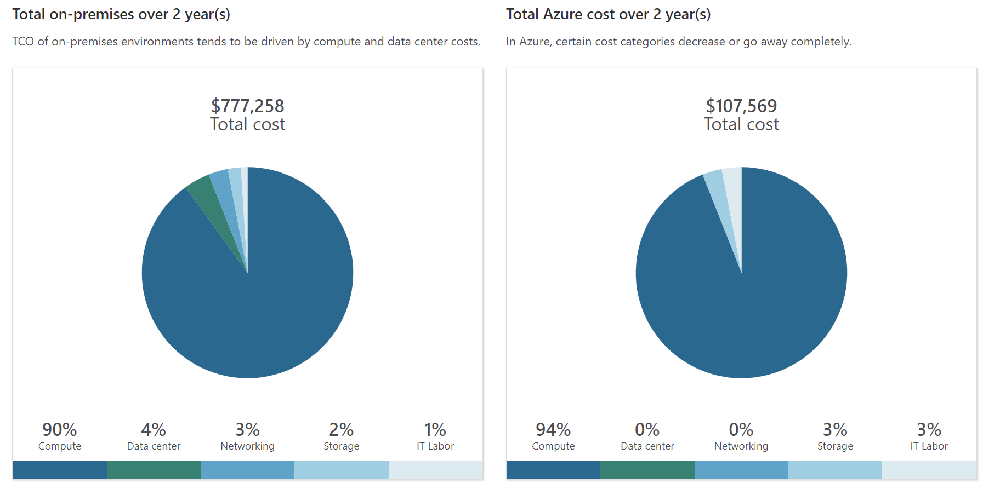

TODO: I didn't touch this page, but from our conversation, let's see if we want to lead with TCO.

After this unit, we might move to the TCO exercise where you help TWT understand their current cloud spend (and see what Azure thinks the savings will be.)

After that, move to 2-purchase-azure-products-services and discuss pricing structure. Then do the pricing exercise.

After that, move to 9-explore-minimizing-costs and then 10-define-azure-cost-management (I haven't looked closely, but perhaps we can combine them.)

After that, move to the knowledge check unit and then the summary

The [Total Cost of Ownership Calculator](https://azure.microsoft.com/pricing/tco?azure-portal=true) is a tool that you can use to estimate the cost savings of operating a solution in Azure over time, instead of in your on-premises data center. While total cost of ownership is a common business financial term, it can be hard to truly see all of the hidden costs related to operating a technology capability on-premises, in addition to the purchase price of hardware and software licenses. 

With the Total Cost of Ownership calculator you enter the details of your on-premises workloads and then review the suggested industry average cost (which you can adjust) for related operational costs, such as electricity, network maintenance and IT labor. You are then presented with a side-by-side report, letting you compare those costs with the same workloads running in Azure.

**Step 1: Define your workloads**

Here you will enter the specifications of your on-premises infrastructure into the TCO calculator, according to four groups:

+ **Servers**. Operating system, virtualization method, CPU Cores, RAM (memory).
+ **Databases**. Database type,  database server hardware specifications, and the corresponding Azure service you would like to use, including the expected maximum concurrent user logins.
+ **Storage**. Storage type and capacity, including any backup or archive storage.
+ **Networking**. The amount of network bandwidth you currently consume in your on-premises environment.

**Step 2: Adjust assumptions**

In this section, you will define if your current on-premises licenses are enrolled for Software Assurance (which can save you money by re-using them in Azure), and whether you need to replicate your storage to another Azure region for greater redundancy.

Then, you can see the values of key operating cost assumptions across several different areas, which might vary between customers. These costs have been certified by independent research company Nucleus Research. For example, these include electricity price per KW hour, hourly rate for an IT administrator and network maintenance cost as a percentage of network hardware & software costs.

To improve the accuracy of the TCO calculator results, you should adjust the values so they match the costs of your current on-premises infrastructure. 

**Step 3: View the report**

Choosing a timeframe of between 1 - 5 years, the TCO calculator generates a report based on the information you have entered.

You can also view a side-by-side comparison of the cost breakdown of operating those workloads on-premises versus operating them in Azure, under the categories compute, data center, networking, storage and IT labor. 
  

Then you can download, share or save this report.

In the next exercise, you'll explore how Tailwind Traders uses the TCO calculator. 