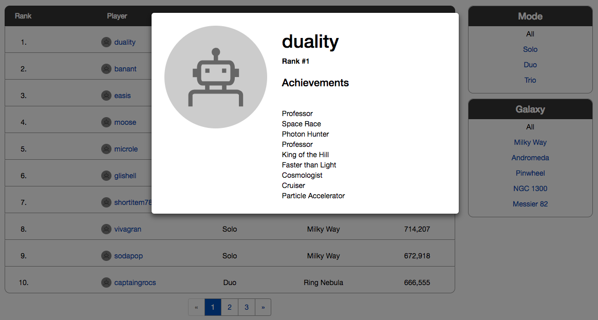

<!-- TODO: There's a gap here. We say earlier that the team uses a centralized version control system to store the app sources. But here we jump to GitHub. We need to bridge that gap - either through narrative or explain it away "for learning purposes". -->

Alice and her team use Visual Studio Code to build and run the app, and modify source code files.

Here you'll get the source code for the _Space Game_ web project from GitHub and build and run it locally, just as Alice does.

> [!NOTE]
> In this module, you are going to work with Git commands and terminology. If you're not familiar with Git, just follow along for now. We'll explain the concepts as we go and also go deeper into Git in future modules.

## Prepare Visual Studio Code

1. Launch Visual Studio Code.
1. From the **View** menu, select **Integrated Terminal**.
1. Run the `cd` command to navigate to the directory you want to work from, such as your home directory (`~`). You can choose a different directory if you prefer.
    ```bash
    cd ~
    ```

<!-- TODO: Talk about choosing the right shell (bash, zsh, PowerShell) -->

## Get the source code

Here you'll get the source code from GitHub and set up Visual Studio Code so that you can run the app and work with source code files.

### Create a fork

The first step is to fork the _Space Game_ web project so you can work with and modify the source files.

A _fork_ is a copy of a GitHub repository. The copy exists in your account, and enables you to make any changes you want without affecting the original project.

Although you can propose changes to the original project, here you'll work with the _Space Game_ web project as though it were the original project owned by Alice and her team.

To fork the _Space Game_ web project into your GitHub account:

1. From a web browser, navigate to [GitHub](https://github.com/) and sign in.
1. Navigate to the [Space Game](https://github.com/MicrosoftDocs/mslearn-tailspin-spacegame-web?azure-portal=true) web project.
1. Click the **Fork** button.

    
1. Follow the instructions to fork the repository into your account.

### Clone your fork locally

You now have a copy of the _Space Game_ web project in your GitHub account. Here you'll download, or _clone_, a copy to your computer so you can work with it.

A clone, just a like a fork, is a copy of a repository. When you clone a repository, you can make changes, verify they work as you expect, and then upload those changes back to GitHub. You can also synchronize your local copy with changes other authenticated users have made to GitHub's copy of your repository.

To clone the _Space Game_ web project to your computer:

1. Navigate to your fork of the _Space Game_ web project on GitHub.
1. Click the **Clone or download** button. Then click the button next to the URL that's shown to copy the URL to your clipboard.

    
1. From Visual Studio Code, navigate to the terminal window and run the `git clone` command. Replace the URL that's shown with the contents of your clipboard.

    ```bash
    git clone https://github.com/your-name/mslearn-tailspin-spacegame-web.git
    ```
1. Move to the `mslearn-tailspin-spacegame-web` directory. This is the root directory of your repository.

    ```bash
    cd mslearn-tailspin-spacegame-web
    ```

### Open the project in the file explorer

In Visual Studio Code, your terminal window points to the root directory of the _Space Game_ web project. Here you'll open the project from the file explorer so that you can view its structure and work with files.

1. From the **File** menu, select **Open**.
1. Navigate to the root directory of the _Space Game_ web project.

    (You can run the `pwd` command in the terminal window to see the full path if you need a refresher.)

You see the directory and file tree in the file explorer.

## Build and run the web application

Now that you have the web application, you can build and run it locally.

1. From Visual Studio Code, navigate to the terminal window and run the following `dotnet build` command to build the application.

    ```bash
    dotnet build --configuration Release
    ```
    .NET Core projects typically come with two build configurations &mdash; Debug and Release. Debug builds are not optimized for performance and make it easier for you to trace through your program and troubleshoot issues. Here we choose the Release configuration just to see the web app in action.
1. From the terminal window, run the following `dotnet run` command to run the application.

    ```bash
    dotnet run --no-build --project Tailspin.SpaceGame.Web
    ```
    .NET Core solution files can contain more than one project. The `--project` argument specifies the project for _Space Game_ web application.

## Verify the application is running

In development mode, the _Space Game_ web site is configured to run on port 5000.

From a new browser tab, navigate to [http://localhost:5000](http://localhost:5000?azure-portal=true) to see the running application.

You see this.


You can interact with the page, including the leaderboard. When you click a player's name, you see details about that player.



When you're finished, return to the terminal window and press <kbd>Control+C</kbd> to stop the running application.