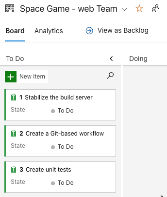
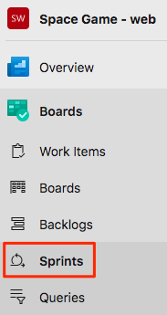
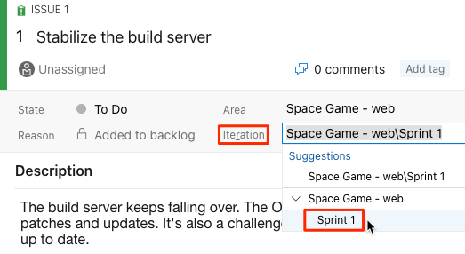

Here you'll create a project, a team, and a board in Azure DevOps.

The Tailspin team is eager to see how Azure Boards is going to work. With the pre-planning out of the way, they can start to use the tools and build the solution they planned.

## Set up Azure Boards using the Basic process

In this part, you'll set up an Azure DevOps project and Azure Boards for the Tailspin team.

### Create the project

Here you'll create an Azure DevOps project.

1. Sign into your account at [dev.azure.com](https://dev.azure.com).
1. Select **+ Create project**.

    The **Create a project** dialog box opens.
1. In the **Project name** field, type **Space Game - web**.
1. In the **Description** field, type **The Space Game website**.
1. Under **Visibility**, you choose whether to make your project public or private. For now, you can choose private.

    Creators of open source projects will often choose public visibility so that others can view active issues and build status.
1. Select **Advanced**.
1. Under **Version control**, make sure that **Git** is selected. Under **Work item process**, make sure that **Basic** is selected.
1. Select **Create**.

After just a few moments, you're taken to your new project.

### Create a team

Here you'll create a team for the project.

1. Select **Project settings** in the lower-left corner.
1. On the **Project details** page, under **General**, select **Teams**.

    You see that a default team, based on the name of the project, **Space Game - web Team**, has been created. We'll use this team, but in practice you may have multiple teams that contribute to the same project.

1. Select **Space Game - web Team**.

    You'll see that you're already a member of this team. Let's add more members.

### Add team members

Now's a good time to add members to your team. Although not required, if you'd like to add a coworker to your Azure DevOps organization, here's how:

1. Under **Members**, select **+ Add**.
1. Enter the email address of the user you'd like to add. Then select **Save changes**.
1. Repeat the process for any other members you'd like to add.

Mara adds entries for herself and her team members: "andy@tailspintoys.com", "amita@tailspintoys.com", "mara@tailspintoys.com", and "tim@tailspintoys.com".

In practice, you might manage your team through an identity and access management service such as Azure Active Directory and set the appropriate permission levels for each team member. We'll point you to more resources at the end of this module.

### Create the board

Although Mara and her team identified a number of issues, here you'll add the three work items Mara originally proposed to your board to practice the process.

1. In the column on the left, point to **Boards** and select **Boards** from the menu that appears.
1. Select **Space Game - web Team boards**. A blank board appears.

    

    Recall that you're using the Basic process. The Basic process involves three task states: **To Do**, **Doing**, and **Done**.

    If you choose a different process, such as Scrum, you'll see a layout that supports that process.

1. In the **To Do** column, select the green **+** button next to the **New item** field.
1. Enter **Stabilize the build server** and then press <kbd>Enter</kbd>.
1. Select the ellipsis (**...**), and then select **Open**.
1. In the **Description** field, enter this text:

    > The build server keeps falling over. The OS, Ubuntu 16.04, requires security patches and updates. It's also a challenge to keep build tools and other software up to date.

1. Select **Save & Close**.
1. Follow the same steps for the next two items.

    | Title                       | Description                                                      |
    |-----------------------------|------------------------------------------------------------------|
    | Create a Git-based workflow | Migrate source code to GitHub and define how we'll collaborate.  |
    | Create unit tests           | Add unit tests to the project to help minimize regression bugs.  |

1. Drag **Stabilize the build server** to the top of the stack. Then, drag **Create a Git-based workflow** to the second item position. Your final board looks like this.

    

### Define a sprint

**Mara**: This is looking great. Now let's define a sprint.

When you create an Azure Boards project, you get an initial sprint called **Sprint 1**. All you need to do is assign dates to the sprint and add tasks. Here's how to follow along with the team:

1. In the left-side column, select **Sprints**.

    

1. Select **Set dates** from the upper right.
1. Leave the name as **Sprint 1**.
1. In the **Start** date field, select the calendar and pick today's date.
1. In the **End** date field, select the calendar and pick the date two weeks from today.
1. Select **Save and Close**.

### Assign tasks and set the iteration

An _iteration_ is another name for a sprint.

You have an initial set of work items and a timeline for your first sprint. Here you'll connect work items to your sprint and assign the tasks to yourself.

1. Under **Boards**, select **Work items**.
1. Select **Stabilize the build server**.
1. In the **Iteration** drop-down list, select **Sprint 1**.

    
1. From the same window, select **Unassigned** and set yourself as the task owner.

    
1. Repeat the process for the other two work items.

    * **Create a Git-based workflow**
    * **Create unit tests**

**Mara**: We did it! We created our first project on Azure Boards and we identified the first tasks we'll take on. It's great! As Andy and I do this work, we'll move each work item to the **Doing** state.

**Amita**: Sounds good. I enjoyed getting together and deciding what's important to us right now. And, like Andy said, now we have a way to see everything all in one place.
