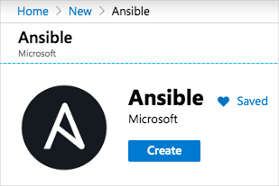
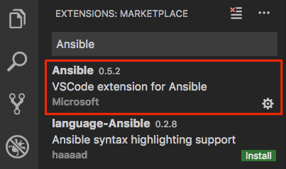

TODO: Point to Docs page about setting up your own control machine. Promise that link here.

Recall that with Ansible, you use a _control machine_ to manage your systems. A control machine includes the Ansible software, Python, your inventory file, and the playbooks you need to run.

* [Red Hat Ansible instance on Linux](https://azuremarketplace.microsoft.com/marketplace/apps/azure-oss.ansible?azure-portal=true), published by Microsoft.

    You can use this image to bring up a control machine, which includes Ansible, the Azure CLI, and other tools, to manage your fleet.

Two approaches:

1. Create an admin, or "jump" box.
    1. Steps
1. Configure your deployment directly from the agent. (could be Microsoft-hosted or your own. Point to 'own' module.)
    1. Steps
    1. 

Auth types

Auto (MSI) - 
Manual - you provide your own security principal details
Off - ??

### Create a service principal

You've configured Terraform to access the state file remotely. Next, you create the service principal that can authenticate with Azure on your behalf.

During the process, you collect information about your service principal that you'll later need when you run your configuration in Azure Pipelines.

1. Create unique ID (TODO)

    ```bash
    UNIQUE_ID=$RANDOM
    ```

1. Run the following `az account list` to get your Azure subscription ID.

    ```azurecli
    ARM_SUBSCRIPTION_ID=$(az account list \
      --query "[?isDefault][id]" \
      --all \
      --output tsv)
    ```

1. Run the following `az ad sp create-for-rbac` command to create a service principal.

    ```azurecli
    ARM_CLIENT_SECRET=$(az ad sp create-for-rbac \
      --name http://ansible-sp-$UNIQUE_ID \
      --role Contributor \
      --scopes "/subscriptions/$ARM_SUBSCRIPTION_ID" \
      --query password \
      --output tsv)
    ```

    The service principal's name begins with "http://ansible-sp-" and ends with your unique ID.

    **Contributor** is the default role for a service principal. This role has full permissions to read and write to an Azure subscription.

    The output from this command is your only opportunity to retrieve the generated password for the service principal. The `--query` argument reads the password field from the output. The output is assigned to the Bash variable named `ARM_CLIENT_SECRET`.

1. Run the following `az ad sp show` command to get your service principal's client ID and assign the result to a Bash variable named `ARM_CLIENT_ID`.

    ```azurecli
    ARM_CLIENT_ID=$(az ad sp show \
      --id http://ansible-sp-$UNIQUE_ID \
      --query appId \
      --output tsv)
    ```

1. Run the following `az ad sp show` command to get your service principal's tenant ID and assign the result to a Bash variable named `ARM_TENANT_ID`.

    ```azurecli
    ARM_TENANT_ID=$(az ad sp show \
      --id http://ansible-sp-$UNIQUE_ID \
      --query appOwnerTenantId \
      --output tsv)
    ```

1. Run the following `az ad sp list` command to list the service principals in your Azure subscription.

    ```azurecli
    az ad sp list --show-mine --query [].servicePrincipalNames
    ```

    Your SP name begins with **http://ansible-sp-** and ends with your unique ID. Here's an example:

    ```json
    [
      [
        "http://ansible-sp-24382",
        "961badb1-8005-45ae-89da-c1583f58ead5"
      ]
    ]
    ```

    Save your name somewhere safe for later.

1. Print each of the Bash variables you collected in this part to verify their contents.

    ```bash
    echo $ARM_SUBSCRIPTION_ID
    echo $ARM_CLIENT_SECRET
    echo $ARM_CLIENT_ID
    echo $ARM_TENANT_ID
    ```

    Each value is a GUID, or a long series of letters and numbers.

    Might store these somewhere safe. You'll need them later.

1. TODO: Create credentials file so that control machine can authenticate access to Azure resources.

    ```bash
    echo "\
    [default]
    subscription_id=$ARM_SUBSCRIPTION_ID
    client_id=$ARM_CLIENT_ID
    secret=$ARM_CLIENT_SECRET
    tenant=$ARM_TENANT_ID" | tee credentials
    ```

    ```bash
    cat credentials
    ```

    ```output
    [default]
    subscription_id=00000000-1111-0000-0000-000000000000
    client_id=00000000-2222-0000-0000-000000000000
    secret=00000000-3333-0000-0000-000000000000
    tenant=00000000-4444-0000-0000-000000000000
    ```

## Create the control machine

1. From Cloud Shell, print out the SSH public key that you created earlier.

    ```bash
    cat ~/.ssh/ansible_rsa.pub
    ```

    Copy the output somewhere safe or keep your Cloud Shell session available for the next step.

1. Go to the [Azure portal](https://portal.azure.com/?azure-portal=true) and sign in.
1. Select **Create a resource**.
1. In the search bar, enter *Ansible*.
1. Select **Create**.

    

1. Under **Basics**, fill in these fields:

    * **Name** - *ansiblehost*
    * **User name** - *azureuser*
    * **Authentication type** - *SSH public key*
    * **SSH public key** - Enter your SSH public key.
    * **Subscription** - Select your Azure subscription.
    * **Resource group** - Select **Create new**. Then enter *learn-ansible-control-machine-rg* and select **OK**.
    * **Location** - Choose a location. You can use the same location that you used earlier to create your VMs to manage.

    Select **OK**.

1. Under **Additional Settings**, enter a unique name in the **Domain name label** field, such as *test1234*. In practice, you would choose a domain name that matches your team's naming convention. Then select **OK**.
1. Under **Integration Settings**, select *Off*. Then select **OK**.
1. Under **Summary**, wait for the validation process to finish and then select **OK**.
1. Under **Buy**, scroll to the end and then select **Create**.
1. Wait a few minutes for your deployment to finish.

    You can monitor your deployment's progress from the **Notifications** tab at the top of the page.

    

## Get your control machine's hostname

```azurecli
az network public-ip list \
  --resource-group learn-ansible-control-machine-rg \
  --query [].dnsSettings.fqdn \
  --output tsv
```

```output
test1234.northeurope.cloudapp.azure.com
```

Copy the output somewhere for later.

## Copy files to your control machine

* SSH private keys => VMs under management
* NO - .cfg file
* NO - inventory file
* Service principal - credentials file

```bash
IPADDRESS=$(az vm list-ip-addresses \
  --resource-group learn-ansible-control-machine-rg \
  --name ansiblehost \
  --query [0].virtualMachine.network.publicIpAddresses[0].ipAddress \
  --output tsv)
```

```bash
ssh -i ~/.ssh/ansible_rsa -o StrictHostKeyChecking=no \
  azureuser@$IPADDRESS 'mkdir -p /home/azureuser/.azure'
```

```bash
scp -i ~/.ssh/ansible_rsa -o StrictHostKeyChecking=no \
  ~/.ssh/ansible_rsa \
  azureuser@$IPADDRESS:/home/azureuser/.ssh

scp -i ~/.ssh/ansible_rsa -o StrictHostKeyChecking=no \
  ~/credentials \
  azureuser@$IPADDRESS:/home/azureuser/.azure

scp -i ~/.ssh/ansible_rsa -o StrictHostKeyChecking=no \
  ~/ansible.cfg \
  azureuser@$IPADDRESS:/home/azureuser

scp -i ~/.ssh/ansible_rsa -o StrictHostKeyChecking=no \
  ~/azure_rm.yml \
  azureuser@$IPADDRESS:/home/azureuser

scp -i ~/.ssh/ansible_rsa -o StrictHostKeyChecking=no \
  ~/users.yml \
  azureuser@$IPADDRESS:/home/azureuser
```

## Install the Ansible extension in VS Code

TODO: WHY

The **Ansible** extension is not installed by default in Visual Studio Code. Let's start by installing it:

1. In VS Code, on the **View** menu, select **Extensions**.
1. In the **Search Extensions in Marketplace** textbox, enter *Ansible*, and then select the **Ansible** extension.

    

1. Select **Install**.
1. Select **Reload** to activate the extension.

## Run Ansible from your control machine

Here, you run Ansible from your control machine by using the Ansible extension in VS Code.

You run the Ansible extension from the command palette. The process prompts you for information such as the playbook you want to run and your control machine's hostname.

### Specify additional options in your user settings

There are a few additional options that you need to specify, including the location of your SSH private key and the path to your inventory file. These options are stored in your VS Code user settings. Here's how to TODO:

1. In VS Code, select <kbd>F1</kbd> or select **View > Command Palette** to access the command palette.
1. In the command palette, enter *Preferences: Open User Settings*.

    A tab appears that displays your current settings.

1. In the **User Settings** pane, add this line:

    > [!TIP]
    > User setting are in JSON format. Be sure to add a comma (**,**) to the end of the last setting listed before you add yours.

    ```json
    "ansible.customOptions": "--private-key ~/.ssh/ansible_rsa -i /home/azureuser/azure_rm.yml"
    ```

    Both path names refer to locations on your control machine.

1. Select **File > Save** to save your settings.

    Your settings resemble this:

    

### Run Ansible

TODO: 

1. In VS Code, select **File > New File**. Then add these contents:

    ```json
    [
      {
        "host": "your host",
        "port": 22,
        "user": "azureuser",
        "key": "your private key"
      }
    ]
    ```
1. Replace `your host` with your Ansible control machine's hostname, such as *test1234.northeurope.cloudapp.azure.com*.
1. Replace `your private key` with the full path to your SSH private key file, *ansible_rsa*, on your local computer.
1. Save the file as *~/.ssh/servers.json*.

    Here's an example of the complete file:

    ```json
    [
      {
        "host": "test1234.northeurope.cloudapp.azure.com",
        "port": 22,
        "user": "azureuser",
        "key": "/Users/jane/.ssh/ansible_rsa"
      }
    ]
    ```

1. In VS Code, open your playbook file, *users.yml*.
1. Select <kbd>F1</kbd> or select **View > Command Palette** to access the command palette.
1. In the command palette, enter *Ansible: Run Ansible Playbook Remotely via ssh*.
1. When prompted, specify:

    * The full path to your playbook file, *users.yml*.
    * Your control machine's hostname, such as *test1234.northeurope.cloudapp.azure.com*.

    From the output, you see that (TODO: Succeeded, but no changes are made; show sample output)

    ```output
    PLAY RECAP *********************************************************************************************************************************************************************************************
    vm1_1bbf                   : ok=2    changed=0    unreachable=0    failed=0    skipped=0    rescued=0    ignored=0
    vm2_867a                   : ok=2    changed=0    unreachable=0    failed=0    skipped=0    rescued=0    ignored=0
    ```