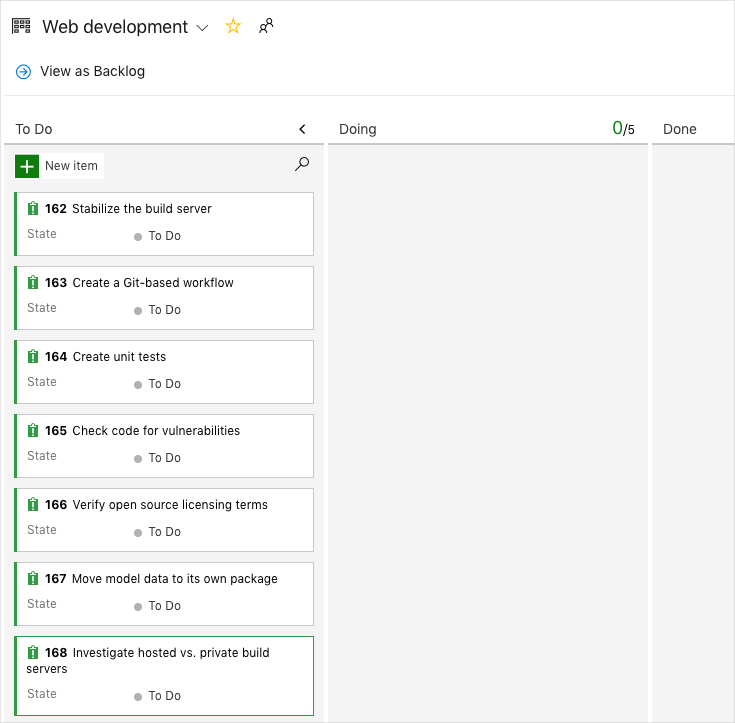
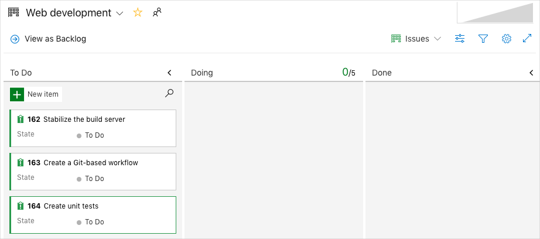

This module is all about setting up a continuous integration (CI) pipeline for your application.

The _Space Game_ web team is being pulled in many different directions. Andy, the lead dev, is running from one meeting to another and never has any time. Amita, the QA person, is helping a tester on another team. Tim, who's in ops, is upgrading his servers and hasn't been seen for days. Mara's dream of a true DevOps team is stalled (again).

But she isn't giving up. She remembers that she and the team used Azure Boards to create a backlog of issues with the build process.

She also remembers that they picked three of the problems to fix within the next two weeks. (Of course, everyone else has forgotten about them.)

Mara decides to take an initial pass on the biggest issue, **Stabilize the build server**, herself. She won't try to fix everything. Instead, she's going to see if she can use Azure Pipelines to replicate the current build process. She's convinced that Azure Pipelines provides enough benefits that the process will be improved just by using it. If she's right, she'll show her version to the team to see if she can make them more enthusiastic.

## Learning objectives

In this module, you will:

- Create a build pipeline in Azure Pipelines
- Map manual build steps to automated build tasks
- Publish your builds so others can access them
- Use templates to build multiple configurations

## Prerequisites

If you don't already have an [Azure DevOps](https://dev.azure.com?azure-portal=true) account, we highly recommend you go through the [Evolve your DevOps practices](https://docs.microsoft.com/learn/paths/evolve-your-devops-practices?azure-portal=true) learning path before starting this module.

You'll also need to set up the following for software development on your Windows, macOS, or Linux system.

* [Visual Studio Code](https://code.visualstudio.com?azure-portal=true)
* [.NET Core 2.1](https://www.microsoft.com/net/download?azure-portal=true)
* [Git](https://git-scm.com/downloads?azure-portal=true)
* A [GitHub](https://github.com/join?azure-portal=true) account

This setup prepares you for this and future modules. You can also use them to apply your new skills to your own projects.

[!include]

## Meet the team

You met the _Space Game_ web team at Tailspin Toys in the previous learning path. As a refresher, here's who you'll work with in this module.

[!include]

[!include]

[!include]