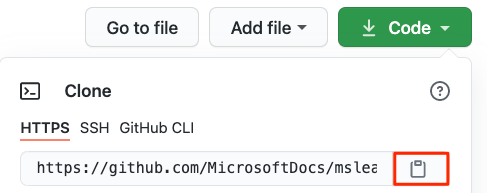
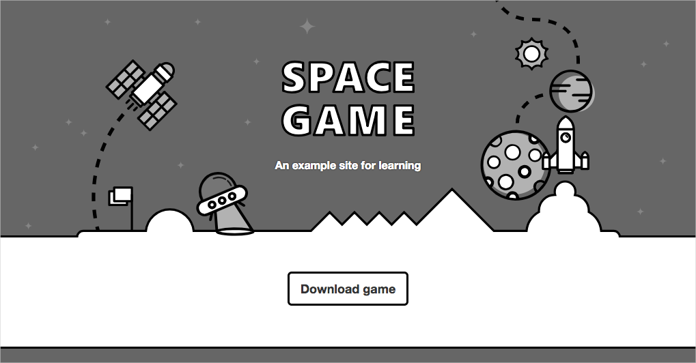

Get ready to start building a CI pipeline with Microsoft Azure Pipelines. The first step is to build and run the *Space Game* web app on your local machine. Understanding how to build software locally will prepare you to repeat the process in the pipeline.

Mara is going to do exactly that and, by following the procedures, you can do the same thing. Everyone on the team, including Mara, uses Visual Studio Code to build and run applications. But the team uses a centralized version control system for its code, and Mara is more comfortable with GitHub, so she's going to use that. If you've never used GitHub, don't worry. Just follow along for now. All will be explained here and in later modules.

## Prepare Visual Studio Code

First you'll set up Visual Studio Code so you can build the website locally and work with source files.

Visual Studio Code comes with an integrated terminal, so you can edit files and work from the command line all from one place.

1. Start Visual Studio Code.
1. On the **View** menu, select **Terminal**.
1. In the drop-down list, select **bash**:

    

    The terminal window lets you choose any shell that's installed on your system, like Bash, Zsh, and PowerShell.

    Here you'll use Bash. Git for Windows provides Git Bash, which makes it easy to run Git commands.

    [!include[](../../shared/includes/troubleshoot-code-terminal.md)]

1. Run the `cd` command to navigate to the directory you want to work from, like your home directory (`~`). You can choose a different directory if you want.

    ```bash
    cd ~
    ```

## Configure Git

If you're new to Git and GitHub, you'll first need to run a few commands to associate your identity with Git and authenticate with GitHub.

[Set up Git](https://help.github.com/articles/set-up-git?azure-portal=true) explains the process in greater detail.

At a minimum, you'll need to complete the following steps. Run these commands from the Visual Studio Code integrated terminal:

1. [Set your username](https://help.github.com/articles/setting-your-username-in-git?azure-portal=true).
1. [Set your commit email address](https://help.github.com/articles/setting-your-commit-email-address-in-git?azure-portal=true).
1. [Cache your GitHub password](https://help.github.com/articles/caching-your-github-password-in-git?azure-portal=true).

> [!NOTE]
> If you're already using two-factor authentication with GitHub, [create a personal access token](https://help.github.com/articles/creating-a-personal-access-token-for-the-command-line?azure-portal=true) and use your token in place of your password when prompted later.
>
> Treat your access token like you would a password. Keep it in a safe place.

## Get the source code

Now you'll get the source code from GitHub and set up Visual Studio Code so that you can run the app and work with source code files.

### Create a fork

The first step is to fork the *Space Game* web project so you can work with and modify the source files.

A *fork* is a copy of a GitHub repository. The copy exists in your account and enables you to make any changes you want without affecting the original project.

Although you can propose changes to the original project, here you'll work with the *Space Game* web project as though it were the original project owned by Mara and her team.

To fork the *Space Game* web project into your GitHub account:

1. In a web browser, go to [GitHub](https://github.com?azure-portal=true) and sign in.
1. Go to the [Space Game](https://github.com/MicrosoftDocs/mslearn-tailspin-spacegame-web?azure-portal=true) web project.
1. Select **Fork**:

    
1. Follow the instructions to fork the repository into your account.

### Clone your fork locally

You now have a copy of the *Space Game* web project in your GitHub account. Now you'll download, or *clone*, a copy to your computer so you can work with it.

A clone, just like a fork, is a copy of a repository. When you clone a repository, you can make changes, verify they work as you expect, and then upload those changes back to GitHub. You can also synchronize your local copy with changes other authenticated users have made to GitHub's copy of your repository.

To clone the *Space Game* web project to your computer:

1. Go to your fork of the *Space Game* web project on GitHub.
1. Select **Clone or download**. Then select the button next to the URL that's shown to copy the URL to your clipboard:

    
1. In Visual Studio Code, go to the terminal window and run the `git clone` command. Replace the URL that's shown here with the contents of your clipboard:

    ```bash
    git clone https://github.com/your-name/mslearn-tailspin-spacegame-web.git
    ```

1. Move to the `mslearn-tailspin-spacegame-web` directory. This is the root directory of your repository.

    ```bash
    cd mslearn-tailspin-spacegame-web
    ```

### Set the upstream remote

A *remote* is a Git repository where team members collaborate (like a repository on GitHub).

Run this `git remote` command to list your remotes:

```bash
git remote -v
```

You see that you have both fetch (download) and push (upload) access to your repository:

```output
origin  https://github.com/username/mslearn-tailspin-spacegame-web.git (fetch)
origin  https://github.com/username/mslearn-tailspin-spacegame-web.git (push)
```

*Origin* specifies your repository on GitHub. When you fork code from another repository, it's common to name the original remote (the one you forked from) as *upstream*.

Run this `git remote add` command to create a remote named *upstream* that points to the Microsoft repository:

```bash
git remote add upstream https://github.com/MicrosoftDocs/mslearn-tailspin-spacegame-web.git
```

Run `git remote` a second time to see the changes:

```bash
git remote -v
```

You see that you still have both fetch (download) and push (upload) access to your repository. You also now have fetch access from the Microsoft repository:

```output
origin  https://github.com/username/mslearn-tailspin-spacegame-web.git (fetch)
origin  https://github.com/username/mslearn-tailspin-spacegame-web.git (push)
upstream        https://github.com/MicrosoftDocs/mslearn-tailspin-spacegame-web.git (fetch)
```

### Open the project in the file explorer

In Visual Studio Code, your terminal window points to the root directory of the *Space Game* web project. You'll now open the project from the file explorer so you can view its structure and work with files.

1. On the **File** menu, select **Open**.
1. Navigate to the root directory of the *Space Game* web project.

    (You can run the `pwd` command in the terminal window to see the full path if you need a reminder.)

You see the directory and file tree in the file explorer.

> [!NOTE]
> You might need to open the integrated terminal a second time after you open the folder.

## Build and run the web application

Now that you have the web application, you can build and run it locally.

1. In Visual Studio Code, navigate to the terminal window and run this `dotnet build` command to build the application:

    ```bash
    dotnet build --configuration Release
    ```

    > [!NOTE]
    > If the `dotnet` command is not found, review the prerequisites at the start of this module. You may need to install .NET Core.

    .NET Core projects typically come with two build configurations: Debug and Release. Debug builds aren't optimized for performance. They make it easier for you to trace through your program and troubleshoot issues. Here we choose the Release configuration just to see the web app in action.
 
1. From the terminal window, run this `dotnet run` command to run the application:

    ```bash
    dotnet run --configuration Release --no-build --project Tailspin.SpaceGame.Web
    ```

    .NET Core solution files can contain more than one project. The `--project` argument specifies the project for the *Space Game* web application.

## Verify the application is running

In development mode, the *Space Game* web site is configured to run on port 5000.

From a new browser tab, navigate to `http://localhost:5000` to see the running application.

You see this:



> [!TIP]
> If you see an error in your browser that's related to a privacy or certificate error, select <kbd>Ctrl+C</kbd> from your terminal to stop the running application.
> 
> Then run `dotnet dev-certs https --trust` and select **Yes** when prompted. Or [see this blog post](https://www.hanselman.com/blog/DevelopingLocallyWithASPNETCoreUnderHTTPSSSLAndSelfSignedCerts.aspx?azure-portal=true) for more information.
>
> After your computer trusts your local SSL certificate, run the `dotnet run` command a second time and go to `http://localhost:5000` from a new browser tab to see the running application.

You can interact with the page, including the leaderboard. When you select a player's name, you see details about that player.


When you're finished, return to the terminal window and select <kbd>Ctrl+C</kbd> to stop the running application.
