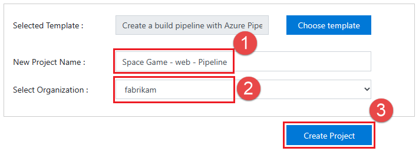

In this part, you'll make sure that your Azure DevOps organization is set up to complete the rest of this module.

The modules in this learning path form a progression, where you follow the Tailspin web team through their DevOps journey.

This learning path also builds on the [Evolve your DevOps practices](/learn/paths/evolve-your-devops-practices?azure-portal=true) learning path. There, you set up your Azure DevOps organization and created a task backlog on Azure Boards using the Basic process.

## Run the template

At this point, you have two options:

1. Continue with the project you created in the _Evolve your DevOps practices_ learning path.
1. Run a template that sets up everything for you in your Azure DevOps organization.

You can continue using your existing project if you completed the previous modules and have the Tailspin project set up in Azure DevOps. Run the template if you don't have the project set up or want to repeat this module from a fresh environment.

<!-- TODO: Update URL with prod -->

> [!div class="nextstepaction"]
> [Run the template](https://azuredevopsdemogenerator-mslearn.azurewebsites.net/?name=create-build-pipeline&azure-portal=true)

From the Azure DevOps Demo Generator site, perform these steps to run the template.

1. Click **Sign In** and accept the usage terms.
1. From the **Create New Project** screen, select your Azure DevOps organization and enter a project name, such as **Space Game - web - Pipeline**. Then click **Create Project**.

    

    It takes a few moments for the template to run.
1. Click **Navigate to project** to go to your project in Azure DevOps.

> [!IMPORTANT]
> The [Clean up your Azure DevOps environment](/modules/create-a-build-pipeline/9-clean-up-environment?azure-portal=true) page in this module contains important cleanup steps. Cleaning up helps ensure that you don't run out of free build minutes. Be sure to perform the cleanup steps even if you don't complete this module.

## Move the work item to Doing

In this part, you'll assign a work item to yourself that relates to this module on Azure Boards. You'll also move the card to the **Doing** state. In practice, you and your team would assign work items at the start of each Sprint, or work iteration.

Assigning work in this way gives you a checklist to work from. It gives others on your team visibility into what you're working on and how much work is left. It also helps the team enforce Work in Progress, or WIP, limits so that the team doesn't take on too much work at one time.

Recall that the team settled on these seven top issues.

Here you'll move the first item, **Stabilize the build server** to the **Doing** column and assign yourself to the work item.

Recall that **Stabilize the build server** relates to fixing the team's existing build server, which runs on spare hardware in the office. The goal is to see if build services on Azure Pipelines can simplify build server maintenance.

To set up the work item:

1. From Azure DevOps, navigate to **Boards** and then select **Boards** from the menu.

    

1. From the **Stabilize the build server** work item, click the down arrow at the bottom of the card. Then assign the work item to yourself.

    
1. Move the work item from the **To Do** to the **Doing** column.

    

At the end of this module, you'll move the card to the **Done** column after you've completed the task.