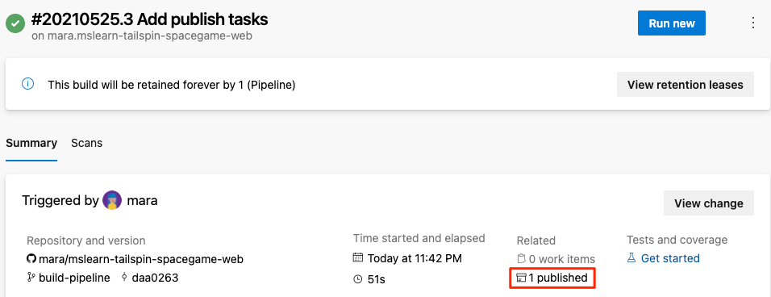
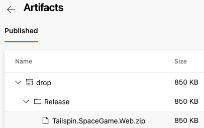
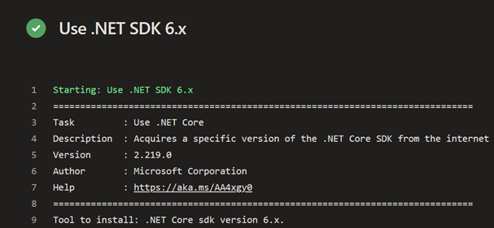

At this point, you can build the *Space Game* web project through the pipeline.

But where do the results of the build go? Right now, the output of the build remains on the temporary build server. Mara needs a way to hand off this build to Amita so she can begin testing.

You can store build artifacts in Microsoft Azure Pipelines so they're later available to others on your team after the build completes. That's what you'll do here. As a bonus, you'll also refactor the build configuration to use variables to make the configuration easier to read and keep up to date.

> [!NOTE]
> Azure Pipelines enables you to automatically deploy the built application to a testing or production environment running in the cloud or in your datacenter. For now, Mara's goal is only to produce builds that she can hand off to QA by using their existing processes.

## Publish the build to the pipeline

In .NET Core, you can package your application as a .zip file. You can then use the built-in `PublishBuildArtifacts@1` task to publish the .zip file to Azure Pipelines.

1. In Visual Studio Code, modify *azure-pipelines.yml* as you see here:

    [!code-yml[](code/7-azure-pipelines-1.yml?highlight=43-54)]

    This version of *azure-pipelines.yml* looks like the previous version, but it adds two additional tasks.

    The first task uses the `DotNetCoreCLI@2` task to *publish*, or package, the application's build results (including its dependencies) into a folder. The `zipAfterPublish` argument specifies to add the built results to a .zip file.

    The second task uses the `PublishBuildArtifacts@1` task to publish the .zip file to Azure Pipelines. The `condition` argument specifies to run the task only when the previous task succeeds. `succeeded()` is the default condition, so you don't need to specify it. But we show it here to illustrate its use.

1. From the integrated terminal, add *azure-pipelines.yml* to the index, commit the change, and push the change up to GitHub.

    > [!TIP]
    > Remember to save *azure-pipelines.yml* before you run these Git commands.

    ```bash
    git add azure-pipelines.yml
    git commit -m "Add publish tasks"
    git push origin build-pipeline
    ```

1. As you did earlier, from Azure Pipelines, trace the build through each of the steps.

1. When the pipeline completes, go back to the summary for the build.

1. Under **Related** there is **1 published**.

    

1. Select the artifact.

1. Expand the drop folder.

    You see a *.zip* file that contains your built application and its dependencies:

    

    If you want to try an optional exercise, you can download this *.zip* file to your computer and explore its contents. To do so, select the *.zip* file, select the download arrow that appears when you mouse over the *.zip* file name.

## Define variables to enhance readability

Mara steps back to examine her work. The build configuration does what she needs, but she wants to make sure Andy and others can easily help keep it up to date and extend it.

Variables enable you to define values one time and refer to those values throughout your pipeline. Azure Pipelines replaces each variable with its current value when the pipeline runs.

Just like in other programming languages, variables enable you to do things like:

* Define values that might change between runs of your pipeline.
* Store information that's repeated throughout your pipeline, like a version number or a file path, in one place. That way, you don't need to update all occurrences when your needs change.

Azure Pipelines provides a number of built-in variables. These variables describe aspects of the build process, like the build identifier and the directory names where your software is built and staged.

You can also define your own variables. Here's an example that shows a variable named `buildConfiguration` that defines the Release build configuration:

```yml
variables:
  buildConfiguration: 'Release'
```

Use variables when you repeat the same value multiple times or when a value, like a dependency version, might change.

You don't need to create a variable for every piece of your build configuration. In fact, too many variables can make your pipeline code harder for others to read and understand.

Take a moment to examine *azure-pipelines.yml*. Notice that these values are repeated:

* The build configuration: `Release`
* The location of the **wwwroot** directory: `Tailspin.SpaceGame.Web/wwwroot`
* The .NET Core SDK version: `3.1.300`

You now use variables to define these values one time. You then reference the variables throughout the pipeline.

1. In Visual Studio Code, modify *azure-pipelines.yml* as you see here:

    [!code-yml[](code/7-azure-pipelines-2.yml?highlight=9-12,16,18,25,33,42,45,49,54)]

    Notice the `variables` section, which defines these variables:

    * `buildConfiguration`. Specifies the build configuration.
    * `wwwrootDir`. Specifies the path to the **wwwroot** directory.
    * `dotnetSdkVersion`. Specifies the .NET Core SDK version to use.

    To reference these variables, you use the `$()` syntax just as you do for built-in variables. Here's the step that runs node-sass to convert Sass files to CSS. It references the `wwwrootDir` variable to obtain the path to the **wwwroot** directory.

    ```yml
    - script: './node_modules/.bin/node-sass $(wwwrootDir) --output $(wwwrootDir)'
      displayName: 'Compile Sass assets'
    ```

    The script command uses the variable to define both the source directory for Sass files and the directory in which to write CSS files. It also uses the variable to define the task name that's shown in the user interface.

1. From the integrated terminal, add *azure-pipelines.yml* to the index, commit the change, and push the change up to GitHub:

    ```bash
    git add azure-pipelines.yml
    git commit -m "Refactor common variables"
    git push origin build-pipeline
    ```

1. From Azure Pipelines, trace the build through each of the steps.

    You see that the variables are replaced with their values when the build runs. For example, here's the `UseDotNet@2` task that sets the .NET Core SDK version to use:

    

    As before, you can navigate to the build summary to see the artifact when the build completes.

Congratulations! You've successfully used Azure Pipelines and created your first build artifact.
