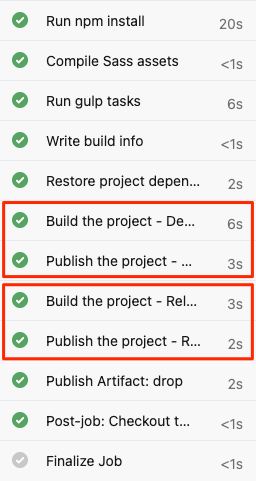

In the previous part, you implemented a pipeline that builds the _Space Game_ web site. You started with a script that performs each build action and mapped each action to its corresponding pipeline task. The output of the pipeline is a .zip file that contains the compiled web application.

In this unit, you'll use a template to define build tasks that can build any configuration defined in the project file. Templates allow you to define your logic one time and then reuse it several times. Templates combine the content of multiple YAML files into a single pipeline.

Let's begin by checking in with Mara and Amita.

## The demo

Mara, excited to share her results, tracks down Amita to show her the build pipeline.

**Amita**: I'm impressed you got this working so quickly! In fact, I was just going to see you because I got an email telling me the build was ready. Thank you! But I see that the pipeline builds only the Release configuration. We also use Debug builds so we can capture additional information if the application crashes. Can we add that?

**Mara**: Absolutely. I forgot to consider Debug builds when I set this up. How about we sit down together and add it?

**Amita**: You showed me the YAML file that defines the build steps, but I'm not sure I would know how to modify it.

**Mara**: That's OK. You can watch while I type. We can think through it together.

## How might you define both build configurations?

Consider the following tasks that build and publish the _Space Game_ web project's Release configuration. (Don't add this code to your **azure-pipelines.yml** file.)

[!code-yml[](code/8-azure-pipelines-partial-release.yml?highlight=2,5,9,14)]

To build the Debug configuration, you might repeat these two tasks, but replace "Release" with "Debug".

That would give you the result you're looking for, but what happens as your build becomes more complex or your requirements change? You would need to manually locate and modify both variations of each build task. Once you added the additional build requirements, you would also need to create two tasks, one for the Debug configuration and one for Release, to satisfy those requirements.

A better solution is to use a template.

## What are templates?

A _template_ enables you to define common build tasks one time and reuse those tasks multiple times.

You call a template from the parent pipeline as a build step. You can pass parameters into a template from the parent pipeline.

Here, Mara can define tasks to build and publish the application as a template and then apply that template to each configuration she needs.

## Define the template

Recall that a template enables you to define common build tasks one time and reuse those tasks multiple times. You call a template from its parent template as a build step and pass parameters into a template from the parent pipeline.

Here you'll create a template that can build any configuration defined in the project file.

1. From Visual Studio Code's integrated console, create the **templates** directory at the root of your project.

    ```bash
    mkdir templates
    ```

    In practice, you can place a template file in any location you choose. You don't need to place them in the **templates** directory.

1. From Visual Studio Code, select **File > New File**. Then select **File > Save** to save the blank file as **build.yml** in your project's **templates** directory, such as **~/mslearn-tailspin-spacegame-web/templates**.

1. From Visual Studio Code, add this to **build.yml**.

    [!code-yml[](code/8-build.yml?highlight=1-2,6,9,13,18)]

    These tasks resemble the ones you defined earlier to build and publish the application. However, in a template, you work with input parameters differently than you do normal variables. Here are two differences:

    1. In a template file, you use the `parameters` section instead of `variables` to define inputs.
    1. In a template file, you use the `${{ }}` syntax instead of `$()` to read a parameter's value.
        When you read a parameter's value, you include the `parameters` section in its name, for example, `${{ parameters.buildConfiguration }}`.

## Call the template from the pipeline

Here you'll call the template you just built from the pipeline. You'll do so one time for the Debug configuration and then repeat the process for the Release configuration.

1. From Visual Studio Code, modify **azure-pipelines.yml** like this.

    [!code-yml[](code/8-azure-pipelines.yml?highlight=38-44)]

    This file resembles the original, except that it calls the template to perform the build and publish tasks.

    ```yml
    - template: templates/build.yml
      parameters:
        buildConfiguration: 'Debug'

    - template: templates/build.yml
      parameters:
        buildConfiguration: 'Release'
    ```

    You see that the template is called one time for each configuration. Each `template` task uses the `parameters` argument to pass the configuration name to the template.

## Run the pipeline

Here you'll push your changes to GitHub and see the pipeline run.

1. From the integrated terminal, add **azure-pipelines.yml** and **templates/build.yml** to the index, commit the changes, and push the changes up to GitHub.

    ```bash
    git add azure-pipelines.yml templates/build.yml
    git commit -m "Support build configurations"
    git push origin build-pipeline
    ```

1. From Azure Pipelines, trace the build through each of the steps as you did earlier.

    As the pipeline runs, you see that the process expands the tasks within the template. The tasks that build and publish the project are repeated two times, one for each build configuration.

    

1. When the build completes, click the **Artifacts** button, click **drop**, and then expand the **drop** folder.

    You see that the pipeline produces a .zip file for both the Debug and Release configurations.

    

## Merge the branch into master

At this point, you have a working build pipeline that accomplishes everything Mara needs for right now.

In practice, you would submit a _pull request_ that merges your `build-pipeline` branch into the `master` branch.

We'll skip that step for now. In the next module, you'll learn about some ways to collaborate with your team on GitHub, including how to submit, review, and merge pull requests.
