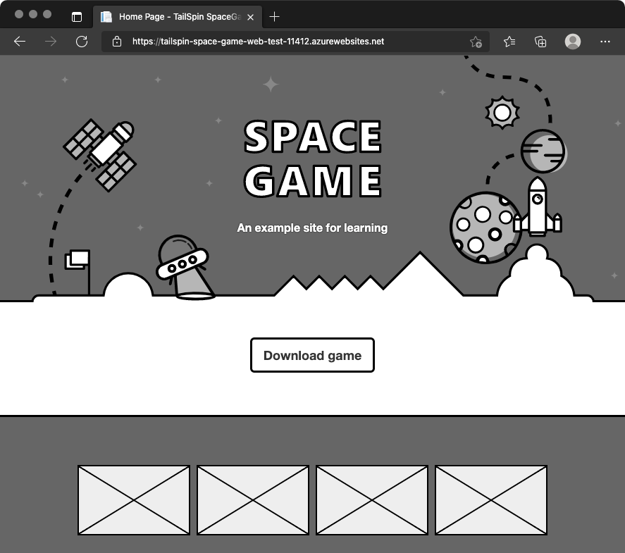

Your release pipeline still has two stages, but they're now different than before. The stages are _Build_ and _Dev_. Every change you push to GitHub triggers the _Build_ stage to run. The _Dev_ stage runs only when the change is in the _release_ branch. Here you add the _Test_ stage to the pipeline.

Recall that the team decided to use a scheduled trigger to promote the build from the _Dev_ stage to the _Test_ stage at 3 A.M. each morning. To set up the scheduled trigger:

> [!div class="checklist"]
> * Define the schedule in your build configuration.
> * Define the _Test_ stage, which includes a condition that runs the stage only if the build reason is marked as `Schedule`.

For learning purposes, here you define the schedule but allow the build to go directly from _Dev_ to _Test_. This setup avoids the need to wait for the schedule to be triggered. After you complete this module, experiment with different cron expressions to run the _Test_ stage only at the scheduled time.

## Promote changes to the Test stage

Here you modify your pipeline configuration to deploy the build to the _Test_ stage.

1. In Visual Studio Code, modify *azure-pipelines.yml* like this:

    [!code-yml[](code/6-azure-pipelines.yml?highlight=5-11,103-125)]

    The `schedules` section defines one cron expression. You can define more than one expression in your configuration. The expression triggers the pipeline to run against the release branch at 3 A.M. each day. The `always` flag is set to `false` so that the pipeline runs only when the release branch contains changes from the prior run.

    The `Test` stage defines a condition that runs the stage only when the build reason equals `Schedule`. (The built-in variable `Build.Reason` defines the build reason.) If this condition is false, the stage is skipped, but the prior stages continue to run.

    > [!NOTE]
    > This condition is shown for learning purposes. It's commented to enable the change to go from _Dev_ to _Test_ without waiting for the schedule to be triggered.

1. From the integrated terminal, add *azure-pipelines.yml* to the index. Then commit the change and push it up to GitHub.

    > [!TIP]
    > Save *azure-pipelines.yml* before you run these Git commands.

    ```bash
    git add azure-pipelines.yml
    git commit -m "Deploy to the Test stage"
    git push origin release
    ```

1. In Azure Pipelines, go to the build. Trace the build as it runs.
1. After the build finishes, select the back button to return to the summary page.

    

    You see that the deployment finished successfully.
1. From a web browser, navigate to the URL that's associated with the App Service instance for your _Test_ environment.

    If you still have the browser tab open, refresh the page. If you don't remember the URL, find it in the Azure portal, on the App Service details page.

    You see that the _Space Game_ website is deployed to App Service, and it's running.

    

1. As an optional step, in Azure Pipelines, select **Environments**. Then select the **test** environment.

    Azure Pipelines records your deployment history. In the history, you can trace changes in the environment back to code commits and work items.

    

Andy and Mara add the _Test_ stage to the pipeline. They show the results to Amita.

**Amita:** I like that changes are built and deployed so that I can test them each morning. But I don't see how I can control when changes arrive at _Staging_.

**Mara:** Yes, deploying through automation is a huge time saver. But remember that we included only the scheduled trigger. We'll add a release approval for you when we set up the _Staging_ environment for Tim. That way, changes will move to _Staging_ only when you're ready.