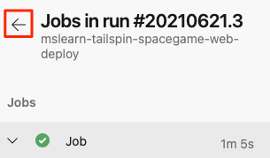
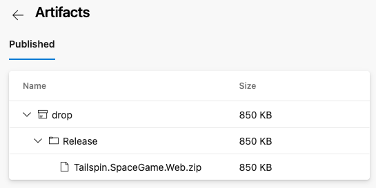

The team has been slowly integrating a DevOps strategy into their existing processes. In this section, you make sure that your environment reflects the team's efforts so far.

To do this, you:

> [!div class="checklist"]
> * Add a user to ensure Azure DevOps can connect to your Azure subscription.
> * Set up an Azure DevOps project for this module.
> * Add the build pipeline.

## Add a user to Azure DevOps

To complete this module, you need your own [Azure subscription](https://azure.microsoft.com/free/?azure-portal=true). In this module, you connect to your Azure subscription from Azure Pipelines. To simplify the process, you need to sign in to both your Azure subscription and your Azure DevOps organization under the same Microsoft account.

If you use different Microsoft accounts to sign into Azure and Azure DevOps, add a user to your DevOps organization under the Microsoft account you use to sign in to Azure. [Add users to your organization or project](https://docs.microsoft.com/azure/devops/organizations/accounts/add-organization-users?view=azure-devops&tabs=browser&azure-portal=true) explains how to add a user. When you add the user, choose the Basic access level.

<!-- TODO: NOT SURE WHETHER BASIC WILL WORK OR IF YOU NEED HIGHER. -->

Then sign out of Azure DevOps and sign in again under the Microsoft account you use to sign in to your Azure subscription.

## Get the Azure DevOps project

Here, you make sure that your Azure DevOps organization is set up to complete the rest of this module. You do so by running a template that creates a project for you in Azure DevOps.

The modules in this learning path form a progression, where you follow the Tailspin web team through their DevOps journey. For learning purposes, each module has an associated Azure DevOps project.

### Run the template

1. Run a template that sets up everything for you in your Azure DevOps organization.

> [!div class="nextstepaction"]
> [Run the template](https://azuredevopsdemogenerator.azurewebsites.net/?name=create-build-pipeline&azure-portal=true)

From the Azure DevOps Demo Generator site, perform these steps to run the template.

1. Select **Sign In** and accept the usage terms.
1. From the **Create New Project** page, select your Azure DevOps organization and enter a project name, such as **Space Game - web - Release**. Then select **Create Project**.

    

    <!-- TODO: Generate the template, update link & screenshot -->

    It takes a few moments for the template to run.
1. Select **Navigate to project** to go to your project in Azure DevOps.

> [!IMPORTANT]
> The [Clean up your Azure DevOps environment](/learn/modules/create-release-pipeline/8-clean-up-environment?azure-portal=true) page in this module contains important cleanup steps. Cleaning up helps ensure that you don't run out of free build minutes. Be sure to perform the cleanup steps even if you don't complete this module.

## Create the initial build pipeline

Here, you turn on multistage pipelines and create an initial pipeline configuration that builds the application to produce a build artifact.

### Turn on multi-stage pipelines in Azure DevOps

Mulit-stage pipelines are a preview feature of Azure Pipelines. Preview features provide early access to features that will soon become part of Azure DevOps. For now, you need to turn on this feature.

From Azure DevOps:

1. Select your profile from the upper corner.
1. Select **Preview features**.
1. Turn on **Multi-stage Pipelines**.

    

1. Notice that separate **Pipelines** menu entries for **Release** and **Build** are now gone. This is because you will now perform both build and release tasks from the same pipeline.

### Create the initial pipeline configuration

Here, you create an initial pipeline configuration that builds the web application. This ensures that your project is set up correctly to build from your GitHub repository. This build configuration resembles the one you set up in previous modules.

1. From Visual Studio Code, open the integrated terminal.
1. Run the following `git fetch` and `git checkout` commands to download a branch named `release-pipeline` from Microsoft's repository and switch to that branch.

    ```bash
    git fetch upstream release-pipeline
    git checkout release-pipeline
    ```

    Recall that `upstream` refers to Microsoft's GitHub repository. Your project's Git configuration understands the `upstream` remote because you set up that relationship when you forked the project from Microsoft's repository and cloned it locally.

    Shortly, you'll push this branch up to your GitHub repository, known as `origin`.

1. As an optional step, open *azure-pipelines.yml* from Visual Studio Code and familiarize yourself with the initial configuration.

    The configuration resembles the basic one you created in the [Create a build pipeline with Azure Pipelines](/learn/modules/create-a-build-pipeline/6-create-the-pipeline?azure-portal=true) module. It builds only the application's Release configuration. For learning purposes, this configuration does not run quality or security checks that you set up in previous modules.

1. Run the following `git commit` command to add an empty entry to your commit history.

    ```bash
    git commit --allow-empty -m "Trigger the pipeline"
    ```

    This step is for learning purposes and is not typical. We provide starter code that you don't yet need to modify. The `--allow-empty` flag ensures that the next step successfully pushes the branch to GitHub and triggers Azure Pipelines to run.

    If you were to omit this step, the `git push` command you run in the next step would not take any action, and therefore wouldn't trigger Azure Pipelines to run.

1. Run the following `git push` command to upload the branch to your GitHub repository.

    ```bash
    git push origin release-pipeline
    ```

1. From Azure Pipelines, go to the build and trace the build as it runs.

    

1. After the build completes, select the back button to return to the summary page.

    

1. On the summary page, select your published artifact.

    

1. From the **Published artifacts** page, expand the **drop** folder.

    You see a _zip_ file that contains your built application and its dependencies. This is your build artifact.

    

    You can manually download and install the build artifact in your own environment, just as Amita did in the previous learning path. In this module, you add a deployment stage that automatically deploys the build artifact to Azure App Service.

You now have a build pipeline for the _Space Game_ web project. Next, you add the deployment stage to the pipeline.