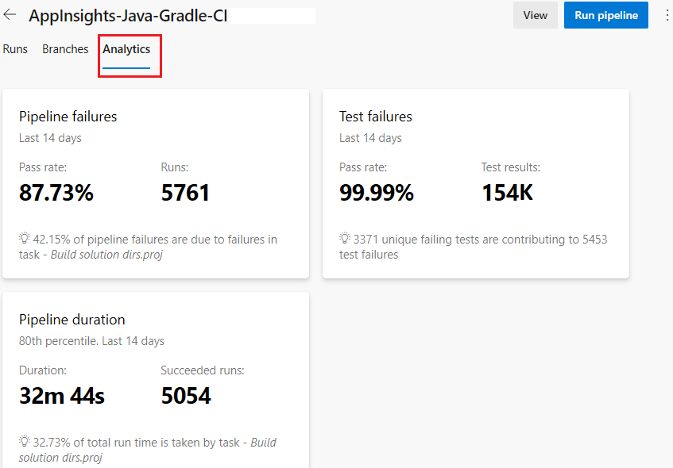

In this exercise, you examine a few of the analytics features that Azure Pipelines provides.

Irwin asked the Tailspin team how they can release faster. Building an automated release pipeline is a great step towards releasing quickly and reliably. As you release more often and more rapidly, it's important to understand the health and history of your releases. Looking at health trends regularly can help you diagnose potential problems before those problems become critical.

Before we take a look at some of your pipeline's analytics, let's listen in on the Tailspin team at their morning meeting.

## How can I track the health of my entire pipeline?

It's the following morning. At the team meeting, Andy and Mara have just finished demonstrating the build and release pipeline that they set up as a POC.

**Amita:** This is fantastic. Having just the build pipeline was a great step, but I still had to manually install the build artifact in my lab so I could test it. If I can get these releases to my test environment on a regular schedule, that would save a lot of time getting new features through QA.

**Mara:** Exactly! And remembember, we can always expand our release pipeline to include more stages. The final goal is to create a complete deployment workflow.

**Tim:** A staging environment would be great. I could do additional stress testing before we present new features to management for final approval.

The team is excited to see what the new pipeline can do and they all start talking at the same time.

**Andy:** I'm excited, too. But let's take things one step at a time. Yes, I think we can do all of this and more, but this is just a POC. We'll work on expanding it over time.

**Amita:** A big question for me is how do we know if what we have in this environment is valid? What I mean is, where do I go to see the health of the releases?

**Andy:** Remember the dashboard we created to monitor the health of the builds? We can do the same thing for the releases. We'll be able to monitor the health of the whole pipeline, and anyone interested can check in on the system and see what's happening.

**Tim:** Irwin will like that.

**Andy:** Let's hold off on building a release dashboard until after we've defined a more complete release workflow. For now, let's look at some of the built-in analytics that Azure Pipelines provides.

The team gathers around Andy's laptop.

## What information does pipeline analytics provide?

Every pipeline provides reports that include metrics, trends, and insights that can help you to improve the efficiency of your pipeline.

These reports include:

* The overall pass rate of your pipeline.
* The pass rate of any tests that are run in the pipeline.
* The average duration of your pipeline runs, including the build tasks, which take the most time to complete.

You'll examine the analytics for your pipeline shortly. Here's a sample report that shows pass rate and duration for a project that has many pipeline runs.

> [!div class="mx-imgBorder"]
> 

You can filter the results to focus in on a time range or the activity on a specific Git branch.

Azure DevOps also provides this information as an OData feed that you can use to publish reports and notifications to other systems such as Power BI, Microsoft Teams, or Slack. You can learn more about analytics feeds at the end of this module.

## Explore your pipeline's analytics

Let's examine a few of your pipeline's analytics. Here's how.

1. In Azure Pipelines, navigate to your pipeline.
1. Select the **Analytics** tab.

    > [!div class="mx-imgBorder"]
    > 

1. Note the pass rates and average duration of your pipeline runs.

    > [!div class="mx-imgBorder"]
    > 

1. Under **Pipeline pass rate**, select **View full report**.

    > [!div class="mx-imgBorder"]
    > 

    At this point, you have a basic pipeline report that contains data for just a few runs.

**Amita:** That's the information I want but I don't see a lot of data there yet.

**Andy:** That's right. We'll collect more data as we perform more runs over time. We'll use this data to gain a greater sense of the health of the pipeline and where we can make it more efficient.

**Mara:** For example, I see that the task that runs `npm install` takes the most time to complete. Do we need to fix that? Perhaps we can cache the Node.js packages that we use on one of our servers to make it run faster.

**Andy:** I always appreciate your willingness to improve things. But let's hold off on that for now. Time will reveal where the pipeline is slow or inefficient. From there, we can decide which improvements are truly worth tackling.