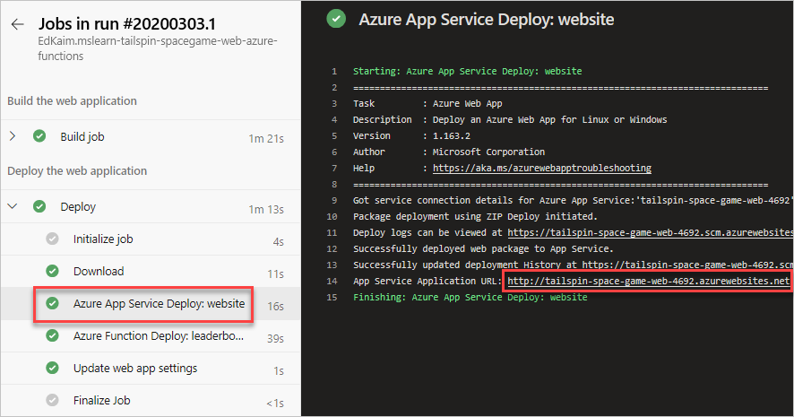
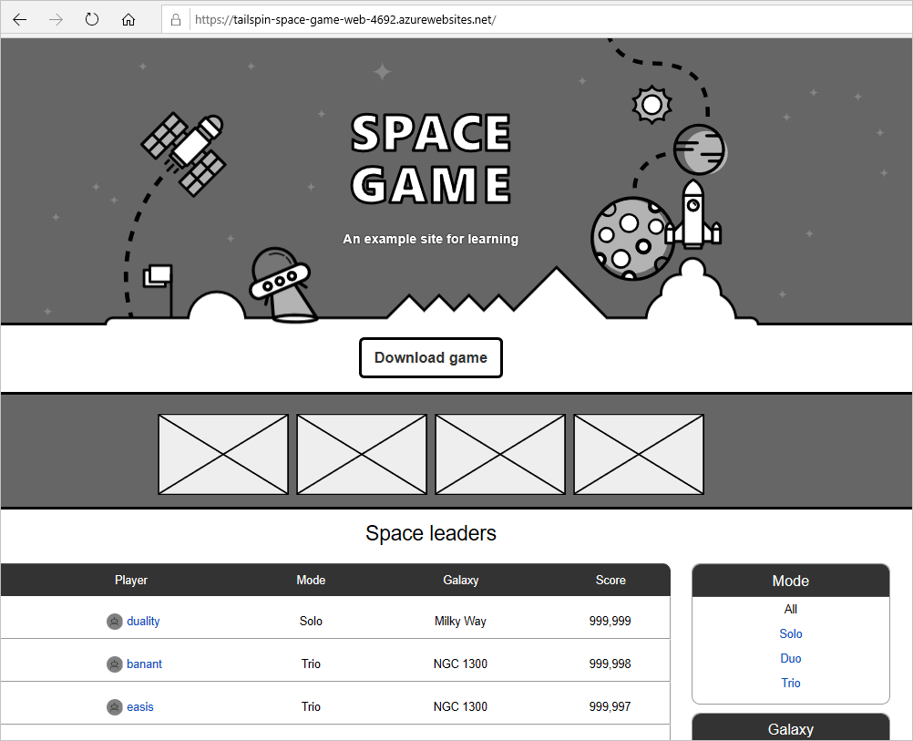
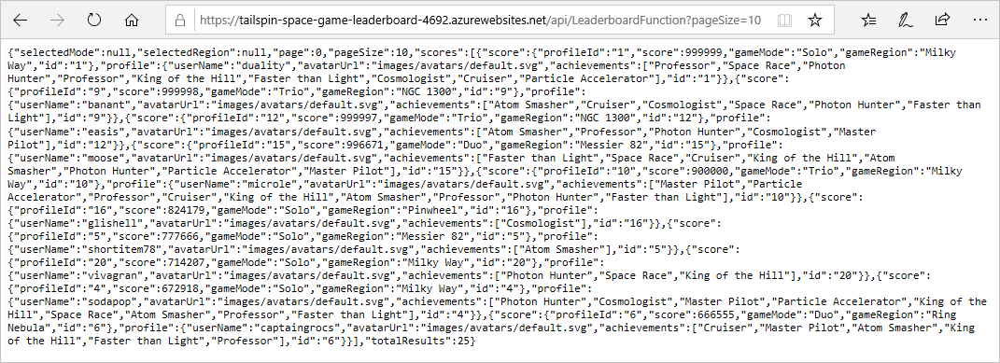

Your project came with a release pipeline that builds the projects in the solution and deploys the web app to its App Service. Now it's time to extend that pipeline to also deploy the new Azure Functions project.

In this part, you'll:

> [!div class="checklist"]
> * Review the **Build** stage.
> * Add a task to deploy your function app.
> * Add a task configure the published App Service to use the published function.
> * Save the pipeline to trigger a CI/CD workflow.

## Review the Build stage

Here you review the existing CI/CD pipeline defined in *azure-pipelines.yml*. 

1. From Azure DevOps, navigate to **Pipelines**.
1. Select the pipeline.
1. Select **Edit**. This will bring up the azure-pipelines.yml file that defines the existing CI/CD pipeline. Because of the use of wildcards to the project paths, the highlighted tasks below will automatically restore, build, and publish the new Azure Functions project.

    [!code-yml[](code/4-1-azure-pipelines.yml?highlight=37-57)]

**Andy:** This was our previous build stage. I didn't change it from the original project because the tasks were already configured to run against all projects based on the wildcard matching pattern.

**Mara:** Yes, this should work as-is. I don't think we need to make any changes here. After this build task runs, the zip file artifacts for both the web and leaderboard projects will be published for the Deploy stage to use.

## Add a task to deploy the Azure Function

**Andy:** I think we can also reuse the App Service deployment task as-is. Hopefully there's something similar we can use for deploying a function app.

**Mara:** I have good news. After a little research, it looks like there's a task that's conceptually similar to the App Service deployment task, but for Azure Pipelines deployments. Let's add it now.

## Azure Function App Task

The `AzureFunctionApp@1` task is designed to deploy function apps. It is conceptually similar to the `AzureWebApp@1` task and includes everything needed for this function app scenario:

* `azureSubscription` refers to the name of your Azure service connection pipeline variable.
* `appType` indicates whether the app is being deployed for Linux (`functionAppLinux`) or Windows (`functionApp`).
* `appName` specifies the name of the Azure Functions app instance in your Azure account.
* `package` specifies the path to the package to be deployed.
* `runtimeStack` indicates which image the function should be run on, which is required for Linux deployments.
* `startUpCommand` specifies the startup command to run after the function has been deployed, which is required for Linux deployments.

You can learn more about the flexibility of this task in the official docs for the [Azure Function App task](/azure/devops/pipelines/tasks/deploy/azure-function-app?azure-portal=true)

Add the highlighted code below to the end of your pipeline.

[!code-yml[](code/4-2-azure-pipelines.yml?highlight=25-33)]

## Add a task to update the App Service's app settings

**Andy:** Now all we need to do is to configure the web app to use the published leaderboard API. We usually configure variables in the portal, but it would be better if we could do it here. It expects an AppSettings parameter named `LeaderboardFunctionUrl`.

**Mara:** I agree. Adding a task for that to our pipeline will help us avoid accidental oversights down the road if we change either service. We can put it right at the end.

Add the highlighted code below to the end of your pipeline. If you would like to learn more about this task, you can review the docs for [Azure App Service Settings task](/azure/devops/pipelines/tasks/deploy/azure-app-service-settings?azure-portal=true).

[!code-yml[](code/4-3-azure-pipelines.yml?highlight=11-23)]

## Save the pipeline to trigger a build and release

1. Select **Save** from the top right corner of the page. Confirm the **Save** to trigger a run.
1. In Azure Pipelines, go to the build. Trace the build as it runs.
1. After the build has succeeded, select the web site's deploy task and click the URL to view the deployed site.

    

1. You will see the site in production. Scroll down to confirm that the leaderboard has real data in it. This is powered by the function app.

    

    > [!NOTE]
    > If there is an error loading the leaderboard, double-check the steps followed in this module. If you see the exception message "An attempt was made to access a socket in a way forbidden by its access permissions", make sure that the app service's AppSettings:LeaderboardFunctionUrl setting is being set correctly.

1. You can also test out the function app directly. Just navigate to your URL using the format below. The response will be in JSON, which should just render as text in your browser.

    ```
    http://<leaderboard function name>.azurewebsites.net/api/LeaderboardFunction?pageSize=10
    ```
    
    such as

    ```
    http://tailspin-space-game-leaderboard-4692.azurewebsites.net/api/LeaderboardFunction?pageSize=10
    ```

    

**Andy:** This turned out great! Everyone should be pretty impressed with the potential we've shown here.
