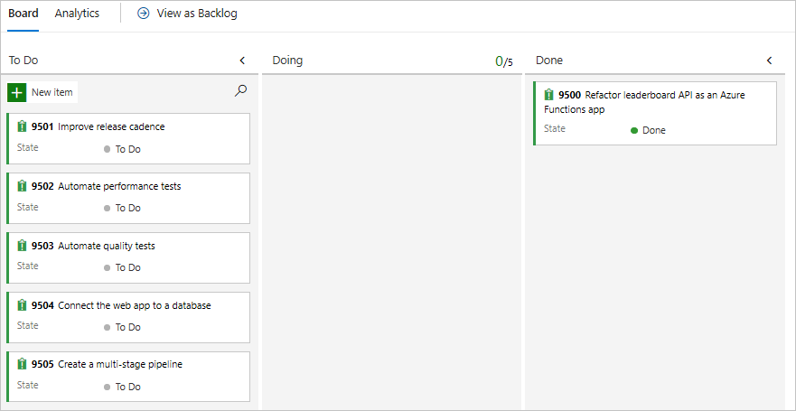

You're finished with the tasks for this module. Here you'll clean up your Azure resources, move the work item to the **Done** state on Azure Boards, and clean up your Azure DevOps environment.

> [!IMPORTANT]
> This page contains important cleanup steps. Cleaning up helps ensure that you don't run out of free build minutes. It also helps ensure that you're not charged for Azure resources after you complete this module.

## Clean up Azure resources

Here you delete your Azure App Service instances. The easiest way to delete the instances is to delete their parent resource group. When you delete a resource group, you delete all resources in that group.

In the [Create a release pipeline with Azure Pipelines](/learn/modules/create-release-pipeline?azure-portal=true) module, you managed Azure resources through the Azure portal. Here you tear down your deployment by using the Azure CLI through Azure Cloud Shell. The steps are similar to the steps that you used when you created the resources.

To clean up your resource group:

1. Go to the [Azure portal](https://portal.azure.com?azure-portal=true) and sign in.
1. From the menu bar, select Cloud Shell. When prompted, select the **Bash** experience.

    

1. Run the following `az group delete` command to delete the resource group that you used, `tailspin-space-game-rg`.

    ```bash
    az group delete --name tailspin-space-game-rg
    ```

    When prompted, enter `y` to confirm the operation.

1. As an optional step, after the previous command finishes, run the following `az group list` command.

    ```bash
    az group list --output table
    ```

    You see that the resource group `tailspin-space-game-rg` no longer exists.

## Move the work item to Done

Here you move the work item that you assigned to yourself earlier in this module. You move **Refactor leaderboard API as an Azure Functions app** to the **Done** column.

In practice, "Done" often means putting working software into the hands of your users. For learning purposes, here you mark this work as done because you fulfilled the goal for the Tailspin team. They wanted to refactor their project to extract a leaderboard API as a function app.

At the end of each *sprint*, or work iteration, you and your team can hold a retrospective meeting. In the meeting, share the work you completed, what went well, and what you can improve.

To complete the work item:

1. From Azure DevOps, navigate to **Boards** and then select **Boards** from the menu.
1. Move the **Refactor leaderboard API as an Azure Functions app** work item from the **Doing** column to the **Done** column.

    

## Disable the pipeline or delete your project

Each module in this learning path provides a template. You can run the template to create a clean environment for the module.

Running multiple templates gives you multiple Azure Pipelines projects. Each project points to the same GitHub repository. This setup can trigger multiple pipelines to run each time you push a change to your GitHub repository. The pipeline runs use up free build minutes on our hosted agents. To avoid losing those free build minutes, disable or delete your pipeline before you move to the next module.

Choose one of the following options.

### Option 1 - Disable the pipeline

Disable the pipeline so that it doesn't process build requests. You can re-enable the build pipeline later if you want to. Choose this option if you want to keep your DevOps project and your build pipeline for future reference.

To disable the pipeline:

1. In Azure Pipelines, navigate to your pipeline.
1. Select **Edit**.

    
1. From the menu in the upper corner, select **Settings**.

    
1. Under **Processing of new run requests**, select **Disabled** > **Save**.

    Your pipeline will no longer process build requests.

### Option 2 - Delete the Azure DevOps project

Delete your Azure DevOps project, including the contents of Azure Boards and your build pipeline. In future modules, you can run another template that brings up a new project in a state where this project leaves off. Choose this option if you don't need your DevOps project for future reference.

To delete the project:

1. In Azure DevOps, navigate to your project. Earlier, we recommended that you name this project **Space Game - web - Azure Functions**.
1. Select the gear icon next to the project name.

    The icon might not appear until you move your mouse over the area.

    
1. In the **Project details** area, go to the bottom and select **Delete**.

    
1. In the window that appears, enter the project name. Select **Delete** again.

    Your project is now deleted.