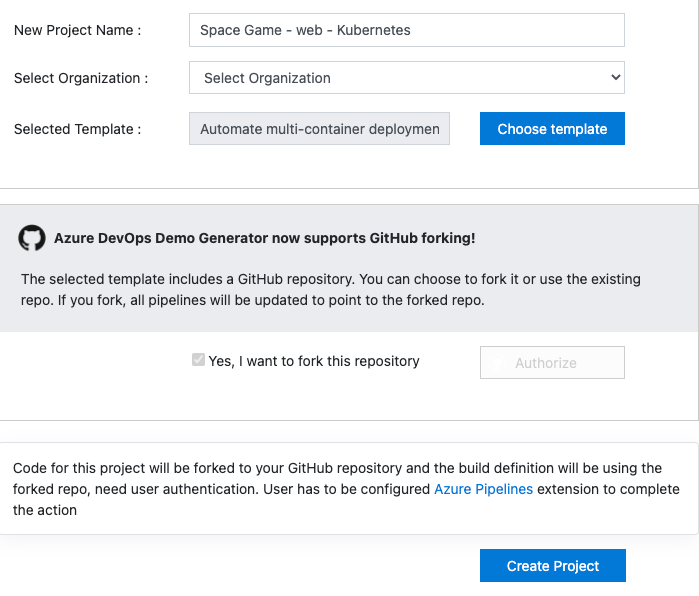
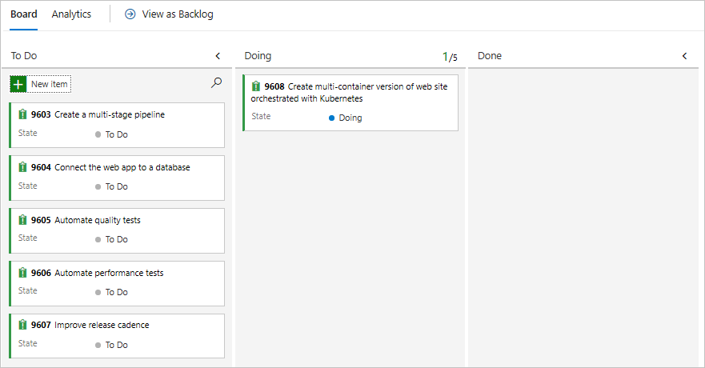
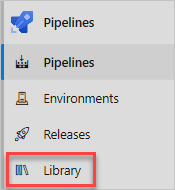
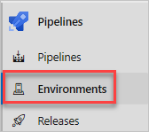

In this section, you make sure that your Azure DevOps organization is set up to complete the rest of this module. You also create the Azure Kubernetes Service environment that you'll deploy to.

To accomplish these goals, you:

> [!div class="checklist"]
> * Add a user to ensure Azure DevOps can connect to your Azure subscription.
> * Set up an Azure DevOps project for this module.
> * On Azure Boards, move the work item for this module to the **Doing** column.
> * Create an Azure Container Registry (ACR) and Azure Kubernetes Service (AKS) cluster using the Azure CLI in Azure Cloud Shell.
> * Create pipeline variables that define the names of your Azure resources.
> * Create a service connection that enables Azure Pipelines to securely access your Azure subscription.
> * Update the source project on GitHub to use your new ACR instance.

## Add a user to Azure DevOps

To complete this module, you need your own [Azure subscription](https://azure.microsoft.com/free/?azure-portal=true). You can get started with Azure for free.

You don't need an Azure subscription to work with Azure DevOps, but here you'll use Azure DevOps to deploy to Azure resources that exist in your Azure subscription. To simplify the process, use the same Microsoft account to sign in to both your Azure subscription and your Azure DevOps organization.

If you use different Microsoft accounts to sign in to Azure and Azure DevOps, add a user to your DevOps organization under the Microsoft account that you use to sign in to Azure. For more information, see [Add users to your organization or project](/azure/devops/organizations/accounts/add-organization-users?azure-portal=true&tabs=browser). When you add the user, choose the **Basic** access level.

Then sign out of Azure DevOps and sign in. Use the Microsoft account that you use to sign in to your Azure subscription.

## Get the Azure DevOps project

Here you make sure that your Azure DevOps organization is set up to complete the rest of this module. To do so, you run a template that creates a project in Azure DevOps.

The modules in this learning path form a progression. You follow the Tailspin web team through their DevOps journey. For learning purposes, each module has its own Azure DevOps project.

### Run the template

Run a template that sets up your Azure DevOps organization:

> [!div class="nextstepaction"]
> [Run the template](https://azuredevopsdemogenerator.azurewebsites.net/?x-ms-routing-name=self&name=Deploymulti-containersolutionstoKubernetes&azure-portal=true)

From the Azure DevOps Demo Generator site, follow these steps to run the template:

1. Select **Sign In** and accept the usage terms.

1. On the **Create New Project** page, select your Azure DevOps organization. Enter a project name, such as *Space Game - web - Kubernetes*.

    

1. Select **Yes, I want to import this repository** > **Authorize**.

    If a window appears, authorize access to your GitHub account.

    > [!IMPORTANT]
    > You need to select this option so the template will connect to your GitHub repository. Select it even if you've already forked the _Space Game_ website project. The template uses your existing fork.

1. Select **Create Project**.

    The template takes a few moments to run.

1. Select **Navigate to project** to go to your project in Azure DevOps.

> [!IMPORTANT]
> In this module, the [Clean up your Azure DevOps environment](/learn/modules/deploy-kubernetes/5-clean-up-environment?azure-portal=true) page contains important cleanup steps. Cleaning up helps ensure that you don't run out of free build minutes. Be sure to follow the cleanup steps even if you don't complete this module.

[!include[](../../shared/includes/project-visibility.md)]

## Move the work item to Doing

Here you assign a work item to yourself on Azure Boards. You also move the work item to the **Doing** state. In practice, you and your team would create work items at the start of each *sprint*, or work iteration.

This work assignment gives you a checklist to work from. It gives other team members visibility into what you're working on and how much work is left. The work item also helps enforce work-in-progress (WIP) limits so that the team doesn't take on too much work at one time.

Here you move the first item, **Create multi-container version of web site orchestrated with Kubernetes**, to the **Doing** column. Then you assign yourself to the work item.

To set up the work item:

1. From Azure DevOps, go to **Boards**. Then, select **Boards** from the menu.

    :::image type="content" source="../../shared/media/azure-devops-boards-menu.png" alt-text="A screenshot of Azure DevOps showing the location of the Boards menu.":::

1. In the **Create multi-container version of web site orchestrated with Kubernetes** work item, select the down arrow at the bottom of the card. Then assign the work item to yourself.

    :::image type="content" source="../../shared/media/azure-boards-down-chevron.png" alt-text="A screenshot of Azure Boards showing the location of the down arrow.":::
1. Move the work item from the **To Do** column to the **Doing** column.

    

At the end of this module, you'll move the card to the **Done** column after you complete the task.

## Create the Azure Kubernetes Service environment

Here you create the Azure Kubernetes Service resources that are required to deploy the new container version of the site.

In [Create a release pipeline with Azure Pipelines](/learn/modules/create-release-pipeline?azure-portal=true), you brought up Azure resources through the Azure portal. Although the portal is a great way to explore what's available on Azure or to do basic tasks, bringing up components such as Azure Kubernetes Service can be tedious.

In this module, you use the Azure CLI to bring up the resources need to deploy and run your app on Azure Kubernetes Service. You can access the Azure CLI from a terminal or through Visual Studio Code. Here you access the Azure CLI from Azure Cloud Shell. This browser-based shell experience is hosted in the cloud. In Cloud Shell, the Azure CLI is configured for use with your Azure subscription.

> [!IMPORTANT]
> You need your own Azure subscription to complete the exercises in this module.

### Bring up Cloud Shell through the Azure portal

1. Go to the [Azure portal](https://portal.azure.com?azure-portal=true), and sign in.

1. From the menu, select **Cloud Shell**. When prompted, select the **Bash** experience.

    

    > [!NOTE]
    > Cloud Shell requires an Azure storage resource to persist any files that you create in Cloud Shell. When you first open Cloud Shell, you're prompted to create a resource group, storage account, and Azure Files share. This setup is automatically used for all future Cloud Shell sessions.

### Select an Azure region

A _region_ is one or more Azure datacenters within a geographic location. East US, West US, and North Europe are examples of regions. Every Azure resource, including an App Service instance, is assigned a region.

To make commands easier to run, start by selecting a default region. After you specify the default region, later commands use that region unless you specify a different region.

1. From Cloud Shell, run the following `az account list-locations` command to list the regions that are available from your Azure subscription.

    ```azurecli
    az account list-locations \
      --query "[].{Name: name, DisplayName: displayName}" \
      --output table
    ```

1. From the `Name` column in the output, choose a region that's close to you. For example, choose `eastasia` or `westus2`.

1. Run `az configure` to set your default region. Replace `<REGION>` with the name of the region you chose.

    ```azurecli
    az configure --defaults location=<REGION>
    ```

    This example sets `westus2` as the default region.

    ```azurecli
    az configure --defaults location=westus2
    ```

### Create Bash variables

Create Bash variables to make the setup process more convenient and less error-prone. Using variables for shared text strings helps avoid accidental typos.

1. From Cloud Shell, generate a random number. This will make it easier to create globally unique names for certain services in the next step.

    ```bash
    resourceSuffix=$RANDOM
    ```

1. Create globally unique names for your Azure Container Registry and Azure Kubernetes Service instance. Note that these commands use double quotes, which instructs Bash to interpolate the variables using the inline syntax.

    ```bash
    registryName="tailspinspacegame${resourceSuffix}"
    aksName="tailspinspacegame-${resourceSuffix}"
    ```

1. Create another Bash variable to store the name of your resource group.

    ```bash
    rgName='tailspin-space-game-rg'
    ```

1. Create a variable to hold the latest AKS version available in your default region.

    ```azurecli
    aksVersion=$(az aks get-versions \
      --query 'orchestrators[-1].orchestratorVersion' \
      --output tsv)
    ```

### Create the Azure resources

This solution requires several Azure resources for deployment, which you create now.

   > [!NOTE]
   > For learning purposes, here you use the default network settings. These settings make your site accessible from the internet. In practice, you could configure an Azure virtual network that places your website in a network that's not internet routable, and that only you and your team can access. Later, you could reconfigure your network to make the website available to your users.

1. Run the following `az group create` command to create a resource group using the name defined earlier.

    ```azurecli
    az group create --name $rgName
    ```

1. Run the following `az acr create` command to create an Azure Container Registry using the name defined earlier.

    ```azurecli
    az acr create \
      --name $registryName \
      --resource-group $rgName \
      --sku Standard
    ```

1. Run the following `az aks create` command to create an AKS instance using the name defined earlier.

    ```azurecli
    az aks create \
      --name $aksName \
      --resource-group $rgName \
      --enable-addons monitoring \
      --kubernetes-version $aksVersion \
      --generate-ssh-keys
    ```

   > [!NOTE]
   > It may take 10-15 minutes for the AKS deployment to complete.

1. Create a variable to store the ID of the service principal configured for the AKS instance.

    ```azurecli
    clientId=$(az aks show \
      --name $aksName \
      --resource-group $rgName \
      --query "servicePrincipalProfile.clientId" \
      --output tsv)
    ```

1. Create a variable to store the ID of the Azure Container Registry.

    ```azurecli
    acrId=$(az acr show \
      --name $registryName \
      --resource-group $rgName \
      --query "id" \
      --output tsv)
    ```

1. Run the following `az acr list` command to print the login server for your ACR instance.

    ```azurecli
    az acr list \
     --resource-group $rgName \
     --query "[].{loginServer: loginServer}" \
     --output table
    ```

    Note the login server for your container registry. You'll need this when configuring the pipeline and environment in some upcoming steps. Here's an example.

    ```output
    LoginServer                      
    --------------------------------
    tailspinspacegame4692.azurecr.io
    ```

1. Run the following `az role assignment create` command to create a role assignment to authorize the AKS cluster to connect to the Azure Container Registry.

    ```azurecli
    az role assignment create \
      --assignee $clientId \
      --role acrpull \
      --scope $acrId
    ```

> [!IMPORTANT]
> The [Clean up your Azure DevOps environment](/learn/modules/deploy-kubernetes/5-clean-up-environment?azure-portal=true) page in this module contains important cleanup steps. Cleaning up helps ensure that you're not charged for Azure resources after you complete this module. Be sure to perform the cleanup steps even if you don't complete this module.

## Create pipeline variables in Azure Pipelines

In [Automate Docker container deployments with Azure Pipelines](/learn/modules/deploy-docker?azure-portal=true), you added a variable to your pipeline that stores the name of your Azure Container Registry. Here you do the same.

You could hard-code this name in your pipeline configuration, but if you define it as a variable, your configuration will be more reusable. Plus, if the name of your instance changes, you can update the variable and trigger your pipeline without modifying your configuration.

To add the variables:

1. In Azure DevOps, go to your **Space Game - web - Kubernetes** project.

1. Under **Pipelines**, select **Library**.

    

1. Select **+ Variable group**.

1. Under **Properties**, enter *Release* for the variable group name.

1. Under **Variables**, select **Add**.

1. For the name of your variable, enter *RegistryName*. For the value, enter the login server for your Azure Container Registry, such as *tailspinspacegame4692.azurecr.io*.

1. Near the top of the page, select **Save** to save your variable to the pipeline.

    Your variable group resembles this one:

    

## Create required service connections

Here, you create service connections that enable Azure Pipelines to access your Azure Container Registry and Azure Kubernetes Service instances. Azure Pipelines uses these service connections to push your containers, as well as to instruct your AKS cluster to pull them in to update the deployed service.

> [!IMPORTANT]
> Make sure that you're signed in to both the Azure portal and Azure DevOps under the same Microsoft account.

1. In Azure DevOps, go to your **Space Game - web - Kubernetes** project.

1. From the bottom corner of the page, select **Project settings**.

1. Under **Pipelines**, select **Service connections**.

1. Select **New service connection**, then select **Docker Registry**, and then select **Next**.

1. Near the top of the page, select **Azure Container Registry**.

1. Enter the following values for each setting.

    | Setting               | Value                                        |
    |---------------------|----------------------------------------------|
    | Subscription    | Your Azure subscription                          |
    | Azure container registry  | **Select the one you created earlier** |
    | Service connection name | *Container Registry Connection*          |

1. Ensure that **Grant access permission to all pipelines** is selected.

1. Select **Save**.

1. Select **New service connection**, then select **Kubernetes**, and then select **Next**.

1. Near the top of the page, select **Azure Subscription**.

1. Enter the following values for each setting.

    | Setting               | Value                                        |
    |---------------------|----------------------------------------------|
    | Subscription    | Your Azure subscription                          |
    | Cluster  | *Select the one you created earlier* |
    | Namespace | *default*          |
    | Service connection name | *Kubernetes Cluster Connection*          |

1. Ensure that **Grant access permission to all pipelines** is selected.

1. Select **Save**.

### Create the environment

1. Under **Pipelines**, select **Environments**.

    

1. Select **Create environment**.
1. Under **Name**, enter *spike*.
1. Under **Resource**, select **Kubernetes**.
1. Select **Next**.
1. Under **Provider**, select **Azure Kubernetes Service**.
1. Under **Azure subscription**, select your subscription.
1. Under **Cluster**, select the AKS cluster you created earlier.
1. Under **Namespace**, **Existing** and **default**.
1. Select **Validate and create**.

## Update the Kubernetes deployment manifest in your GitHub source project

Here you update the Kubernetes *deployment.yml* manifest to point to the container registry you created earlier.

1. Go to the GitHub project created for this module. The project is named *mslearn-tailspin-spacegame-web-kubernetes* in your GitHub account.

1. Open the file at *manifests/deployment.yml* in edit mode.

    

1. Change the container image references to use your ACR login server. The following code uses *tailspinspacegame2439.azurecr.io* as an example.

    [!code-yml[](code/3-1-deployment.yml?highlight=17,37)]

1. Commit the changes to the `master` branch.