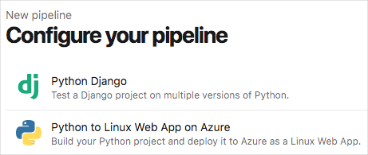
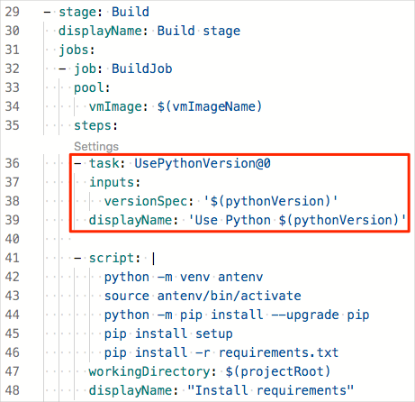

In this part, you'll learn some of the ways Azure and Azure DevOps support Python applications.

**Python** is an interpreted programming language designed to be easy to use and understand. Python includes strong native support for object-oriented programming, which enables developers to develop applications that scale in size and complexity, which makes it an ideal candidate for modern applications. You can learn more about the details at [python.org](https://www.python.org/?azure-portal=true).

## What is Django?

**Django** helps make the development of web applications in Python more practical. It provides a collection of modules and conventions that enable Python developers to efficiently build and maintain web applications using a variety of development tools and deployment targets. You can learn more at [djangoproject.com](https://www.djangoproject.com/?azure-portal=true).

> [!NOTE]
> This module is based on a Python project that makes use of Django, although the concepts apply to just about any Python application that may use other frameworks (or none at all).

## Python and Azure

Azure provides first-class support for Python. This means that you can take your existing codebase and, in most cases, deploy it directly to Azure without making modifications. On Azure, hosting a Node.js application is similar to hosting a .NET application, assuming that the proper dependencies are configured. Azure also enables you to configure environment variables for application settings, which means you can continue to load settings and secrets using standard methods for Python.

Once deployed to Azure, a Python application can connect to resources within Azure, across VPN connections, and anywhere else accessible via the internet. This includes consuming databases, document stores, and all the other resources and services Python developers rely on.

## Python and Azure DevOps

As a Python developer, you'll find a welcoming environment in Azure DevOps. Although Azure DevOps provides a wide range of features for managing the entire software lifecycle, you can choose the features you need to make the process as efficient as possible.

When you connect your code to Azure Pipelines, Azure Pipelines can automatically detect the language that you're using and provide starter code for your CI/CD pipeline.

Here's an example that shows starter code templates for a Python application:

Azure Pipelines provides built-in tasks that support the build, test, and deployment jobs you need to deploy source code from GitHub or anywhere else.

In Azure Pipelines, pipeline code is expressed through YAML configuration files. This example shows the built-in `UsePythonVersion@0` task, which installs the version of Python that you need t0 build your application.

If Azure Pipelines doesn't provide a specific task that you need, you can provide scripts that fill in the gaps. The `script` task in the previous example uses the `python` and `pip` programs to install dependencies and build the application.

Pipeline jobs are run on agents that are managed by Azure DevOps. Although you can use build agents that you manage, most jobs can be run entirely on Microsoft-hosted agents that include images for Windows, Linux, and macOS. These agents include common versions of Python, pip, PyPy, and Selenium web drivers for the browsers native to that platform. The exact software and versions available on each platform image vary, but you'll find details about each image at [Microsoft-hosted agents](/azure/devops/pipelines/agents/hosted?azure-portal=true).

> [!NOTE]
> Later in this module, you'll configure the pipeline to automatically run web browser tests by using Selenium. You'll find more resources about running Selenium and other functional tests at the end of this module.