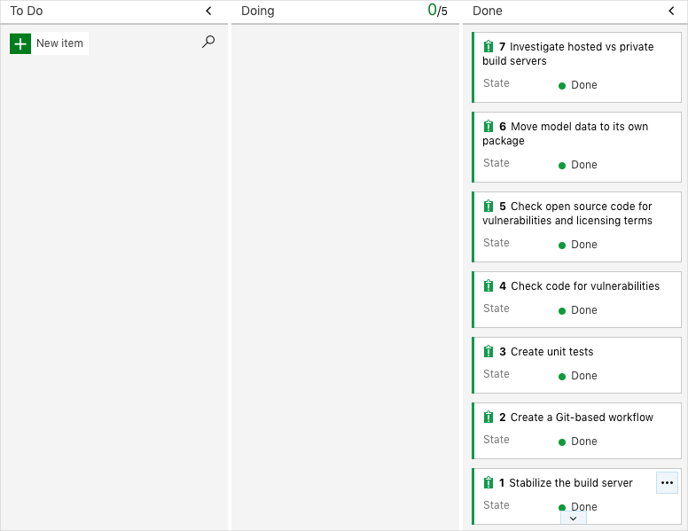

You're all done with the tasks for this module. In this unit, you move the work item to the **Done** state on Azure Boards and clean up your Azure DevOps environment.

> [!IMPORTANT]
> This page contains important cleanup steps. Cleaning up helps ensure that you don't run out of free build minutes. Be sure to perform the cleanup steps if you ran the template earlier in this module.

## Move the work item to Done

In this section, you move the work item that you previously assigned to yourself, **Investigate hosted vs private build servers**, to the **Done** column.

In practice, the definition of "Done" often means that working software is in the hands of your users. In this unit, for learning purposes, you mark this work as complete, because you have a private build agent working on Azure Pipelines.

At the end of each sprint, or work iteration, you and your team might hold a retrospective meeting in which you share the work you completed, what went well in the sprint, and what could be improved.

To complete the work item:

1. From Azure DevOps, go to **Boards** and then, in the left pane, select **Boards**.
1. Drag the **Investigate hosted vs private build servers** work item from the **Doing** column to the **Done** column.

    

## Disable the pipeline or delete your project

> [!IMPORTANT]
> You can skip this section if you plan to continue to the next module and use the same Azure DevOps project.

Each module in this learning path provides a template that you can run to create a clean environment for the duration of the module.

Running multiple templates creates multiple Azure Pipelines projects, each pointing to the same GitHub repository. This action can cause multiple pipelines to run each time you push a change to your GitHub repository. This action, in turn, can cause you to run out of free build minutes on our hosted agents. Therefore, it's important to disable or delete your pipeline before you move on to the next module.

Choose either of the next two options.

### Option 1: Disable the pipeline

This option disables the pipeline so that it doesn't process further build requests. You can reenable the build pipeline later if you want to. Choose this option if you want to keep your DevOps project and your build pipeline for future reference.

To disable the pipeline:

1. In Azure Pipelines, go to your pipeline.
1. Select **Edit**.

    
1. At the top right, select **Settings**.

    
1. Under **Processing of new run requests**, select **Disabled**, and then select **Save**.

    Your pipeline will no longer process build requests.

### Option 2 - Delete the Azure DevOps project

This option deletes your Azure DevOps project, including what's on Azure Boards and your build pipeline. In future modules, you'll be able to run another template that brings up a new project in a state where this one leaves off. Choose this option if you don't need your DevOps project for future reference.

To delete the project:

1. In Azure DevOps, go to your project. Earlier, we recommended that you name this project **Space Game - web - Agent**.
1. Select the gear icon next to the project name.

    The icon might not appear until you move your mouse over that area.

    
1. In the **Project details** area, scroll to the bottom, and then select **Delete**.

    
1. In the window that appears, enter the project name, and then select **Delete** a second time.

    Your project is now deleted.