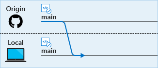
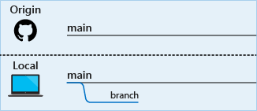
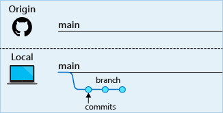
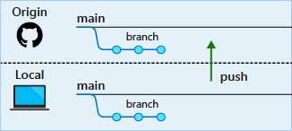
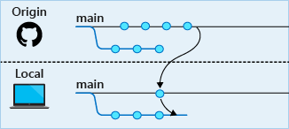
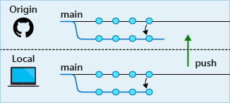

It's important to choose a code flow strategy that fits in with how your team works. There are several strategies to consider and you'll find links that explain them at the end of the module. The Tailspin web team will use a code flow strategy based on Git and GitHub.

When Mara set up Azure Boards, she and the team identified a few initial tasks to address. One of them was to create a Git-based workflow.

Let's listen in on the team as they work out a better way to collaborate. Currently, they are using a centralized version control system but the plan is to move to Git, a distributed system.

Mara is diligently working on her assigned features when Andy walks in.

**Andy**: Hi Mara, are you finished with those files yet? I need them released to finish my build. I'm blocked until I can get them.

**Mara**: I have one more small bug to fix and then I want to test all the files together. I should be done with them in a few hours.

Andy gives a heavy sigh.

**Andy**: Fine, just let me know when they are available.

**Mara**: You know Andy, maybe we should think about implementing a Git workflow now. It's on our board. If we were using distributed version control, you wouldn't be blocked. It would be much easier for all of us to work together on the same project. It's also a task on our board to increase visibility so all the stakeholders know what everyone is doing. I think a distributed source control system like Git would help there as well.

**Andy**: I've been wanting to try Git for a while. I just never seem to have the time. Is it difficult to learn or set up? If it seems reasonable, maybe we could work on it now. I'm tired of always putting things off. 

It would be nice to be able to see what everyone is doing and to have access to the entire repository. OK, what's it all about?

**Mara**: Let me explain it, and then you can decide if it sounds like a good fit.

Mara and Andy move to the whiteboard for a discussion on version control.

## What is Git and distributed version control?

<!-- TODO: Might be nice to draw out distributed vs. centralized on the whiteboard and add a screen cap here. -->

**Mara:** The drawing on the left is _centralized version control_ like what we are using now. We have a central version of the code base  in Team Foundation Version Control (TFVC) that everyone uses. We each check out the files we need to change and then merge them back into the master repository when we're finished with them. We all need access to the server in order to do that, so we are limited to working on the project only when we can access the server.

**Andy:** Like when I went to the conference. I couldn't get to the code.

**Mara:** Right! And you were blocked  from checking out the files you needed today because I have them checked out. We could use a branching strategy with TFVC to solve the blocking issue, but in our current configuration, merging might get a bit more complicated.

And remember when we had that breaking change  merged into the main repository? No one could get any work done until we got that solved. That problem is always lurking because we're all using the same copy of the code.

On the right is a drawing of _distributed version control_. We still have a main or _master_ repository  that's the stable version of the code base, but each developer has their own copy  of it to work from. This frees us up to experiment and try different approaches without affecting the main repository or locking other developers out of the files they're working with.

Distributed version control also ensures that only working code  gets merged into the master repository. We could even set it up to where code can't merge until it has been reviewed.

What's cool about Azure DevOps is that it works well with both centralized and distributed version control systems.

**Andy:** What happens when more than one person changes the same file?

**Mara:** Often, Git can merge multiple changes automatically. Of course, we want to always make sure the combination of changes results in working code. When Git can't automatically merge changes, it marks the conflicts directly in the files so that a human can choose what changes to accept.

**Andy:** What about the problem of accessing the code when we're not in the building?

**Mara:** I'm glad you asked. That's where hosting comes in.

## Where can I host my repository?

**Mara:** When deciding where to host our repositories, we have a few options. For example, we can host them on a local server, in Bitbucket, or GitHub. Bitbucket and GitHub are hosting solutions that are web-based. We can access them from anywhere.

**Andy:** Have you used either of these?

**Mara:** I've used GitHub in the past. It has features that are important to developers, like easy access to change logs and version control features from either the command line or the online portal.

**Andy:** So how does Git work?

## How do I work with Git?

**Mara:** Like I mentioned before, with distributed systems, developers are free to access any file they need without affecting other developers' work since they have their own copy of the repository. A _clone_ is your local copy of a repository.

When we work on a feature or a bug fix, we usually want to try out different approaches until we find the best solution. But trying out code on your copy of the main codebase isn't a good idea since you may not want to keep the first few tries.

To give you a better option, Git has a feature called _branching_ where you can maintain as many copies as you want and only merge back the one you want to keep. This keeps the main branch stable.

**Andy:** I get the concepts so far. How do I check in my code?

## How do my local changes get up to the main codebase?

**Mara:** In Git, the main branch, or _trunk_, is typically called `master`.

Once you feel your code is ready to be merged into the `master` branch in the main repository shared by all developers, you create what's called a _pull request_. When you create a pull request, you're telling the other developers that you have code ready to review and you want it merged into the `master` branch. When your pull request is approved, it becomes part of the master codebase.

## What does a branching workflow look like?

 :::row:::
    :::column span="8":::
**Step 1:**
When you begin to work on a new feature or bug fix, the first thing you want to do is make sure you are starting with the latest stable codebase. To do this, you can synchronize your local copy of the `master` branch with the server's copy. This pulls down all of the other developers' changes that have been pushed up to the `master` branch on the server since your last synchronization.
    :::column-end:::
    :::column:::
        
    :::column-end:::
 :::row-end:::
 :::row:::
    :::column span="8":::
**Step 2:**
To make sure you are working safely on your copy of the code, you create a new branch just for that feature or bug fix. As you can imagine, having many branches for all of the things you are doing might get hard to remember, so a good naming convention is critical here.

Before you make changes to a file, you check out a new branch so that you know you are working on the files from that branch and not a different branch. You can switch branches anytime by checking out that branch.
    :::column-end:::
    :::column:::
        
    :::column-end:::
:::row-end:::
 :::row:::
    :::column span="8":::
**Step 3:**
You're now safe to make whatever changes you want because these changes are only in your branch. As you work, you can _commit_ your changes to your branch to make sure you don't lose any work and to provide a way to roll back any changes you've made to previous versions. Before you can commit changes, you need to stage your files so that Git knows which ones you're ready to commit.
    :::column-end:::
    :::column:::
        
    :::column-end:::
:::row-end:::
 :::row:::
    :::column span="8":::
**Step 4:**
The next step is to _push_, or upload, your local branch up to the remote repository (such as GitHub) so that others can see what you're working on. Don't worry, this won't merge your changes yet. You can push up your work as often as you'd like. In fact, that's a good way to backup your work or allow you to work from multiple computers.
    :::column-end:::
    :::column:::
        
    :::column-end:::
:::row-end:::
:::row:::
    :::column span="8":::
**Step 5:**
This step is a common one, but not required. When you're satisfied that your code is working as you want it to, you can _pull_, or merge, the remote `master` branch back into your local  `master` branch. Changes have been taking place there that your local `master` branch doesn't have yet. Once you've synchronized the remote master branch into yours, merge your local `master` branch into your working branch and test your build again.

This process helps ensure that your feature works with the latest code. It also helps ensure that your work will integrate smoothly when you submit your pull request.
    :::column-end:::
    :::column:::
        
    :::column-end:::
:::row-end:::
:::row:::
    :::column span="8":::
**Step 6:**
Your local code now needs to be committed and pushed up to the hosted repository. This is the same as steps 3 and 4.
    :::column-end:::
    :::column:::
        
    :::column-end:::
:::row-end:::
:::row:::
    :::column span="8":::
**Step 7:**
You're finally ready to propose your changes to the remote `master` branch. To do this, you begin a pull request. This triggers your CI build process, such as Azure Pipelines, and you can watch your changes move through the pipeline. After the build succeeds and others approve your pull request, your code is merged into the remote `master` branch.
    :::column-end:::
    :::column:::
        
    :::column-end:::
:::row-end:::

**Andy**: This all looks complicated and hard to learn.

**Mara**: Git can seem intimidating because it's so powerful but once you get a hang of the flow it starts to feel natural.

There are really only a few commands you'll use daily. Here's a summary.

| Category                 | To perform this task                       | Use this command |
|--------------------------|--------------------------------------------|------------------|
| Repository management    | Create a Git repository                    | `git init`       |
|                          | Download a remote repository               | `git clone`      |
| Branch                   | Create a branch                            | `git checkout`   |
| Stage and commit changes | See which files have been changed          | `git status`     |
|                          | Stage files to commit                      | `git add`        |
|                          | Commit files to your branch                | `git commit`     |
| Remote synchronization   | Download a branch from a remote repository | `git pull`       |
|                          | Upload a branch to a remote repository     | `git push`       |

**Andy**: That sounds like a great starting point. I can definitely handle that. I can learn more advanced commands as I need them.