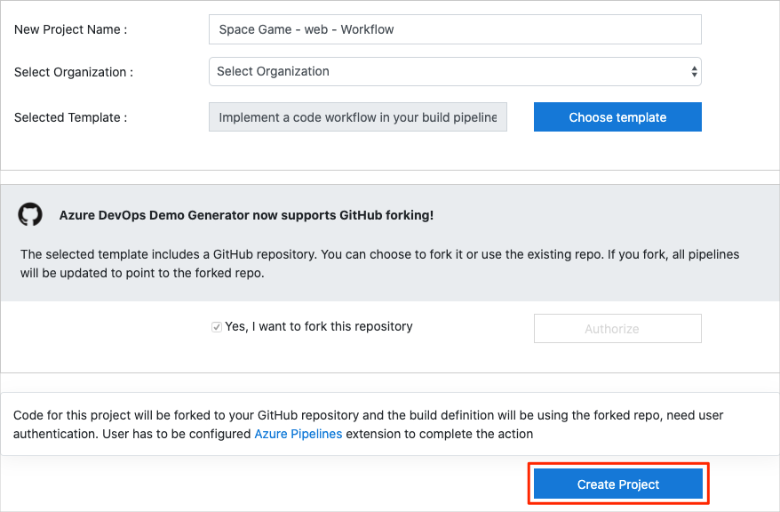

In this unit, you ensure that your Microsoft Azure DevOps organization is set up to complete the rest of this module.

To do this, you:

> [!div class="checklist"]
> * Set up an Azure DevOps project for this module.
> * Move the work item for this module on Azure Boards to the **Doing** column.
> * Make sure your project is set up locally so that you can push changes to the pipeline.

## Get the Azure DevOps project

Here, you make sure that your Azure DevOps organization is set up to complete the rest of this module. You do this by running a template that creates a project for you in Azure DevOps.

The modules in this learning path form a progression, where you follow the Tailspin web team through their DevOps journey. For learning purposes, each module has an associated Azure DevOps project.

### Run the template

Run a template that sets up everything for you in your Azure DevOps organization.

> [!div class="nextstepaction"]
> [Run the template](https://azuredevopsdemogenerator.azurewebsites.net/?name=implement-code-workflow&azure-portal=true)

To run the template, on the Azure DevOps Demo Generator site, do the following:

1. Select **Sign In**, and accept the usage terms.
1. On the **Create New Project** page, select your Azure DevOps organization, and then enter a project name, such as *Space Game - web - Workflow*.
1. Select **Fork repository on GitHub**, and then select **Authorize**. If a window appears, authorize access to your GitHub account.

    > [!IMPORTANT]
    > You need to select this option for the template to connect to your GitHub repository. Select it even if you've already forked the _Space Game_ website project. The template uses your existing fork.

1. Select **Create Project**.

    

    It takes a few moments for the template to run.
1. Select **Navigate to project** to go to your project in Azure DevOps.

> [!IMPORTANT]
> The [Clean up your Azure DevOps environment](/learn/modules/implement-code-workflow/9-clean-up-environment?azure-portal=true) page in this module contains important cleanup steps. Cleaning up helps ensure that you don't run out of free build minutes. Be sure to perform the cleanup steps even if you don't complete this module.

[!include]

## Move the work item to Doing

In this section, you assign yourself a work item that relates to this module on Azure Boards. You also move the work item to the **Doing** state. In practice, you and your team would assign work items at the start of each sprint, or work iteration.

Assigning work in this way gives you a checklist to work from. It gives others on your team visibility into what you're working on and how much work is left. It also helps the team enforce work in process (WIP) limits so that the team doesn't take on too much work at one time.

Recall that the team settled on these seven top issues:

> [!NOTE]
> Within an Azure DevOps organization, work items are numbered sequentially. In your project, the number that's assigned to each work item might not match what you see here.

Here you move the second item, **Create a Git-based workflow**, to the **Doing** column and assign yourself to the work item.

Recall that **Create a Git-based workflow** relates to moving to a code workflow that enables better collaboration among team members.

To set up the work item:

1. In Azure DevOps, go to **Boards** and then, in the left pane, select **Boards**.

    

1. In the **Create a Git-based workflow** work item, select the **To Do** down arrow, and then assign the work item to yourself.

    
1. Drag the work item from the **To Do** column to the **Doing** column.

    

At the end of this module, after you've completed the task, you'll move the card to the **Done** column.

[!include]