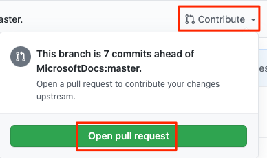
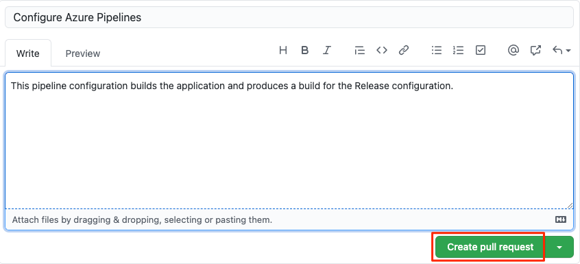

Here you'll practice the process of submitting a pull request and merging your changes into the `master` branch so everyone can benefit from your work.

In [Create a build pipeline with Azure Pipelines](/learn/modules/create-a-build-pipeline-azure-pipelines?azure-portal=true), you created a Git branch named `build-pipeline` where you defined a basic build pipeline for the _Space Game_ web site. Recall that your build definition goes in a file named **azure-pipelines.yml**.

Although your branch produces a build artifact, that work only exists on the `build-pipeline` branch. You need to merge your branch into `master`.

You already did most of the work. You created the `build-pipeline` branch and verified that your build works. All you need to do now is submit a pull request and merge the change.

Recall that a _pull request_ tells the other developers that you have code ready to review if necessary and you want your changes merged into another branch such as `master`.

Before we start, let's check in with Mara and Andy.

**Andy**: Hi, Mara. You showed us your build pipeline running on Azure. I'm adding a feature to the web site and I want to see the build process for myself. Are we ready to do that?

**Mara**: Absolutely. I set this up on a branch. Why don't we set up a pull request and get it merged into `master` so you can use it?

**Andy**: Sounds great. Let's take a look.

## Get the branch from GitHub

If you went through the previous module and have the `build-pipeline` branch locally, move to the next step.

Otherwise, if you don't have the `build-pipeline` branch, run this `git checkout` command to get it from Microsoft's repository.

```bash
git checkout --track upstream/build-pipeline
```

## Push your branch to GitHub

Your GitHub repository likely already has your latest changes to your `build-pipeline` branch, but let's make sure.

1. Run the following `git checkout` command to ensure you're on the `build-pipeline` branch.

    ```bash
    git checkout build-pipeline
    ```

1. Run `git status` to verify you have no more uncommitted work on your branch.

    ```bash
    git status
    ```

    You see this, which indicates that you have no additional work to add to your branch.

    ```output
    On branch build-pipeline
    nothing to commit, working tree clean
    ```

1. Run the following `git push` command to verify the latest version of your `build-pipeline` branch is on GitHub.

    ```bash
    git push origin build-pipeline
    ```

    You'll likely see that your branch is already synchronized with GitHub.

    ```output
    Everything up-to-date
    ```

## Create a pull request

1. From a browser, navigate to [github.com](https://www.github.com?azure-portal=true) and sign in.
1. Navigate to your **mslearn-tailspin-spacegame-web** repository.
1. From the dropdown menu, to navigate to your `build-pipeline` branch.

    

1. Click **New pull request** button to start your pull request.

    

1. Ensure that **base** specifies your forked repository and not Microsoft's repository.

    

    > [!IMPORTANT]
    > This step is important because you won't be able to merge your changes into Microsoft's repository. When you work directly with your own repository, and not a fork, your `master` branch is selected by default.

1. Specify a title for your pull request and add a description.

    * Title:
    > _Configure Azure Pipelines_
    * Description:
    > _This configuration builds the application and produces builds for both Debug and Release configurations._

1. Click the **Create pull request** button to complete your pull request.

    This step does not merge any code. It tells others that you have changes that you are proposing be merged.

    

    You see the pull request screen. You also see that the build status in Azure Pipelines is configured to appear as part of the pull request. This enables you and others to see the status of the build as it's running.

    

    Just like when you push a branch to GitHub, by default a pull request triggers Azure Pipelines to build your application.

1. As an optional step, click the **Details** link and trace the build as it moves through the pipeline.

    After the build completes, you see the **Artifacts** button appear in Azure Pipelines. You can hand off your build to the next step in the process, such as QA. Later, you can configure the pipeline to push your change all the way out to your QA lab or production.

1. Navigate back to your pull request on GitHub.

    You see that the build succeeded. You are now ready to merge your pull request.

    

1. After the build succeeds, click the **Merge pull request** button. Then click **Confirm merge**.
1. Click the **Delete branch** button to delete the `build-pipeline` branch from GitHub.

    

    It's completely safe to delete a branch from GitHub once you've merged your pull request. In fact, it's a common practice because the branch is no longer needed. The changes are merged and you can still find the details about the changes on GitHub or from the command line. Deleting merged branches also helps others see what work is currently active.

    Git branches are typically meant to be short-lived. After you merge a branch, you typically do not push additional commits onto it or merge it a second time. In most cases, you start with a clean branch that's based on the `master` branch every time you start on a new feature or bug fix.

    Deleting a branch on GitHub does not delete that branch from your local system. To do that, you would pass the `-d` switch to the `git branch` command.