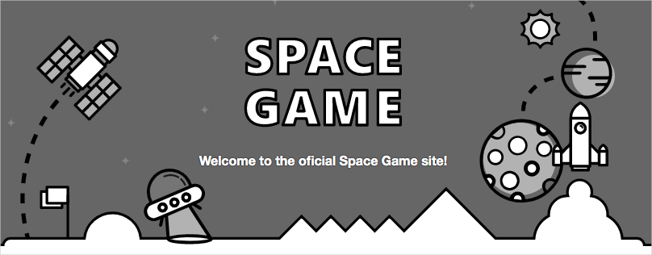
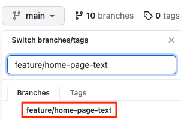

Here you'll practice the complete code workflow by pushing a small change to the _Space Game_ web site to GitHub.

Mara has been given the task of changing some text on the home page of the web site, `Index.cshtml`. Here, you'll follow along.

Let's briefly review steps you'll follow to complete the task.

> [!div class="checklist"]
> * Synchronize with the latest `master` branch on GitHub.
> * Create a branch to hold your changes.
> * Make the code changes you need and verify them locally.
> * Push your branch to GitHub.
> * Merge any recent changes from the `master` branch on GitHub into your local working branch and verify your changes still work.
> * Push up any remaining changes, watch Azure Pipelines build the application, and submit your pull request.

> [!IMPORTANT]
> This part builds on work you did in the [Create a build pipeline with Azure Pipelines](/learn/modules/create-a-build-pipeline?azure-portal=true) module. Be sure to complete that module before you continue with this one &mdash; it provides everything you need to get set up.

## Get the latest code from GitHub

Here you'll prepare Visual Studio Code for development, get the latest source code from GitHub, and run the application to verify things are working properly.

> [!NOTE]
> If you are using two-factor authentication on GitHub and are prompted for a user name and password, [create a personal access token](https://help.github.com/en/articles/creating-a-personal-access-token-for-the-command-line?azure-portal=true) for the command line.

### Prepare Visual Studio Code

1. Launch Visual Studio Code.
1. From the **View** menu, select **Terminal**.
1. Run the `cd` command to navigate to the directory where you put the _Space Game_ web project. Here's an example.

    ```bash
    cd ~/mslearn-tailspin-spacegame-web
    ```

### Fetch the latest master branch

In the last part, you created a pull request and merged your `build-pipeline` branch into the `master` branch on GitHub. Now you need to pull the changes to `master` back to your local branch.

The `git pull` command fetches the latest code from the remote repository and merges it into your local repository. This way you know you're working with the latest codebase.

1. From your terminal, run `git checkout master` to switch to the `master` branch.

    ```bash
    git checkout master
    ```

1. Run this `git pull` command to pull down the latest changes.

    ```bash
    git pull origin master
    ```

    You see the list of files that were changed. As an optional step, you can open **azure-pipelines.yml** to verify that it contains your complete build configuration.

    Recall that a Git repository where team members collaborate (such as on GitHub) is called a _remote_. Here, _origin_ specifies your repository on GitHub.

    Later, you'll fetch starter code from Microsoft's GitHub repository, known as _upstream_.

### Open the project in the file explorer

If you already have the _Space Game_ web project open in Visual Studio Code, move to the next step.

In Visual Studio Code, your terminal window points to the root directory of the _Space Game_ web project. Here you'll open the project from the file explorer so that you can view its structure and work with files.

1. From the **File** menu, select **Open**.
1. Navigate to the root directory of the _Space Game_ web project.

    You see the directory and file tree in the file explorer.

### Build and run the web application

Build and run the web application locally to make sure you have a working copy to start your changes.

1. From Visual Studio Code, navigate to the terminal window and run the following `dotnet build` command to build the application.

    ```bash
    dotnet build --configuration Release
    ```

1. Run the following `dotnet run` command to run the application.

    ```bash
    dotnet run --configuration Release --no-build --project Tailspin.SpaceGame.Web
    ```

### Verify the application is running

In development mode, the _Space Game_ web site is configured to run on port 5000.

1. From a new browser tab, navigate to [http://localhost:5000](http://localhost:5000?azure-portal=true) to see the running application.

    You see this.

    

    When you're finished, return to the terminal window and press <kbd>Control+C</kbd> to stop the running application.

## Create a feature branch

Here you'll create a Git branch so that you can work on files without impacting anyone else. No one will even know you're working on those files until you push them to the remote repository.

To create a branch, you use the `git checkout` command and give your branch a name.

Before you create a branch, it's a good idea to adhere to a naming convention. For example, if your branch is for working on a new feature, you might use `feature/<branch-name>`. For a bug fix, you could use `bugfix/<bug-number>`. Here your branch name will be `feature/home-page-text`.

1. From your terminal, run the following `git checkout` command.

    ```bash
    git checkout -b feature/home-page-text
    ```

    The `-b` argument specifies to create a new branch if it doesn't exist. Omit the `-b` argument when you want to switch to an existing branch.

    By default, your new branch builds on the previous branch from where you ran the `git checkout` command. Here, the parent branch is `master`. But the parent branch can be another one, such as a feature branch someone else started that you want to build on or experiment with.

    It's now safe to make whatever changes you need since you are on your own local branch. If you want to see which branch you are on, run `git branch -v`.

## Make changes and test it locally

1. From Visual Studio Code, open `Index.cshtml` under the `Tailspin.SpaceGame.Web/Views/Home` directory.
1. Locate this text near the top of the page.

    ```html
    <p>An example site for learning</p>
    ```

1. Replace the text in the previous step with this text and then save the file.

    ```html
    <p>Welcome to the oficial Space Game site!</p>
    ```

    > [!IMPORTANT]
    > The typing error, "oficial", is on purpose &mdash; we will address that later in this module.
1. From the terminal, run the following `dotnet build` command to build the application.

    ```bash
    dotnet build --configuration Release
    ```

1. Run the following `dotnet run` command to run the application.

    ```bash
    dotnet run --configuration Release --no-build --project Tailspin.SpaceGame.Web
    ```

1. From a new browser tab, navigate to [http://localhost:5000](http://localhost:5000?azure-portal=true) to see the running application.

    You see that the home page contains the updated text.

    

    When you're finished, return to the terminal window and press <kbd>Control+C</kbd> to stop the running application.

## Commit and push your branch

Here you'll stage your changes to **Index.cshtml**, commit the change to your branch, and push your branch up to GitHub.

1. Run `git status` to check whether there are uncommitted changes on your branch.

    ```bash
    git status
    ```

    You see that **Index.cshtml** has been modified. You'll commit that to your branch shortly, but first you need to make sure that Git is tracking this file. This is called _staging_ the file.

1. Run the following `git add` command to stage **Index.cshtml**.

    ```bash
    git add Tailspin.SpaceGame.Web/Views/Home/Index.cshtml
    ```

1. Run the following `git commit` command to commit your staged file to the `feature/home-page-text` branch.

    ```bash
    git commit -m "Improve the text at the top of the home page"
    ```

    The `-m` argument specifies the commit message. The commit message becomes part of a changed file's history. It helps reviewers understand the change as well as help future maintainers understand how the file changed over time.

    > [!TIP]
    > The best commit messages complete the sentence "If you apply this commit, you will ___."

    If you omit the `-m` argument, Git brings up a text editor where you can detail the change. This option is useful when you want to specify a commit message that spans multiple lines. The text up to the first blank line specifies the commit title.

1. Run this `git push` command to push, or upload, the `feature/home-page-text` branch to your repository on GitHub.

    ```bash
    git push origin feature/home-page-text
    ```

1. Navigate to GitHub to see that your branch has been pushed to your remote repository.

    

## Watch Azure Pipelines build the application

Just as you did previously, Azure Pipelines automatically queues the build when you push changes to GitHub.

As an optional step, trace the build as it moves through the pipeline and verify that the build succeeds.

## Synchronize any changes to the master branch

While you were busy working on your feature, there may have been changes made to the remote `master` branch. Before creating a pull request, it's common practice to get the latest from the remote `master` branch.

To do this, you first checkout, or switch to, the `master` branch. You then merge the remote `master` branch with your local `master` branch.

Next, you checkout your feature branch. Then you merge your feature branch with the `master` branch.

Let's try the process now.

1. From the terminal, run this `git checkout` command to checkout the `master` branch.

    ```bash
    git checkout master
    ```

1. Run this `git pull` command to download the latest changes to the remote `master` branch and merge those changes into your local `master` branch.

    ```bash
    git pull origin master
    ```

    Since no one actually made any changes to your `master` branch, this command tells you that everything is already up-to-date.

    ```output
    From https://github.com/username/mslearn-tailspin-spacegame-web
     * branch            master     -> FETCH_HEAD
    Already up to date.
    ```

1. Run `git checkout` to checkout your feature branch.

    ```bash
    git checkout feature/home-page-text
    ```

1. Merge your feature branch with `master`.

    ```bash
    git merge master
    ```

    Again, since no one actually made any changes to your `master` branch, you see that everything is still up to date.

    ```output
    Already up to date.
    ```

    If you did incorporate any changes, you would want to test your application again to make sure everything is still working.

## Push your local branch again

When you incorporate changes from the remote repository into your local feature branch, you need to push your local branch back to the remote repository a second time.

Although you didn't incorporate any changes from the remote repository, let's practice the process to see what happens.

1. Run this `git push` command to push your changes to GitHub.

    ```bash
    git push origin feature/home-page-text
    ```

    Once again, the response says that you are already up-to-date since no changes were made.

    ```output
    Everything up-to-date
    ```

## Submit a pull request

Here you'll submit a pull request just as you did in the previous part.

1. From a browser, navigate to [github.com](https://www.github.com?azure-portal=true) and sign in.
1. Navigate to your **mslearn-tailspin-spacegame-web** repository.
1. From the dropdown menu, navigate to your `feature/home-page-text branch`.
1. Click **New pull request** button to start your pull request.
1. Ensure that **base** specifies your repository and not Microsoft's repository.

    > [!IMPORTANT]
    > Again, this step is important because you won't be able to merge your changes into Microsoft's repository. When you work directly with your own repository, and not a fork, your `master` branch is selected by default.

1. Specify a title for your pull request and add a description.

    * Title:
    > _Improve the text at the top of the home page_
    * Description:
    > _Received the latest home page text from Irwin in product_

1. Click the **Create pull request** button to complete your pull request.

    This step doesn't merge any code. It tells others that you have changes that you are proposing be merged.

    You see the pull request screen. Just like before, by default a pull request triggers Azure Pipelines to build your application.

1. As an optional step, click the **Details** link or navigate to your project on Azure DevOps and watch the pipeline run.
1. When the build completes, navigate back to your pull request on GitHub.
1. Click the **Merge pull request** button. Then click **Confirm merge**.
1. Click the **Delete branch** button to delete the `feature/home-page-text` branch from GitHub.