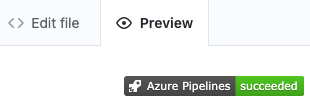

It's important for members of the team to know the status of the build. An easy way to quickly discover the build status is to add a build badge to the **README.md** file on GitHub. Here we check in on the team to see how it's done.

Andy is at his desk sifting through his emails. He's answering the third email related to the status of the build for the _Space Game_ web site.

**Andy**: There has to be some way to automate a status message. We have the pipeline, so we should be able to put a status somewhere. Maybe Mara knows how we can do it.

Andy finds Mara talking with Amita in the break room.

**Andy**: Hi, Amita. Mind if I borrow Mara for a second?

**Amita**: I have to get to a meeting anyway. Borrow away.

**Mara**: Hi Andy. What's up?

**Andy**: I really like the changes we've made to our build pipeline by using Azure Pipelines and Git is a great version control system. I was wondering, is there a way to let people know the status of the build?

**Mara**: Yes, actually. We can use a build badge.

## What is a build badge?

A _badge_ is part of Azure Pipelines. It has methods you can use to add an SVG image that shows the status of the build on your GitHub repository.

Most GitHub repositories include a file named **README.md** which is a Markdown file that includes essential details and documentation about your project. GitHub renders this file on your project's home page.

Here's an example build badge:

## Add the build badge

Up until now, you created Git branches locally to make changes to the _Space Game_ project. You can also propose changes directly through GitHub. Here you'll do that to set up your status badge.

1. From Azure DevOps, select **Pipelines** and then **Builds** from the side menu.
1. Click the ellipsis (**...**). Then click **Status badge**.

    

1. Under the **Sample Markdown** field, click the copy button to copy the Markdown code to your clipboard.
1. From GitHub, navigate to your project page.
1. Make sure you are on the `master` branch. Then locate **README.md** from the files area and click the file to open it.
1. Click the pencil icon to open the file in the editor.
1. At the top of the page, add a blank line and then paste the contents of the clipboard.
1. Click the **Preview changes** tab to see your proposed changes.

    GitHub renders the Markdown file and shows you the build badge.

    

## Commit your changes to master

Here you'll commit your changes to the `master` branch on GitHub.

1. Scroll to the bottom of the page and specify a commit message, such as "Add build badge".

    

1. Leave the "Commit directly to the `master` branch." option selected and  click the **Commit changes** button to commit your changes to the `master` branch.

    You see your badge on the **README.md** page.

    

    This process is a more basic way to merge code into GitHub. Instead of committing directly, you could have created a pull request with your changes for others to review.

    In practice, you would switch to the `master` branch and pull the latest changes from GitHub the next time you need to add a feature or address a bug.

**Andy**: Mara, you just made a change directly to master. Why didn't you use the flow you taught me? You know, with the feature branches.

**Mara**: We could have done that. But sometimes when people are only changing the Readme file or other documentation files, they commit to master right then. Plus, you and I were able to verify the work together before we merged the change. 
But this brings up a good point. If we can all just commit to master when we want to, we could be letting problems in the code slip into our master branch.

**Andy**: I've been meaning to talk to you about that.

Andy and Mara continue this conversation while walking back to their offices.

