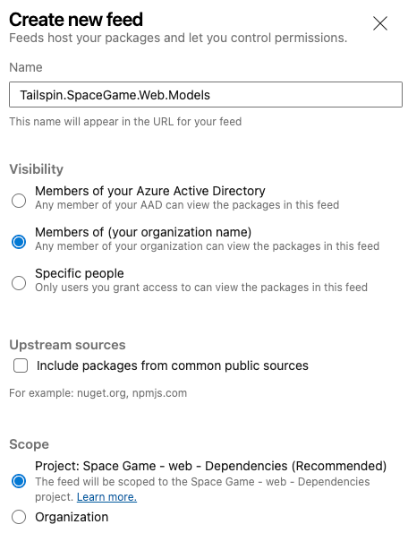

In this part, you'll set up Azure Artifacts and create a new feed. You'll use this feed later to store your new Models package, and to consume the package in your application pipeline.

## Set up Azure Artifacts

1. From a new browser tab, navigate to Azure DevOps and sign in.
1. Click the **Artifacts** tab and then **+ New feed**.
    1. Name the feed **Tailspin.SpaceGame.Web.Models**.
    1. Under **Visibility**, keep **People in your organization**.
    1. Under **Packages from public sources**, choose **Only use packages published to this feed**.

        The other choice, to use public sources, is if you want to create an *upstream* from this feed. That is, you can access your packages and packages from public package managers like Nuget or npmjs from this feed.

    1. Click **Create**.

        

1. Click **Connect to feed**

    This has a list of links, commands, and a credential provider you could use if you wanted to run this locally using Visual Studio. For brevity, we'll skip this part.

**Andy:** I've got Azure Artifacts set up. Now we need to create a pipeline that creates the new package there.
