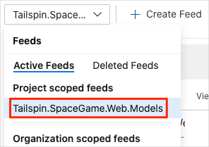
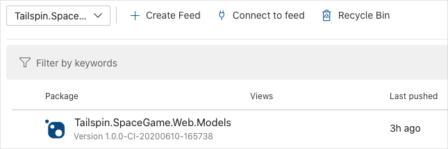

Here you'll get the team's new code for the *Tailspin.SpaceGame.Web.Models* project that is now separate from the *Tailspin.SpaceGame.Web* project. You'll create a Microsoft Azure Pipelines project for the Models project, and see the artifact in Microsoft Azure Artifacts with a version number of 1.0.0 in your feed.

## What changes were made to the project?

Recall that the _Space Game_ website is an ASP.NET Core application. It uses the Model-View-Controller (MVC) pattern to separate data from how that data is displayed in the user interface. Andy and Mara want to move the model classes to a separate library so that multiple projects can use those classes.

To do that, they create a new C# project, called **Tailspin.SpaceGame.Web.Models**, that contains only the model classes. At the same time, they remove the model classes from their existing project, **Tailspin.SpaceGame.Web**. They replace the model classes in their existing project with a reference to the **Tailspin.SpaceGame.Web.Models** project.

To build these projects, Andy and Mara use two pipelines, one for each project. You already have the first project and its associated Azure Pipelines configuration. Here, you'll fork the second project on GitHub, and create an Azure Pipelines configuration to build it. You'll publish the resulting package to Azure Artifacts.

## Prepare Visual Studio Code

Set up Visual Studio Code so you can work with source files.

1. From Visual Studio Code, open the integrated terminal.
1. Go to a directory to work from, such as your home directory (`~`). We suggest using the parent directory from where your **mslearn-tailspin-spacegame-web** project is located.

## Get the source code

Get the source code for the second project from GitHub, and set up Visual Studio Code so you can work with the files.

### Create a fork

The first step is to fork the **mslearn-tailspin-spacegame-web-models** repository so you can work with and modify the source files. Recall that Mara put the **Models** directory in a new project, and removed it from the web project.

To fork the **mslearn-tailspin-spacegame-web-models** project into your GitHub account:

1. From a web browser, go to [GitHub](https://github.com?azure-portal=true) and sign in.
1. Go to the [mslearn-tailspin-spacegame-web-models](https://github.com/MicrosoftDocs/mslearn-tailspin-spacegame-web-models?azure-portal=true) project.
1. Select **Fork**.
1. Follow the instructions to fork the repository into your account.

### Clone your fork locally

To clone the **mslearn-tailspin-spacegame-web-models** projects to your computer:

1. Go to your fork of the **mslearn-tailspin-spacegame-web-models** project on GitHub.
1. Select **Clone or download**. Then select the button next to the URL that's shown to copy the URL to your clipboard.
1. From Visual Studio Code, go to the terminal window and run this `git clone` command. Replace the URL that's shown with the contents of your clipboard.

    ```bash
    git clone https://github.com/your-name/mslearn-tailspin-spacegame-web-models.git
    ```

1. Move to the **mslearn-tailspin-spacegame-web-models** directory. This is the root directory of your repository.

    ```bash
    cd mslearn-tailspin-spacegame-web-models
    ```

### Open the project and examine the configuration

In Visual Studio Code, your terminal window points to the root directory of the **mslearn-tailspin-spacegame-web-models** project. Open the project from the file explorer so that you can view its structure and work with files.

1. From the **File** menu, select **Open** or **Open Folder**.
1. Go to the root directory of the **mslearn-tailspin-spacegame-web-models** project.

    You see the directory and file tree in the file explorer.

1. Open the *azure-pipelines.yml* file.

    You see the steps where the package is built, the version is set, and the package is added to Azure Artifacts.

    This `DotNetCoreCLI@2` task builds the project:

    ``` yml
    - task: DotNetCoreCLI@2
      displayName: 'Build the project - $(buildConfiguration)'
      inputs:
        command: 'build'
        arguments: '--no-restore --configuration $(buildConfiguration)'
        projects: '**/*.csproj'
    ```

    This `DotNetCoreCLI@2` task packages the project with a version of 1.0.0:

    ``` yml
    - task: DotNetCoreCLI@2
      displayName: 'Pack the project - $(buildConfiguration)'
      inputs:
        command: 'pack'
        projects: '**/*.csproj'
        arguments: '--no-build --configuration $(buildConfiguration)'
        versioningScheme: byPrereleaseNumber
        majorVersion: '1'
        minorVersion: '0'
        patchVersion: '0'
    ```

    When developing your package, it's common to use the `byPrereleaseNumber` versioning scheme. This appends a unique pre-release suffix, such as "-CI-20190621-042647" to the end of the version number. Following this example, the complete version number would be "1.0.0-CI-20190621-042647".

    This `NuGetCommand@2` task pushes the package to your **Tailspin.SpaceGame.Web.Models** Azure Artifacts feed:

    ```yml
    - task: NuGetCommand@2
      displayName: 'Publish NuGet package'
      inputs:
        command: push
        publishVstsFeed: 'Space Game - web - Dependencies/Tailspin.SpaceGame.Web.Models'
        allowPackageConflicts: true
      condition: succeeded()
    ```

## Create the pipeline in Azure Pipelines

You learned how to set up Azure Pipelines in an earlier module. If you need a refresher, head over to [Create a build pipeline with Azure Pipelines](/learn/modules/create-a-build-pipeline?azure-portal=true).

Since your solution has just the one project in it, the scope of the job agent is limited and cannot access the package. To make sure the agent has the permissions it needs to publish the artifact, you need to un-check **Limit job authorization scope to current project** in the pipeline settings.

1. From Azure DevOps, go to the **Space Game - web - Dependencies** project.
1. Select **Settings** at the bottom left of the screen.
1. Under **Pipelines** select **Settings**
1. Un-check **Limit job authorization scope to current project**.

Here, you'll set up a second pipeline to build the package and upload that package to Azure Artifacts.

1. From Azure DevOps, go to the **Space Game - web - Dependencies** project.
1. Select **Pipelines**, either from the project page or from the menu on the left and the the **All** tab.
1. Select **+ New Pipeline**.
1. From the **Connect** tab, select **GitHub**.
1. From the **Select** tab, select **mslearn-tailspin-spacegame-web-models**.

    a. When prompted, enter your GitHub credentials.

    b. From the page that appears, scroll to the bottom and select **Approve and install**.

    c. From the **Review** tab, you see the new pipeline's *azure-pipelines.yml* file.

    d. Select **Run**.
1. Watch the pipeline run.
1. Go to the **Artifacts** tab.
1. From the dropdown at the top, select **Tailspin.SpaceGame.Web.Models**.

    

    You see the resulting package, **Tailspin.SpaceGame.Web.Models**, in Azure Artifacts. Copy the version number where you can easily access it later. You'll use this version number in the next part.

    
