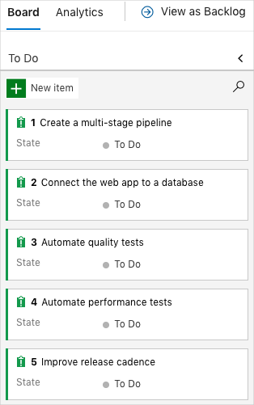

In this section, you make sure that your Azure DevOps organization is set up to complete the rest of this module.

To set up your Azure DevOps organization, you:

> [!div class="checklist"]
> * Add a user to ensure that Azure DevOps can connect to your Azure subscription.
> * Set up an Azure DevOps project for this module.
> * In Azure Boards, move the work item for this module to the **Doing** column.
> * Make sure that your project is set up locally so that you can push changes to the pipeline.

## Add a user to Azure DevOps

To complete this module, you need your own [Azure subscription](https://azure.microsoft.com/free/?azure-portal=true). You can get started with Azure for free.

You don't need an Azure subscription to work with Azure DevOps. But here you'll use Azure DevOps to deploy to resources that exist in your Azure subscription. To simplify the process, use the same Microsoft account to sign in to both your Azure subscription and your Azure DevOps organization.

If you use different Microsoft accounts to sign in to Azure and Azure DevOps, add a user to your DevOps organization under the Microsoft account that you use to sign in to Azure. For more information, see [Add users to your organization or project](https://docs.microsoft.com/azure/devops/organizations/accounts/add-organization-users?view=azure-devops&tabs=browser&azure-portal=true). When you add the user, choose the **Basic** access level.

Then sign out of Azure DevOps. Sign in again under the Microsoft account that you use to sign in to your Azure subscription.

## Get the Azure DevOps project

Here you make sure that your Azure DevOps organization is set up to complete the rest of this module. You run a template that creates a project in Azure DevOps.

The modules in this learning path form a progression. You follow the Tailspin web team through their DevOps journey. For learning purposes, each module has an associated Azure DevOps project.

### Run the template

Run a template that sets up your Azure DevOps organization.

> [!div class="nextstepaction"]
> [Run the template](https://azuredevopsdemogenerator.azurewebsites.net/?name=manage-database-changes&azure-portal=true)

On the Azure DevOps Demo Generator site, follow these steps to run the template.

1. Select **Sign In** and accept the usage terms.
1. From the **Create New Project** page, select your Azure DevOps organization. Enter a project name, such as *Space Game - web - Database*.

    

1. Select **Yes, I want to fork this repository**, and then select **Authorize**.
1. Select **Create Project**.

    The template takes a few moments to run.
1. To go to your project in Azure DevOps, select **Navigate to project**.

> [!IMPORTANT]
> The [Clean up your Azure DevOps environment](/learn/modules/manage-database-changes-in-azure-pipelines/8-clean-up-environment?azure-portal=true) page in this module contains important cleanup steps. Cleaning up helps ensure that you don't run out of free build minutes. Follow the cleanup steps even if you don't complete this module.

[!include]

## Move the work item to Doing

In this part, in Azure Boards you assign yourself a work item that relates to this module. You also move the work item to the **Doing** state. In practice, your team would assign work items at the start of each sprint, or work iteration.

Assigning work in this way gives you a checklist to work from. The work item lets your teammates see what you're working on and how much work is left. It also helps the team enforce work-in-progress (WIP) limits to avoid taking on too much work at one time.

Recall that the team settled on these top issues for the current sprint:

> [!NOTE]
> Within an Azure DevOps organization, work items are numbered sequentially. In your project, the number for each work item might not match what you see here.

Here you move the second item, **Connect the web app to a database**, to the **Doing** column. You assign yourself to the work item. **Connect the web app to a database** relates to connecting the _Space Game_ web application to a database and managing changes to the database schema in Azure Pipelines.

To set up the work item:

1. In Azure DevOps, navigate to **Boards**. In the menu, select **Boards**.

    

1. In the **Connect the web app to a database** work item, select the down arrow at the bottom of the card. Assign the work item to yourself.

    

1. Move the work item from the **To Do** column to the **Doing** column.

    

At the end of this module, you move the card to the **Done** column after you complete the task.

[!include]

[!include]
