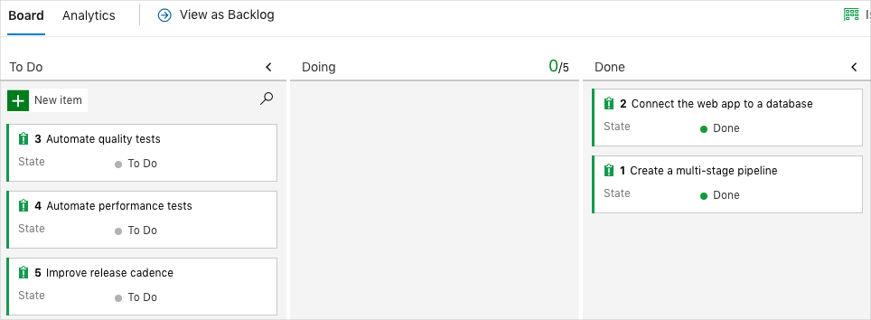

You're all done with the tasks for this module. Here, you'll move the work item to the **Done** state on Azure Boards and clean up your Azure DevOps environment.

> [!IMPORTANT]
> This page contains important cleanup steps. Cleaning up helps ensure that you don't run out of free build minutes. It also helps ensure that you're not charged for Azure resources after you complete this module.

## Clean up Azure resources

Here, you delete your Azure App Service instances and the database server and database. The easiest way to do that is to delete their parent resource group. Deleting a resource group deletes all resources in that group.

In [Create a release pipeline with Azure Pipelines](/learn/modules/create-release-pipeline?azure-portal=true), you managed Azure resources through the Azure portal. Here, you tear down your deployment by using the Azure CLI through Azure Cloud Shell, similar to how you created these resources earlier in this module.

To clean up your resource group:

1. Go to the [Azure portal](https://portal.azure.com?azure-portal=true) and sign in.
1. From the menu bar, select Cloud Shell. When prompted, select the **Bash** experience.

    

1. Run the following `az group delete` command to delete the resource group you used in this module, **tailspin-space-game-rg**.

    ```azurecli
    az group delete --name tailspin-space-game-rg
    ```

    When prompted, enter **y** to confirm the operation.

1. As an optional step, run the following `az group list` command after the previous command completes.

    ```azurecli
    az group list --output table
    ```

    You see that the resource group **tailspin-space-game-rg** no longer exists.

## Move the work item to Done

Here, you'll move the work item you assigned to yourself earlier in this module, **Manage database schema changes**, to the **Done** column.

In practice, the definition of "Done" often means working software in the hands of your users. For learning purposes, here you'll mark this work as complete because the goal for the Tailspin team is to connect the web app to a database.

At the end of each sprint, or work iteration, you and your team might hold a retrospective meeting, where you share the work you completed, what went well in the sprint, and what could be improved.

To complete the work item:

1. From Azure DevOps, navigate to **Boards** and then select **Boards** from the menu.
1. Move the **Connect the app to a database** work item from the **Doing** to the **Done** column.

    

## Disable the pipeline or delete your project

> [!IMPORTANT]
> You can skip this part if you plan to continue to the next module using the same Azure DevOps project.

Each module in this learning path provides a template you can run to create a clean environment for the duration of the module.

Running multiple templates gives you multiple Azure Pipelines projects, each pointing to the same GitHub repository. This can trigger multiple pipelines to run each time you push a change to your GitHub repository, which can cause you to run out of free build minutes on our hosted agents. Therefore, it's important that you disable or delete your pipeline before moving on to the next module.

Choose one of the following options.

### Option 1 - Disable the pipeline

This option disables the pipeline so that it does not process further build requests. You can re-enable the build pipeline later if you want to. Choose this option if you want to keep your DevOps project and your build pipeline for future reference.

To disable the pipeline:

1. From Azure Pipelines, navigate to your pipeline.
1. Click the **Edit** button.

    
1. From the menu in the upper corner, select **Settings**.

    
1. Under **Processing of new run requests**, select **Disabled** and then click **Save**.

    Your pipeline will no longer process build requests.

### Option 2 - Delete the Azure DevOps project

This option deletes your Azure DevOps project, including what's on Azure Boards and your build pipeline. In future modules, you'll be able to run another template that brings up a new project in a state where this one leaves off. Choose this option if you don't need your DevOps project for future reference.

To delete the project:

1. From Azure DevOps, navigate to your project. Earlier, we recommended that you name this project **Space Game - web - Deploy database**.
1. Click the gear icon next to the project name.

    The icon might not appear until you move your mouse over that area.

    
1. From the **Project details** area, scroll to the bottom and click **Delete**.

    
1. From the window that appears, enter the project name and click **Delete** a second time.

    Your project is now deleted.
