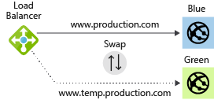
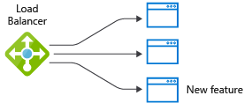

A _deployment pattern_ is an automated way to smoothly roll out new application features to your users. Choosing an appropriate deployment pattern helps you minimize downtime. Some patterns also enable you to roll out new features progressively, allowing you to validate new features with select users before making those features available to everyone.

In this section, you'll learn about some of the more common deployment patterns. You'll also learn how Azure App Service helps make it easy to implement the pattern that the Tailspin team chooses.

## Morning meeting

The Tailspin team is feeling good. Their pipeline has really sped up their process. The team has a development environment where they can integrate the webapp with a database. Both Tim and Amita are happy about having automated tests that make their jobs easier. In general, they're seeing fewer delays and fewer bugs. But there is, as always, a problem. Let's drop in on their team meeting, where Tim is talking.

**Tim:** It's so hard to keep everyone happy. Irwin thinks it takes too long to release new features. I can't do anything until management approves the release and, right now, there's no smooth way to roll it out once they give the okay. Not only does it take a long time but it's messy, it's manual, and there's down time. The whole process can take five days. I know that's too long but what am I supposed to do? Maybe if I just drink more coffee the solution will come to me.

**Andy:** Coffee is essential to all effective problem solving, no doubt. I also think that what we're talking about is called a *deployment pattern*.

A deployment pattern is an automated way to do the cut-over, where we move the software from the final testing stage to live production. Picking the right pattern definitely addresses your problems, like minimizing down time. Another advantage is that a deployment pattern would give us a chance to run tests that should really happen in production.

Here are the possibilities for us to consider:

*Andy starts writing on the white board.*

* Blue-Green deployment
* Canary releases
* Feature toggles
* Dark launches
* A/B testing
* Progressive exposure deployment

Let's briefly discuss each one.

## Blue-green deployments

A _blue-green deployment_ reduces risk and downtime by running two identical environments. These environments are called *blue* and *green*. At any time, only one of the environments is live. A blue-green deployment typically involves a router or load balancer that helps us control the flow of traffic.

Let's say blue is live. As we prepare a new release, we would do our final tests in the green environment. Once the software is working in the green environment, we would just switch the router so that all incoming requests go to the green environment. Blue-green deployment also gives us a fast way to do a rollback. If anything goes wrong in the green environment, we simply switch the router back to the blue environment.

## Canary releases

A _canary release_ is a way to identify potential problems as soon as possible without exposing all our users to the issue. The idea is that we would expose a new feature only to a small subset of users before making it available to everyone.

We would monitor what happens when we release the the feature. If the canary release has problems, we can apply a fix. After the canary release is known to be stable, we can move it to the actual production environment.

## Feature toggles

_Feature toggles_ let us "flip a switch” at runtime. We can deploy new software without exposing any other new or changed functionality to our users. Mara and I would build new features behind a toggle. When a release occurs, the feature is “off” so it's not impacting the production software. Depending on how we configure the toggle, we can flip the switch to "on" and expose it how we want.

For example, we could expose it to a small, select number of users to see how they react. We could expose it to a random sample of users. We could simply let it go live to everyone. Also, I'm not sure if this isn't more of a convenience for Mara and me. The big advantage to feature toggles is that it helps us avoid too much branching. Merging branches can be painful.

## Dark launches

A _dark launch_ is similar to a canary release or switching a feature toggle. Rather than expose a new feature to everyone, we would release it to a small set of users.

Those users don't know they're being used as test users and we wouldn't even highlight the new feature to them. That's why it's a dark launch. The software is gradually or unobtrusively released to users so we can get feedback and test performance.

## A/B testing

_A/B testing_ compares two versions of a webpage or app against each other to determine which one performs better. A/B testing is like an experiment we would run.

We would show two or more variations of a page to users at random, and then use statistical analysis to decide which variation performs better for our goals.

## Progressive exposure deployment

_Progressive exposure deployment_ is sometimes called ring-based deployment. It's another way of limiting the impact changes have on users while making sure those changes are valid in a production environment. Rings are basically an extension of the canary stage. The canary release releases to a stage to measure impact. Adding another ring is essentially the same thing.

With a ring-based deployment, we would deploy changes to risk-tolerant customers first, and then progressively roll out to a larger set of customers.

## Implementing the blue-green deployment

Andy looks at Tim.

**Andy:** That's a lot, I know. Do you want to take some time to think about it, or you and I could...

**Tim:** Blue-green.

Everyone in the room laughs.

**Mara:** Is that the coffee talking?

**Tim:** Feature toggles involve a change in how you and Andy work. Let's do one thing at a time. The methods that gradually expose a feature require statistical analysis or feature toggles. A blue-green deployment is something I can control. Switching a router is straightforward. It's easy and it sounds safe. This way management has an environment to evaluate. Then when they give the okay, we can easily switch. Let's start there.

So the question is, how do we do this with our pipeline?

## What are deployment slots?

**Andy:** Since we're using Azure App Service, we can take advantage of what are called *deployment slots*. Deployment slots are running apps that have their own host names.

I know we're not yet ready to deploy the _Space Game_ website to production. But as a test, we can add a deployment slot to our _Staging_ environment.

Instead of setting up a load balancer or a router, we can simply add a second slot to the App Service instance we use in our existing _Staging_ environment. We can call the primary slot *blue* and the secondary slot *green*.

This way we can deploy new features without any downtime. We could swap an application and its configuration between the two deployment slots. Basically we'd be swapping the IP addresses of the two slots.

**Tim:** I like that! You might call this variation of a blue-green deployment a *zero-downtime deployment*.

**Andy:** Great! Tim and I will work on getting this implemented and we can all meet later to show it to everyone.
