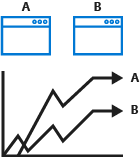
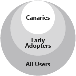

A _deployment pattern_ is an automated way to smoothly roll out new application features to your users. An appropriate deployment pattern helps you minimize downtime. Some patterns also enable you to roll out new features progressively. That way, you can validate new features with select users before you make those features available to everyone.

In this section, you'll learn about some common deployment patterns. You'll also learn how Azure App Service will help implement the pattern that the Tailspin team chooses.

## Morning meeting

The Tailspin team is feeling good. Their pipeline has sped up their process. The team has a development environment where they can integrate the web app with a database. Both Tim and Amita are happy to have automated tests that simplify their jobs. In general, they see fewer delays and fewer bugs. 

But there is, as always, a problem. Let's drop in on the team meeting, where Tim is talking.

**Tim:** It's so hard to keep everyone happy. Irwin thinks it takes too long to release new features. I can't do anything until management approves the release and, right now, there's no smooth way to roll out the features after they give the OK. The process is not only long but messy. It's manual, and there's downtime. The whole process can take five days. I know that's too long, but what am I supposed to do? Maybe if I just drink more coffee the solution will come to me.

**Andy:** Coffee is essential to all effective problem solving, no doubt. 

I think the solution we need is a good deployment pattern. A deployment pattern is an automated way to do the cutover. It's how we move the software from the final preproduction stage to live production. 

Picking the right pattern would definitely help you, like by minimizing downtime. Another advantage of a deployment pattern is that it gives us a chance to run tests that should really happen in production.

*Andy starts writing on the whiteboard.*

Here are the possibilities we should consider:

* Blue-green deployment
* Canary releases
* Feature toggles
* Dark launches
* A/B testing
* Progressive-exposure deployment

Let's briefly discuss each pattern.

## Blue-green deployments

A _blue-green deployment_ reduces risk and downtime by running two identical environments. These environments are called *blue* and *green*. At any time, only one of the environments is live. A blue-green deployment typically involves a router or load balancer that helps control the flow of traffic.

Let's say blue is live. As we prepare a new release, we do our final tests in the green environment. After the software is working in the green environment, we just switch the router so that all incoming requests go to the green environment. 

Blue-green deployment also gives us a fast way to do a rollback. If anything goes wrong in the green environment, then we just switch the router back to the blue environment.

## Canary releases

A _canary release_ is a way to identify potential problems early without exposing all users to the issue. The idea is that we expose a new feature to only a small subset of users before we make it available to everyone.

In a canary release, we monitor what happens when we release the feature. If the release has problems, then we apply a fix. After the canary release is known to be stable, we move it to the actual production environment.

## Feature toggles

_Feature toggles_ let us "flip a switch" at runtime. We can deploy new software without exposing any other new or changed functionality to our users. 

In this deployment pattern, Mara and I build new features behind a toggle. When a release occurs, the feature is "off" so that it doesn't affect the production software. Depending on how we configure the toggle, we can flip the switch to "on" and expose it how we want.

For example, we could expose the feature first to a small number of users to see how they react. That random sample of users sees the feature. Or we could just let the feature go live to everyone. 

But this deployment pattern might benefit Mara and me more than anyone else. The big advantage to the feature toggles pattern is that it helps us avoid too much branching. Merging branches can be painful.

## Dark launches

A _dark launch_ is similar to a canary release or switching a feature toggle. Rather than expose a new feature to everyone, in a dark launch we release the feature to a small set of users.

Those users don't know they're testing the feature for us. We don't even highlight the new feature to them. That's why it's called a dark launch. The software is gradually or unobtrusively released to users so we can get feedback and can test performance.

## A/B testing

_A/B testing_ compares two versions of a webpage or app to determine which one performs better. A/B testing is like an experiment.

In A/B testing, we randomly show users two or more variations of a page. Then we use statistical analysis to decide which variation performs better for our goals.

## Progressive-exposure deployment

_Progressive-exposure deployment_ is sometimes called _ring-based deployment_. It's another way to limit how changes affect users while making sure that those changes are valid in a production environment. 

Rings are basically an extension of the canary stage. The canary release releases to a stage to measure effect. Adding another ring is essentially the same idea.

In a ring-based deployment, we deploy changes to risk-tolerant customers first. Then we progressively roll out to a larger set of customers.

## Implementing the blue-green deployment

*Andy looks at Tim.*

**Andy:** That's a lot, I know. Do you want to take some time to think about it? Or you and I could ...

**Tim:** Blue-green.

*Everyone in the room laughs.*

**Mara:** Is that the coffee talking?

**Tim:** Feature toggles involve a change in how you and Andy work. Let's do one thing at a time. The methods that gradually expose a feature require statistical analysis or feature toggles. 

A blue-green deployment is something I can control. Switching a router is straightforward. It's easy and sounds safe. And in a blue-green deployment, management has an environment to evaluate. When they give the OK, we can easily switch. Let's start there.

So the question is, how do we implement a blue-green deployment in our pipeline?

## What are deployment slots?

**Andy:** Because we're using Azure App Service, we can take advantage of *deployment slots*. Deployment slots are running apps that have their own host names.

I know we're not yet ready to deploy the _Space Game_ website to production as part of the automated pipeline. But as a test, we can add a deployment slot to our **staging** environment.

Instead of setting up a load balancer or a router, we can just add a second slot to the App Service instance that we use in our existing _Staging_ environment. We can call the primary slot *blue* and the secondary slot *green*.

This way we can deploy new features without any downtime. We swap an application and its configuration between the two deployment slots. Basically we're swapping the IP addresses of the two slots.

**Tim:** I like that! You might call this variation of a blue-green deployment a *zero-downtime deployment*.

**Andy:** Great! Tim and I will work on implementing this deployment pattern. We can all meet later to see the results.
