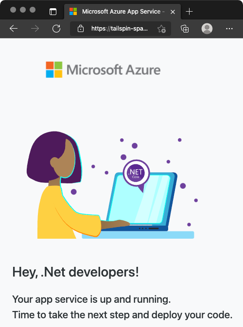

In [Create a multi-stage pipeline with Azure Pipelines](/learn/modules/create-multi-stage-pipeline?azure-portal=true), you built a basic deployment pipeline that deploys a web application to Azure App Service in these stages: _Dev_, _Test_, and _Staging_.

Here, you build on that workflow by implementing the *blue-green* deployment pattern during _Staging_.

To do so, you:

> [!div class="checklist"]
> * Add a deployment slot to the App Service instance that corresponds to _Staging_.
> * Add a task to the pipeline that swaps the deployment slots.

## Add a deployment slot

By default, every App Service instance provides a default slot, named *production*. You deployed to the *production* slot when you set up the pipeline in the previous section.

An App Service instance can have multiple slots. Here, you add second deployment slot to the App Service instance that corresponds to _Staging_. The deployment slot is named *swap*.

1. Go to the [Azure portal](https://portal.azure.com?azure-portal=true) and sign in.
1. From the menu bar, select Cloud Shell. When prompted, select the **Bash** experience.
1. Run the following command to get the name of the App Service instance that corresponds to _Staging_ and store the result in a Bash variable named `staging`.

    ```azurecli
    staging=$(az webapp list \
      --resource-group tailspin-space-game-rg \
      --query "[?contains(@.name, 'tailspin-space-game-web-staging')].{name: name}" \
      --output tsv)
    ```

    The `--query` argument uses [JMESPath](http://jmespath.org?azure-portal=true), a query language for JSON, to select the App Service instance whose `name` field contains "tailspin-space-game-web-staging".

1. Print the `staging` variable to verify that you got the correct name.

    ```bash
    echo $staging
    ```

    Here's example output:

    ```output
    tailspin-space-game-web-staging-1234
    ```

1. Run the following command to add a slot named *swap* to your _Staging_ environment.

    ```azurecli
    az webapp deployment slot create \
      --name $staging \
      --resource-group tailspin-space-game-rg \
      --slot swap
    ```

1. Run the following command to list your deployment slot's hostname.

    ```bash
    az webapp deployment slot list \
        --name $staging \
        --resource-group tailspin-space-game-rg \
        --query [].hostNames \
        --output tsv
    ```

    The result resembles this:

    ```output
    tailspin-space-game-web-staging-25391-swap.azurewebsites.net
    ```

    Make note of this hostname for later.

    As an optional step, navigate to your site in a browser. You see the default homepage because you haven't yet deployed your code to this slot.

    

    By default, a deployment slot is accessible from the internet. In practice, you could configure an Azure virtual network that places your *swap* slot in a non-internet routable network that's accessible only to you and your team. Your *production* slot would remain reachable from the internet.

## Swap deployment slots during _Staging_

Here, you use the [AzureAppServiceManage@0](https://docs.microsoft.com/azure/devops/pipelines/tasks/deploy/azure-app-service-manage?view=azure-devops?azure-portal=true) task to swap deployment slots in your _Staging_ environment.

You can also use this task to start, stop, or delete a slot, as well as install site extensions or enable continuous monitoring on App Service.

1. In Visual Studio Code, modify *azure-pipelines.yml* like this:

    > [!TIP]
    > You can replace the entire file or just update the part that's highlighted.

    [!code-yml[](code/4-azure-pipelines.yml?highlight=111-144)]

1. In the integrated terminal, add *azure-pipelines.yml* to the index, commit the changes, and push the branch up to GitHub.

    > [!TIP]
    > Remember to save *azure-pipelines.yml* before running these Git commands.

    ```bash
    git add azure-pipelines.yml
    git commit -m "Swap deployment slots"
    git push origin blue-green
    ```

    Note these changes:

    * The `AzureWebApp@1` task now specifies these values:
        * `deployToSlotOrASE`, when set to `true`, deploys to an existing deployment slot.
        * `resourceGroupName` specifies the name of the resource group, and is required when `deployToSlotOrASE` is `true`.
        * `slotName` specifies the name of the deployment slot.
    * The new task, `AzureAppServiceManage@0`, swaps the deployment slots.
        * `sourceSlot` and `targetSlot` specify the slots to swap.
        * `action` specifies the action to take. Recall that you can use this task to start, stop, or delete a slot. Here, "Swap Slots" specifies to swap the source and target slots.

1. From Azure Pipelines, trace the build through each of the steps.
1. As an optional step, go to the URL that corresponds to each stage in a browser.

    Although you haven't yet made changes to the website, you see that the _Space Game_ website successfully deployed to each App Service environment.

    