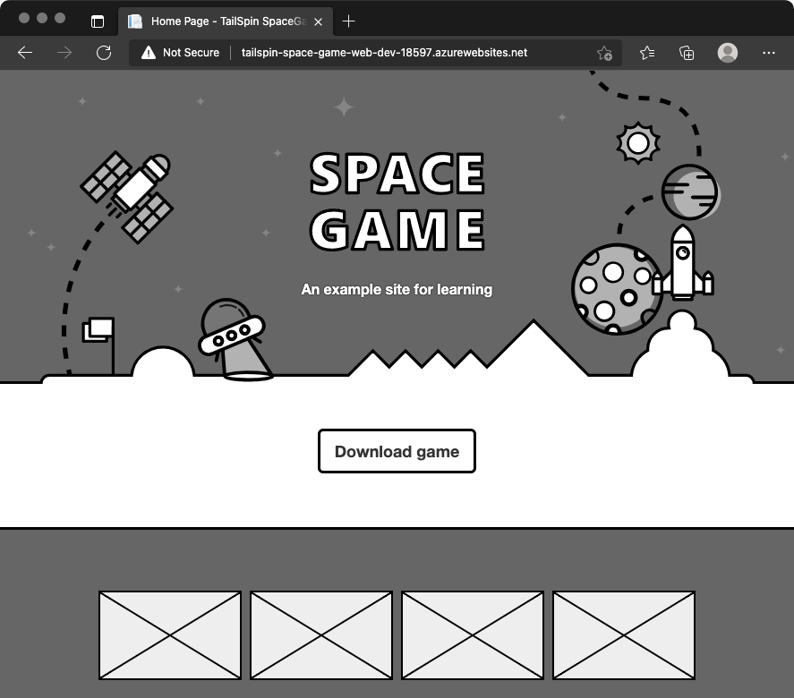

In [Create a multistage pipeline by using Azure Pipelines](/learn/modules/create-multi-stage-pipeline?azure-portal=true), you built a basic deployment pipeline that deploys a web application to Azure App Service in these stages: _Dev_, _Test_, and _Staging_.

Here you add to that workflow by applying the *blue-green* deployment pattern during _Staging_.

To do so, you:

> [!div class="checklist"]
> * Add a deployment slot to the App Service instance that corresponds to _Staging_.
> * Add a task to the pipeline to swap the deployment slots.

## Add a deployment slot

Here you add a deployment slot to the App Service instance that corresponds to _Staging_.

By default, every App Service instance provides a default slot, named *production*. You deployed to the *production* slot when you set up the pipeline in the previous section.

An App Service instance can have multiple slots. Here you add a second deployment slot to the App Service instance that corresponds to _Staging_. The deployment slot is named *swap*.

To add the slot:

1. Go to the [Azure portal](https://portal.azure.com?azure-portal=true) and sign in.
1. On the menu, select **Cloud Shell**. When you're prompted, select the **Bash** experience.
1. Run the following command to get the name of the App Service instance that corresponds to _Staging_ and to store the result in a Bash variable that's named `staging`.

    ```azurecli
    staging=$(az webapp list \
      --resource-group tailspin-space-game-rg \
      --query "[?contains(@.name, 'tailspin-space-game-web-staging')].{name: name}" \
      --output tsv)
    ```

    The `--query` argument uses [JMESPath](http://jmespath.org?azure-portal=true), which is a query language for JSON. The argument selects the App Service instance whose `name` field contains "tailspin-space-game-web-staging".

1. Print the `staging` variable to verify that you get the correct name.

    ```bash
    echo $staging
    ```

    Here's an example of the output:

    ```output
    tailspin-space-game-web-staging-1234
    ```

1. Run the following command to add a slot named *swap* to your **staging** environment.

    ```azurecli
    az webapp deployment slot create \
      --name $staging \
      --resource-group tailspin-space-game-rg \
      --slot swap
    ```

1. Run the following command to list your deployment slot's host name.

    ```azurecli
    az webapp deployment slot list \
        --name $staging \
        --resource-group tailspin-space-game-rg \
        --query [].hostNames \
        --output tsv
    ```

    The result resembles this output:

    ```output
    tailspin-space-game-web-staging-25391-swap.azurewebsites.net
    ```

    Make note of this host name for later.

1. As an optional step, go to your site in a browser. You see the default home page because you haven't yet deployed your code to this slot.

    

By default, a deployment slot is accessible from the internet. In practice, you could configure an Azure virtual network that places your *swap* slot in a network that's not routable from the internet but that only your team can access. Your *production* slot would remain reachable from the internet.

## Swap deployment slots in Staging

Here you use the [AzureAppServiceManage@0](https://docs.microsoft.com/azure/devops/pipelines/tasks/deploy/azure-app-service-manage?view=azure-devops?azure-portal=true) task to swap deployment slots in your _Staging_ environment.

You can also use this task to start, stop, or delete a slot. Or you can use it to install site extensions or to enable continuous monitoring on App Service.

1. In Visual Studio Code, modify *azure-pipelines.yml* by using this code:

    > [!TIP]
    > You can replace the entire file or just update the part that's highlighted.

    [!code-yml[](code/4-azure-pipelines.yml?highlight=111-144)]

    Note these changes:

    * The `AzureWebApp@1` task now specifies these values:
        * `deployToSlotOrASE`, when set to `true`, deploys to an existing deployment slot.
        * `resourceGroupName` specifies the name of the resource group. This value is required when `deployToSlotOrASE` is `true`.
        * `slotName` specifies the name of the deployment slot. Here you deploy to the slot that's named *swap*.
    * The new task, `AzureAppServiceManage@0`, swaps the deployment slots.
        * `sourceSlot` and `targetSlot` specify the slots to swap.
        * `action` specifies the action to take. Recall that you can use this task to start, stop, or delete a slot. Here, "Swap Slots" specifies to swap the source and target slots.

    This configuration always deploys to the *swap* slot. It then swaps the *production* and *swap* slots. The swap process ensures that *production* points to the more recent deployment.

1. In the integrated terminal, add *azure-pipelines.yml* to the index. Commit the changes, and then push the branch up to GitHub.

    > [!TIP]
    > Save *azure-pipelines.yml* before you run these Git commands.

    ```bash
    git add azure-pipelines.yml
    git commit -m "Swap deployment slots"
    git push origin blue-green
    ```

1. In Azure Pipelines, trace the build through each of the steps.
1. As an optional step, in a browser, go to the URL that corresponds to each stage.

    Although you haven't yet made changes to the website, you see that the _Space Game_ website successfully deployed to each App Service environment.

    