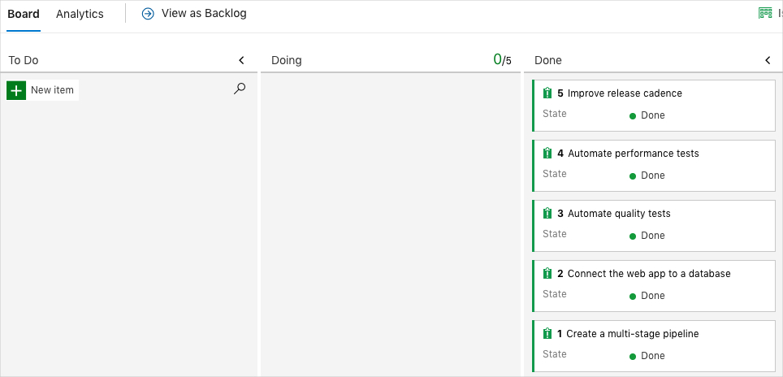

You're done with the tasks for this module. Here you clean up your Azure resources, move the work item to the **Done** state in Azure Boards, and then clean up your Azure DevOps environment.

> [!IMPORTANT]
> This page contains important cleanup steps. Cleaning up helps ensure that you don't run out of free build minutes. It also helps ensure that you're not charged for Azure resources after you complete this module.

## Clean up Azure resources

Here you delete your Azure App Service instances. The easiest way to do that is to delete their parent resource group. Deleting a resource group deletes all resources in that group.

To clean up your resource group:

1. Go to the [Azure portal](https://portal.azure.com?azure-portal=true) and sign in.
1. From the menu, select Cloud Shell. When you're prompted, select the **Bash** experience.

    

1. Run the following `az group delete` command to delete the resource group that you used in this module, **tailspin-space-game-rg**.

    ```bash
    az group delete --name tailspin-space-game-rg
    ```

    When you're prompted, confirm the operation by entering *y*.

1. As an optional step, after the previous command finishes, run the following `az group list` command.

    ```bash
    az group list --output table
    ```

    You see that the resource group **tailspin-space-game-rg** no longer exists.

## Move the work item to Done

Earlier in this module, you assigned the **Improve release cadence** work item to yourself. Here you move that work item to the **Done** column.

In practice, "Done" often means putting working software into the hands of your users. For learning purposes, here you mark this work as complete because you can now choose a deployment pattern that enables you to release changes more quickly to your users.

At the end of each _sprint_, or work iteration, your team might want to hold a retrospective meeting. In the meeting, you can share the work that you completed in the sprint, what went well, and what could be improved.

To complete the work item:

1. In Azure DevOps, go to **Boards**, and then select **Boards** from the menu.
1. Move the **Improve release cadence** work item from the **Doing** column to the **Done** column.

    

## Disable the pipeline or delete your project

Each module in this learning path provides a template that you run to create a clean environment for the module.

Running multiple templates gives you multiple Azure Pipelines projects. Each project points to the same GitHub repository. This setup can trigger multiple pipelines to run each time you push a change to your GitHub repository. These pipeline runs can consume free build minutes on our hosted agents. So it's important to disable or delete your pipeline before you move to the next module.

Choose one of the following options.

### Option 1 - Disable the pipeline

Here you disable the pipeline so that it processes no further build requests. You can reenable the build pipeline later if you want to. Choose this option if you want to keep your DevOps project and your build pipeline for future reference.

To disable the pipeline:

1. In Azure Pipelines, navigate to your pipeline.
1. From the drop-down menu, select **Settings**:

    
1. Under **Processing of new run requests**, select **Disabled** and then select **Save**.

    Your pipeline will no longer process build requests.

### Option 2 - Delete the Azure DevOps project

Here you delete your Azure DevOps project, including what's in Azure Boards and your build pipeline. In future modules, you can run another template that brings up a new project in a state where this module leaves off. Choose this option if you don't need your DevOps project for future reference.

To delete the project:

1. In Azure DevOps, go to your project. Earlier we recommended that you name this project **Space Game - web - Deployment patterns**.
1. Select the gear icon next to the project name.

   The icon might not appear until you move your mouse pointer over that area.

   
1. At the bottom of the **Project details** area, select **Delete**.

    
1. In the window that appears, enter the project name, and then select **Delete** again.

Your project is now deleted.