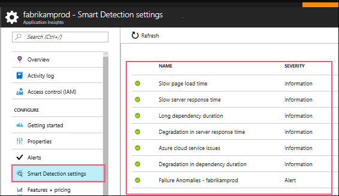

[Application Insights](/azure/azure-monitor/app/app-insights-overview?azure-portal=true) analyzes the performance of your web application and can warn you about potential problems.

This feature requires no special setup other than configuring your app for Application Insights (on ASP.NET, Java, or Node.js, and in the web page code). It's active once your app generates enough telemetry.

## When would I get a Smart Detection notification?

Application Insights sends a notification when it detects that the performance of your application has degraded in one of these ways:

- Response time degradation,

    Your app has started responding to requests more slowly than it used to. The change might have been sudden, for example if there was a regression in your latest deployment. Or, the degradation might have been gradual, perhaps because there is a memory leak.
- Dependency duration degradation.

    Your app makes calls to a REST API, database, or other dependency. The dependency is responding more slowly than it used to.
- Slow performance pattern.

    Your app has a performance issue that affects only some requests. For example, pages are loading more slowly on one type of browser than on others; or requests are being served more slowly from one particular server. Application Insights algorithms look at page load times, request response times, and dependency response times.

[Smart Detection](/azure/azure-monitor/app/proactive-diagnostics?azure-portal=true) is an Application Insights feature that warns you of potential performance problems and failure anomalies in your web application. It requires at least eight days of telemetry, at a sufficient volume, to establish a baseline. After that time period, any significant issue produces a notification.

## Does an alert always signify a problem?

An alert doesn't necessarily mean that your app has a problem. It's more of a suggestion about something you might want to look at more closely.

## How do I resolve issues?

Each alert notification includes diagnostic information. Here's an example of how you can use that information:

- For triage.

    The notification shows you how many users or how many operations are affected. This can help you assign a priority to the problem.
- To determine scope.

    Is the problem affecting all traffic or just some pages? Is it restricted to particular browsers or locations?
- For diagnostics.

    Often, the diagnostic information in the notification suggests the nature of the problem. For example, if response times slow down when the request rate is high, that suggests your server or dependencies are overloaded. If you  need more information, open the **Performance** section in Application Insights. There, you find profiler data. If exceptions were thrown, you can also try the snapshot debugger.

## Configure email notifications

Smart Detection notifications are enabled by default and sent to those who have *owners*, *contributors*, and *readers* access to the Application Insights resource. To change this, either select **Configure** in the email notification or open **Smart Detection settings** in Application Insights.

You can use the unsubscribe link in the Smart Detection email to stop receiving email notifications.

Emails about Smart Detection performance anomalies are limited to one email per day per Application Insights resource. The email is sent only if there's at least one new issue that was detected on that day.

## How can I improve performance?

Slow and failed responses are frustrating for website users. It's important to address the issues quickly. The steps to take to improve performance are:

1. Triage.
1. Diagnose.
1. Improve.

Let's look at these steps more closely, in terms of page load times.

### Triage

When looking at the issue, the first thing to ask is: does it matter? If a page is always slow to load but only 1% of your site's users ever look at it, then the issue is low priority. On the other hand, if only 1% of users open the page but it throws an exception every time, the priority is high. Use the impact statement (affected users or percentage of traffic) as a general guide, but be aware that impact isn't the whole story. Gather other evidence and consider the parameters of the issue. If the issue is dependent on geography, set up [availability tests](/azure/azure-monitor/app/monitor-web-app-availability?azure-portal=true) that include the region.

### Diagnose slow page loads

In diagnosing the issue, ask yourself these questions:

* Where is the problem?
* Is the server slow to respond?
* Is the page long?
* Does the browser have to do much work to display this page?

If you're investigating browser response times, open the **Browsers** metric. The segmented display of browser page load times shows where the time is going.

- If **Send Request Time** is high, either the server is responding slowly or the request is a POST with a large amount of data. Look at the [performance metrics](/azure/azure-monitor/app/web-monitor-performance#metrics) to investigate response times.
- Set up [dependency tracking](/azure/azure-monitor/app/asp-net-dependencies?azure-portal=true) to see whether the delay is due to external services or your database.
- If **Receiving Response** is predominant, your page and its dependent parts - JavaScript, CSS, images, and so on (but not asynchronously loaded data) are long. Set up an [availability test](/azure/azure-monitor/app/monitor-web-app-availability?azure-portal=true), and be sure to set the option to load dependent parts. When you get some results, open the detail of a result and expand it to see the load times of different files.
- A **High Client Processing** time suggests scripts are running slowly. If the reason isn't obvious, consider adding some timing code and send the times in `trackMetric` calls.

### Improve slow pages

Here are some places to get started when thinking about how to improve slow pages:

- Slow loading because of large files.

    Load the scripts and other parts asynchronously. Use script bundling. Break the main page into widgets that load their data separately. Don't send plain old HTML for long tables: use a script to request the data as JSON or other compact format, then fill the table in place.
- Slow server dependencies.

    Consider the geographical locations of your components. For example, if you're using Azure, make sure the web server and the database are in the same region. Do queries retrieve more information than they need? Would caching or batching help?
- Capacity issues.

    Look at the server metrics of response times and request counts. If response times peak disproportionately with peaks in request counts, it's likely that your servers are working too hard. Consider scaling up or scaling out.

## Server response time degradation

A response time degradation notification tells you:

- The response time as compared to the normal response time for this operation.
- How many users are affected.
- Average response time and 90th percentile response time for this operation on the day of the detection and seven days before.
- Count of operation requests on the day of the detection and seven days before.
- Correlation between degradation in this operation and degradations in related dependencies.
- Resources to help you diagnose the problem.
  - Profiler traces help you view where operation time is spent (the link is available if Profiler trace examples were collected for this operation during the detection period).
  - Performance reports in Metric Explorer, where you can examine time ranges and filters for this operation.
  - Search to look for this call to view specific call properties.
  - Failure reports - If the count is greater than 1, this means that there were failures in this operation that might have contributed to performance degradation.

## Dependency duration degradation

If your application relies heavily on external services, it's a good idea to watch for dependency degradation.

Here's an example dependency degradation notification:

This tells you:

- The duration compared to normal response time for this operation.
- How many users are affected.
- Average duration and 90th percentile duration for this dependency on the day of the detection and seven days before.
- The number of dependency calls on the day of the detection and seven days before.
- Resources to help you diagnose the problem.
  - Performance reports in Metric Explorer for this dependency.
  - Search for this dependency's calls to view call properties.
  - Failure reports. If there are one or more failures, this indicates there were failed dependency calls during the detection period that might have contributed to duration degradation.
  - Open Analytics with queries that calculate this dependency duration and count.

## Smart Detection of slow performing patterns

Application Insights finds performance issues that might only affect some portion of your users, or only affect users in some cases. For example, you might see that slow page loads happen only with one kind of browser or in a given geographical area.

Anomalies like these are hard to detect just by inspecting the data, but they're more common than you might think. Often, they only surface when your customers complain.

Application Insights algorithms look at page load times, request response times at the server, and dependency response times. You don't have to set any thresholds or configure rules. Machine learning and data mining algorithms are used to detect abnormal patterns. Here's an example of a notification:

The **When** field shows the time the issue was detected.

The **What** field describes:

- The problem that was detected.
- The events that led to the problem behavior.

The table compares the poorly performing set with the average behavior of all other events.

Select the links to open **Metric Explorer** and **Search** to find relevant reports that are filtered on the time and properties of the slow performing set. Then modify the time range and filters to explore the telemetry.
