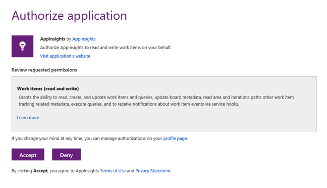
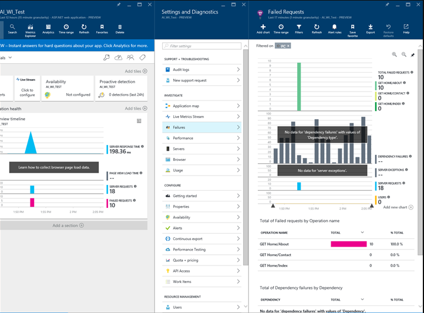
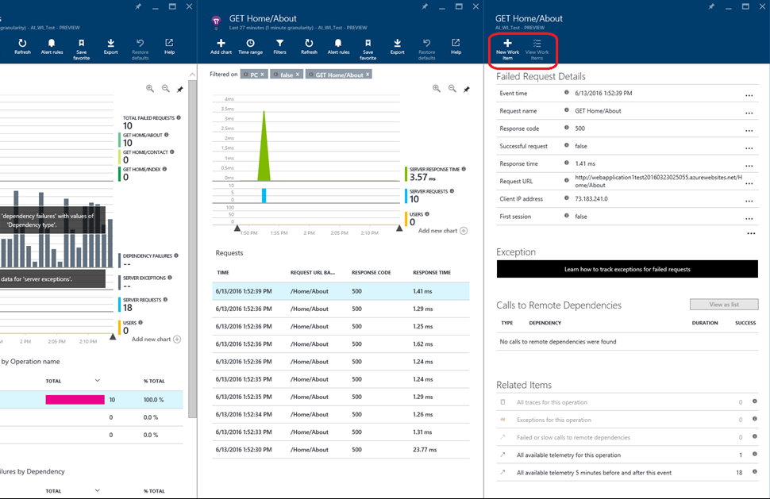
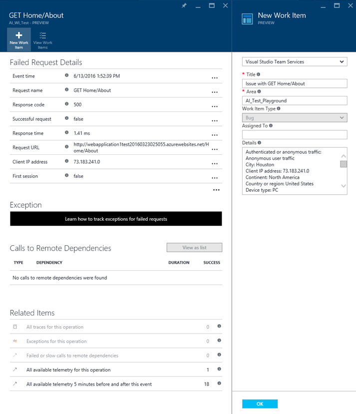
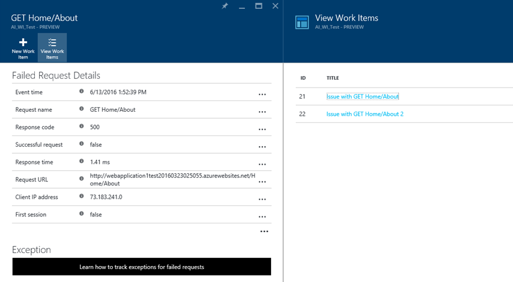
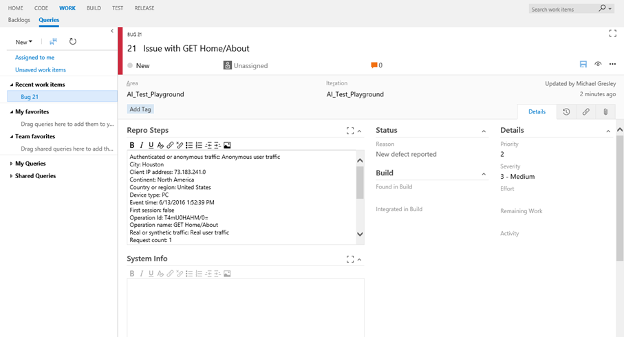

Copied form ILT

## ITSM Connector

Customers use Azure monitoring tools to identify, analyze and troubleshoot issues. However, the work items related to an issue is typically stored in an ITSM tool. Instead of having to go back and forth between your ITSM tool and Azure monitoring tools, customers can now get all the information they need in one place. ITSMC will improve the troubleshooting experience and reduce the time it takes to resolve issues. IT Service Management Connector (ITSMC) for Azure provides bi-directional integration between Azure monitoring tools and your ITSM tools – ServiceNow, Provance, Cherwell, and System Center Service Manager. Specifically, you can use ITSMC to:

Create or update work-items (Event, Alert, Incident) in the ITSM tools based on Azure alerts (Activity Log Alerts, Near Real-Time metric alerts and Log Analytics alerts)
Pull the Incident and Change Request data from ITSM tools into Azure Log Analytics.
You can setup ITSMC by following the steps in our documentation. Once set up, you can send Azure alerts to ITSM tool using the ITSM action in Action groups.

You can also view your incident and change request data in Log Analytics to perform trend analysis or correlate it against operational data.

https://docs.microsoft.com/en-gb/azure/azure-monitor/platform/itsmc-overview

## Integration with Azure Boards

Work item integration functionality allows you to easily create work items in VSTS that have relevant Application Insights data embedded in them. It is very straightforward to configure this association and begin creating work items (this process should only take a minute or two).

Configuring work item integration

To configure work item integration for an Application Insights resource, simply navigate to your settings blade for that resource. You’ll note that there is now a new item in the "Configure" section of the settings blade that says "Work Items."

 

Click on this, and the configuration blade for work items will open. All you need to do is fill out the information about the VSTS system to which you want to connect, along with the project where you want to write your work items:

Once that information is in place, you can click on the Authorization button, where you will be redirected to authorize access in your selected VSTS system so that work items can be written there:

Once you’ve completed the authorization process, you can set defaults for "area path" and "assigned to." Only area path is required (if you haven’t set up specific area paths in your project, that’s ok. Just use the name of the project, as it is the top-level area path. Click OK, and assuming you’ve entered everything correctly, you’ll see a message stating "Validation Successful" and the blade will close. You’re now ready to start creating work items!

Creating work items

Creating work items from Application Insights is very easy. There are currently two locations from where you can create work items: Proactive detection and individual instances of activity (i.e., exceptions, failures, requests, etc.). I will show you a simple example of the latter, but the functionality is identical in either case.

In this example, I’m looking at a test web app that I’ve published to Azure. I’ve started to drill into the activity for this app by looking at the Failures blade (but we could also get to this same information through the Search button or the Metrics Explorer):

 

We can see that I have a number of exceptions that fired when the user clicked on the Home/About tab on this web app. If I drill into this group of exceptions, I can see the list, and then choose an individual exception:

 

Looking at the detail blade for this exception, we see that there are now two buttons available at the top of the blade that read "New Work Item" and "View Work Items." To create a work item, I simply click on the first of these buttons, and it opens the new work item blade:

 

As you can see, just about everything you need in your average scenario has been filled out for you. The default values for "area path" and "assigned to" that you designated in the initial configuration are set, and all of the detail information we have available for this exception has been added to the details field. You can override the title, area path and assigned to fields in this blade if you wish, or you can add to the captured details. When you’re ready to create your work item, just clicked on the "OK" button, and your work item will be written to VSTS.

Viewing work items

Once you’ve created one or more work items in Application Insights, you can easily view them in VSTS. If you are in the Azure portal, the detail blade for the event associated to the work item(s) will have the "View Work Items" button enabled. To see the list, simply click the button:

If you click the link for the work item that you want to view, it will open in VSTS:

Advanced Configuration

Some of you may have noticed that there is a switch on the configuration blade that is labeled "Advanced Configuration." This is additional functionality that we’ve provided to help you configure your ability to write to VSTS in scenarios where you’ve changed or extended some of the out-of-the-box settings. A good example of this is designating additional required fields. Currently, there is no way to handle this additional required mapping in the standard config, but you can handle it in advanced mode.

If you click on the switch, the controls at the bottom of the blade will change to look like this:

 

You can see that you are now given a JSON-based editing box where you can specify all of the particular settings/mappings that you might need to handle modifications to your VSTS project. Some sample text is filled in for you. In the near future, we plan to enhance this control with intellisense as well as publish some basic guidance to better understand the advanced configuration mode.

Next steps

We think that this is a good start to integrating work item functionality with Application Insights. But, please keep in mind that this is essentially the 1.0 version of this feature set. We have a lot of work planned, and you will see a significant evolution in this space over the upcoming months. Just for starters, let me outline a few of the things that we already have planned or are investigating:

Support for all work item types – You probably noticed that the current feature set locks the work item type to just "bug." Logging bugs was our primary ask for this space, so that’s where we started, but we certainly don’t think that’s where things should end. One of the more near-term changes that you will see is to handle all work item types for all supported processes in VSTS.
Links back to Application Insights – It’s great to be able to create a work item with App Insights data in it, but what happens when you’re in your ALM system and looking at that item and want to quickly navigate back to the source of the work item in App Insights? We plan to add links to the work items in the very near future to make this as fast and easy as possible.
More flexible configuration – Currently, our standard configuration only handles scenarios where the user has not significantly modified/extended their project in VSTS. Today, if you’ve made these kind of changes, you’ll need to switch to advanced configuration mode. Going forward, we want to handle common things that people might change (e.g., making additional fields required, adding new fields) in the standard configuration wherever possible. This requires some updates from our friends on the VSTS team, but they are already working on some of these for us. Once they’re available, we will begin to make the standard configuration more flexible. In the meantime (and in the future), you can always use the advanced configuration to overcome any limitations.
Multiple profiles – Setting up a single configuration means that in shops where there are several ways in which users commonly create work items, the people creating work items from Application Insights would have to frequently override values. We plan to give users the capability to set up 1:n profiles, with standard values specified for each so that when you want to create a work item with that particular profile, you can simply choose it from a drop-down list.
More sources of creation for work items – We will continue to investigate (and take feedback on) other places in Application Insights where it makes sense to create work items.
Automatic creation of work items – There are certainly scenarios we can imagine (and I’m sure you can too) where we might want a work item to be created for us based upon criteria. This is definitely on the radar, but we are spending some design time with this to limit possibilities of super-noisy or runaway work item creation. We believe that this is a powerful and convenient feature, but we want to reduce the potential for spamming the ALM system as much as possible.
Support for other ALM systems – Hey, we think that VSTS is an awesome product, but we recognize that many of our users may use some other product for their ALM, and we want to meet people where they are. So, we are working on additional first-tier integrations of popular ALM products. We also plan to provide a pure custom configuration choice (similar to advanced config for VSTS) so that end users will be able to hook up Application Insights to virtually any ALM system.
