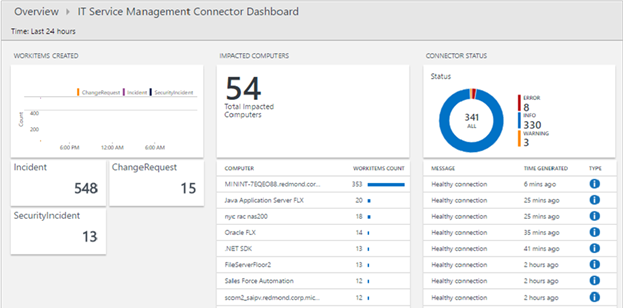
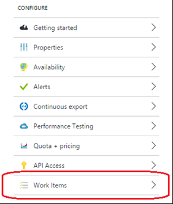
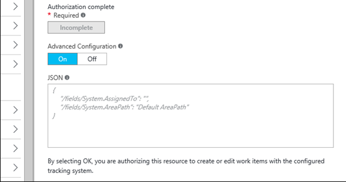

TODO: In this part, you ...

TODO: Any introduction from the TS team?

Azure monitoring tools enable you to to identify, analyze, and troubleshoot issues. However, the work items related to an issue are typically stored in an ITSM tool. Instead of having to go back and forth between your ITSM tool and Azure monitoring tools, customers can now get all the information they need in one place. ITSMC will improve the troubleshooting experience and reduce the time it takes to resolve issues.

## What IT Service Management Connector?

[IT Service Management Connector](https://docs.microsoft.com/azure/azure-monitor/platform/itsmc-overview) (ITSMC) for Azure provides bidirectional integration between Azure monitoring tools and your ITSM tools, including ServiceNow, Provance, Cherwell, and System Center Service Manager. You can use ITSMC to:

* Create or update work-items (event, alert, incident) in the ITSM tools, based on Azure alerts.
* Pull incident and change request data from ITSM tools into Azure Log Analytics.

You can send Azure alerts to ITSM tool using the ITSM action in Action groups. TODO: Here's a ...

You can also view your incident and change request data in Log Analytics to perform trend analysis or correlate against operational data.

TODO: Here's a ...

## Integration with Azure Boards

Work item integration enables you to more easily create work items in VSTS that have relevant Application Insights data embedded in them.

### Configuring work item integration

To configure work item integration for an Application Insights resource, go to the settings for that resource in the Azure portal. From the **Configure** section, select **Work Items**.

Fill out the information about the Azure DevOps organization to connect to, along with the project where you want to maintain your work items:

Once that information is in place, you can click on the Authorization button, where you will be redirected to authorize access in your selected VSTS system so that work items can be written there:

Once you’ve completed the authorization process, you can set defaults for "area path" and "assigned to." Only area path is required (if you haven’t set up specific area paths in your project, that’s ok. Just use the name of the project, as it is the top-level area path. Click OK, and assuming you’ve entered everything correctly, you’ll see a message stating "Validation Successful" and the blade will close. You’re now ready to start creating work items!

### Creating work items

Creating work items from Application Insights is very easy. There are currently two locations from where you can create work items: Proactive detection and individual instances of activity (i.e., exceptions, failures, requests, etc.). I will show you a simple example of the latter, but the functionality is identical in either case.

In this example, I’m looking at a test web app that I’ve published to Azure. I’ve started to drill into the activity for this app by looking at the Failures blade (but we could also get to this same information through the Search button or the Metrics Explorer):

 

We can see that I have a number of exceptions that fired when the user clicked on the Home/About tab on this web app. If I drill into this group of exceptions, I can see the list, and then choose an individual exception:

 

Looking at the detail blade for this exception, we see that there are now two buttons available at the top of the blade that read "New Work Item" and "View Work Items." To create a work item, I simply click on the first of these buttons, and it opens the new work item blade:

 

As you can see, just about everything you need in your average scenario has been filled out for you. The default values for "area path" and "assigned to" that you designated in the initial configuration are set, and all of the detail information we have available for this exception has been added to the details field. You can override the title, area path and assigned to fields in this blade if you wish, or you can add to the captured details. When you’re ready to create your work item, just clicked on the "OK" button, and your work item will be written to VSTS.

### Viewing work items

Once you’ve created one or more work items in Application Insights, you can easily view them in VSTS. If you are in the Azure portal, the detail blade for the event associated to the work item(s) will have the "View Work Items" button enabled. To see the list, simply click the button:

If you click the link for the work item that you want to view, it will open in VSTS:

### Advanced configuration

Some of you may have noticed that there is a switch on the configuration blade that is labeled "Advanced Configuration." This is additional functionality that we’ve provided to help you configure your ability to write to VSTS in scenarios where you’ve changed or extended some of the out-of-the-box settings. A good example of this is designating additional required fields. Currently, there is no way to handle this additional required mapping in the standard config, but you can handle it in advanced mode.

If you click on the switch, the controls at the bottom of the blade will change to look like this:

 

You can see that you are now given a JSON-based editing box where you can specify all of the particular settings/mappings that you might need to handle modifications to your VSTS project. Some sample text is filled in for you. In the near future, we plan to enhance this control with intellisense as well as publish some basic guidance to better understand the advanced configuration mode.

TODO: Summarize any interesting observations here.
TODO: Any observations from the TS team?