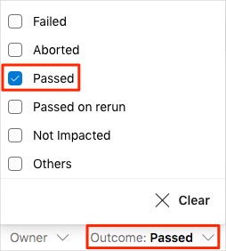
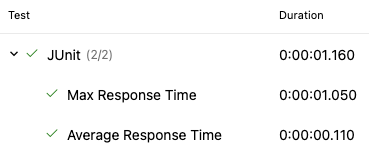

In this section, you run the test plan that Mara and Tim created in the release pipeline. The test plan uses Apache JMeter to run load tests.

Here's how you run the tests:

> [!div class="checklist"]
> * Fetch and check out a Git branch that implements the tests.
> * Modify your pipeline to install JMeter, run the test plan, transform the results to JUnit, and publish the results to Azure Pipelines.
> * Push your branch to GitHub, watch the tests run in Azure Pipelines, and then examine the results.

## Fetch the branch from GitHub

In this section, you fetch the `jmeter` branch from GitHub and check out, or switch to, that branch.

This branch contains the _Space Game_ project that you worked with in previous modules. It also contains an Azure Pipelines configuration to start with.

1. In Visual Studio Code, open the integrated terminal.
1. To download a branch named `jmeter` from the Microsoft repository and switch to that branch, run the following `git fetch` and `git checkout` commands:

    ```bash
    git fetch upstream jmeter
    git checkout -b jmeter upstream/jmeter
    ```

    Recall that *upstream* refers to the Microsoft GitHub repository. Your project's Git configuration understands the upstream remote because you set up that relationship when you forked the project from the Microsoft repository and cloned it locally.

    Shortly, you'll push this branch up to your GitHub repository, known as `origin`.

1. Optionally, in Visual Studio Code, open the *azure-pipelines.yml* file. Review the initial configuration.

    The configuration resembles the ones that you created in previous modules in this learning path. It builds only the application's **Release** configuration. For brevity, it omits the triggers, manual approvals, and tests that you set up in previous modules.

    [!include[](../../shared/includes/pipeline-branches-note.md)]

1. Optionally, in Visual Studio Code, you can check out the JMeter test plan file, *LoadTest.jmx*, and the XLST transform, *JMeter2JUnit.xsl*. The XLST file transforms the JMeter output to JUnit so that Azure Pipelines can visualize the results.

## Add the STAGING_URL variable to Azure Pipelines

Tim's original test plan provides a hard-coded value for the host name of the _Space Game_ website that runs in the **staging** environment.

To make the test plan more flexible, your version uses a JMeter property. Think of a property as a variable that you can set from the command line.

Here's how the `hostname` variable is defined in JMeter:


Here's how the `hostname` variable uses the [__P](https://jmeter.apache.org/usermanual/functions.html?azure-portal=true#__P) function to read the `hostname` variable.


The corresponding test plan file, *LoadTest.jmx*, specifies this variable and uses it to set the host name.

When you run JMeter from the command line, you use the `-J` argument to set the `hostname` property. Here's an example:

```bash
apache-jmeter-5.2/bin/./jmeter -n -t LoadTest.jmx -o Results.xml -Jhostname=tailspin-space-game-web-staging-1234.azurewebsites.net
```

Here you set the `STAGING_HOSTNAME` variable in Azure Pipelines. This variable points to your site's host name that runs on App Service in your **staging** environment.

When the agent runs, this variable is automatically exported to the agent as an environment variable. So your pipeline configuration can run JMeter this way:

```bash
apache-jmeter-5.2/bin/./jmeter -n -t LoadTest.jmx -o Results.xml -Jhostname=$(STAGING_HOSTNAME)
```

Let's add the pipeline variable now, before you update your pipeline configuration. To do so:

1. In Azure DevOps, go to your **Space Game - web - Nonfunctional tests** project.
1. Under **Pipelines**, select **Library**.
1. Select the **Release** variable group.
1. Under **Variables**, select **+ Add**.
1. For the name of your variable, enter *STAGING_HOSTNAME*. For its value, enter the URL of the App Service instance that corresponds to your **staging** environment, such as *tailspin-space-game-web-dev-1234.azurewebsites.net*.

    > [!IMPORTANT]
    > Don't include the `http://` or `https://` protocol prefix in your value. JMeter provides the protocol when the tests run.

1. To save your variable to the pipeline, near the top of the page, select **Save**.

    Your variable group resembles this one:

    

## Modify the pipeline configuration

In this section, you modify the pipeline to run your load tests during the _Staging_ stage.

1. In Visual Studio Code, open the *azure-pipelines.yml* file. Then modify the file:

    > [!TIP]
    > You can replace the entire file or just update the part that's highlighted.

    [!code-yml[](code/5-azure-pipelines.yml?highlight=133-155)]

    Here's a summary of the changes:

    * The `RunLoadTests` job does load testing from a Linux agent.
    * The `RunLoadTests` job depends on the `Deploy` job to ensure that the jobs are run in the correct order. You need to deploy the website to App Service before you can run the load tests. If you don't specify this dependency, jobs within the stage can run in any order or run in parallel.
    * The `jmeterVersion` variable specifies the version of JMeter to install. Using a variable helps make it easier to upgrade to newer versions.
    * The first `script` task downloads and installs JMeter.
    * The second `script` task runs JMeter. The `-J` argument sets the `hostname` property in JMeter by reading the `STAGING_HOSTNAME` variable from the pipeline.
    * The third `script` task installs **xsltproc**, an XSLT processor, and transforms the JMeter output to JUnit.
    * The `PublishTestResults@2` task publishes the resulting JUnit report, *JUnit.xml*, to the pipeline. Azure Pipelines can help you visualize the test results.

1. In the integrated terminal, add *azure-pipelines.yml* to the index, commit the changes, and push the branch up to GitHub.

    ```bash
    git add azure-pipelines.yml
    git commit -m "Run load tests with Apache JMeter"
    git push origin jmeter
    ```

## Watch Azure Pipelines run the tests

Here you watch the pipeline run. You see the load tests run during _Staging_.

1. In Azure Pipelines, go to the build and trace it as it runs.

    During _Staging_, you see the load tests run after the website is deployed.
1. After the build finishes, go to the summary page.

    

    You see that the deployment and the load tests finished successfully.
1. Near the top of the page, note the summary.

    You see that the build artifact for the _Space Game_ website is published just like always. Also note the **Tests** section, which shows that the load tests have passed.

    

1. Select the test summary to see the full report.

    The report shows that both tests have passed.

    

    If any test were to fail, you would see detailed results of the failure. From those results, you could investigate the source of the failure.

    Recall that the XSLT file produces a JUnit file, *JUnit.xml*. The JUnit file answers these two questions:

    * Is the average request time less than one second?
    * Do fewer than 10 percent of requests take more than one second to complete?

    The report proves that these requirements are met. To see more details, select the **Outcome** arrow in the report. Then make sure that only **Passed** is selected.

    

    You see that the **Average Response Time** and **Max Response Time** test cases both succeeded.

    

> [!NOTE]
> You're using the **B1** App Service plan, which runs on the **Basic** tier. This plan is intended for apps that have low traffic requirements, such as apps in a test environment. Because of this plan, the performance of your website might be less than you expect. In practice, you would choose a plan for the **staging** environment that more closely matches your production environment. For example, the **Standard** and **Premium** plans are for production workloads. These run on dedicated virtual machine instances.

**Tim:** Mara, I don't need to tell you this, but at first I resisted the changes you proposed. I feared losing control over my production environment. But even with all these changes, I still have control. Plus, we now do load testing earlier in the process. In the past, I waited until just before we released because the process was time-consuming. Now we can continuously monitor how our websites perform. If performance drops, we know which change caused the decline.

**Mara:** Early testing also gives us enough time to fix the problem, rather than scrambling at the last minute. I love your attitude, Tim. Thanks for sticking with it!
