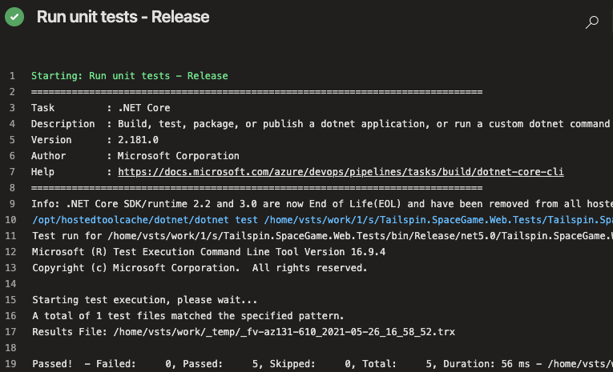
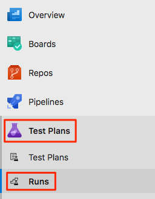

Andy is going to work with Mara to add unit tests to the automated build that Mara created with Microsoft Azure Pipelines. Regression bugs are creeping into their code and breaking the leaderboard's filtering functionality. Specifically, the wrong game mode keeps appearing.

The following image illustrates Amita's problem. When Amita selects "Milky Way" to show only scores from that game map, she gets results from other game maps, such as Andromeda.


Both Andy and Mara want to catch the error before it reaches Amita, the tester. Unit tests are a great way to automatically test for regression bugs.

Andy also thinks that adding the unit tests now will give them a head start as they improve the _Space Game_ web app. The application uses a document database to store high scores and player profiles. Right now, it uses local test data. Later, they plan to connect the app to a live database.

A number of unit test frameworks are available for C# applications. Mara chooses NUnit because it's popular with the community and she's used it before.

Here's the unit test you're working with, along with Mara and Andy.

```csharp
[TestCase("Milky Way")]
[TestCase("Andromeda")]
[TestCase("Pinwheel")]
[TestCase("NGC 1300")]
[TestCase("Messier 82")]
public void FetchOnlyRequestedGameRegion(string gameRegion)
{
    const int PAGE = 0; // take the first page of results
    const int MAX_RESULTS = 10; // sample up to 10 results

    // Form the query predicate.
    // This expression selects all scores for the provided game region.
    Expression<Func<Score, bool>> queryPredicate = score => (score.GameRegion == gameRegion);

    // Fetch the scores.
    Task<IEnumerable<Score>> scoresTask = _scoreRepository.GetItemsAsync(
        queryPredicate, // the predicate defined above
        score => 1, // we don't care about the order
        PAGE,
        MAX_RESULTS
    );
    IEnumerable<Score> scores = scoresTask.Result;

    // Verify that each score's game region matches the provided game region.
    Assert.That(scores, Is.All.Matches<Score>(score => score.GameRegion == gameRegion));
}
```

You can filter the leaderboard by any combination of game type and game map.

This test queries the leaderboard for high scores and verifies that each result matches the provided game map.

In an NUnit test method, `TestCase` provides inline data to use to test that method. Here, NUnit calls the `FetchOnlyRequestedGameRegion` unit test method like this:

```csharp
FetchOnlyRequestedGameRegion("Milky Way");
FetchOnlyRequestedGameRegion("Andromeda");
FetchOnlyRequestedGameRegion("Pinwheel");
FetchOnlyRequestedGameRegion("NGC 1300");
FetchOnlyRequestedGameRegion("Messier 82");
```

Notice the call to the `Assert.That` method at the end of the test. An _assertion_ is a condition or statement that you declare to be true. If the condition turns out to be false, that could indicate a bug in your code. NUnit runs each test method using the inline data you specify and records the result as a passing or failing test.

Many unit test frameworks provide verification methods that resemble natural language. These methods help make tests easy to read and help you map the tests to the application's requirements.

Consider the assertion made in this example:

```csharp
Assert.That(scores, Is.All.Matches<Score>(score => score.GameRegion == gameRegion));
```

You might read this line as:

> _Assert that the game region of each returned score matches the provided game region._

Here's the process to follow:

1. Fetch a branch from the Microsoft GitHub repository that contains the unit tests.
1. Run the tests locally to verify that they pass.
1. Add tasks to your pipeline configuration to run the tests and collect the results.
1. Push the branch to your GitHub repository.
1. Watch your Azure Pipelines project automatically build the application and run the tests.

## Fetch the branch from GitHub

Here you fetch the `unit-tests` branch from GitHub and check out, or switch to, that branch.

This branch contains the _Space Game_ project that you worked with in the previous modules and an Azure Pipelines configuration to start with.

1. In Visual Studio Code, open the integrated terminal.
1. Run the following `git` commands to fetch a branch named `unit-tests` from the Microsoft repository, and then switch to that branch.

    ```bash
    git fetch upstream unit-tests
    git checkout -b unit-tests upstream/unit-tests
    ```

    The format of this command enables you to get starter code from the Microsoft GitHub repository, known as `upstream`. Shortly, you'll push this branch to your GitHub repository, known as `origin`.

1. As an optional step, in Visual Studio Code, open the *azure-pipelines.yml* file and familiarize yourself with the initial configuration.
    The configuration resembles the basic one you created in the [Create a build pipeline with Azure Pipelines](/learn/modules/create-a-build-pipeline/6-create-the-pipeline?azure-portal=true) module. It builds only the application's Release configuration.

## Run the tests locally

It's a good idea to run all tests locally before you submit any tests to the pipeline. Here you do that.

1. In Visual Studio Code, open the integrated terminal.
1. Run `dotnet build` to build each project in the solution.

    ```bash
    dotnet build --configuration Release
    ```

1. Run the following `dotnet test` command to run the unit tests:

    ```bash
    dotnet test --configuration Release --no-build
    ```

    The `--no-build` flag specifies not to build the project before running it. You don't need to build the project, because you built it in the previous step.

    You see that all five tests pass.

    ```output
    Starting test execution, please wait...

    Total tests: 5. Passed: 5. Failed: 0. Skipped: 0.
    Test Run Successful.
    Test execution time: 1.0939 Seconds
    ```

    In this example, the tests took about one second to run.

    Notice that there were five total tests. Although we define just one test method, `FetchOnlyRequestedGameRegion`, that test is run five times, once for each game map as specified in the `TestCase` inline data.

1. Run the tests a second time. This time, provide the `--logger` option to write the results to a log file.

    ```bash
    dotnet test Tailspin.SpaceGame.Web.Tests --configuration Release --no-build --logger trx
    ```

    You see from the output that a TRX file is created in the **TestResults** directory.

    A TRX file is an XML document that contains the results of a test run. It's a popular format for NUnit tests because Visual Studio and other tools can help you visualize the results.

    Later, you'll see how Azure Pipelines can help you visualize and track your tests' results as they run through the pipeline.

    > [!NOTE]
    > TRX files are not meant to be included in source control. A *.gitignore* file enables you specify which temporary and other files you want Git to ignore. The project's *.gitignore* file is already set up to ignore anything in the *TestResults* directory.

1. As an optional step, in Visual Studio Code, open the *DocumentDBRepository_GetItemsAsyncShould.cs* file from the *Tailspin.SpaceGame.Web.Tests* folder, and examine the test code. Even if you're not interested in building .NET Core apps specifically, you might find the test code useful because it resembles code you might see in other unit test frameworks.

## Add tasks to your pipeline configuration

Here you configure the build pipeline to run your unit tests and collect the results.

1. In Visual Studio Code, modify *azure-pipelines.yml* like this:

    [!code-yml[](code/4-azure-pipelines.yml?highlight=48-54)]

    This version introduces this `DotNetCoreCLI@2` build task.

    [!code-yml[](code/4-azure-pipelines.yml?range=48-54)]

    This build task runs the `dotnet test` command.

    Notice that this task does not specify the `--logger trx` argument that you used when you ran the tests manually. The `publishTestResults` argument adds that for you. This argument tells the pipeline to generate the TRX file to a temporary directory, accessible through the `$(Agent.TempDirectory)` built-in variable. It also publishes the task results to the pipeline.

    The `projects` argument specifies all C# projects that match *"\*\*/\*.Tests.csproj*." The *"\*\*"* part matches all directories, and the *"\*.Tests.csproj"* part matches all projects whose file name ends with *".Tests.csproj*." The `unit-tests` branch contains just one unit test project, *Tailspin.SpaceGame.Web.Tests.csproj*. But by specifying a pattern, you can run additional test projects without the need to modify your build configuration.

## Push the branch to GitHub

Here you push your changes to GitHub and see the pipeline run. Recall that you're currently on the `unit-tests` branch.

1. In the integrated terminal, add *azure-pipelines.yml* to the index, commit the changes, and push the branch up to GitHub.

    ```bash
    git add azure-pipelines.yml
    git commit -m "Run and publish unit tests"
    git push origin unit-tests
    ```

## Watch Azure Pipelines run the tests

Here you see the tests run in the pipeline and then visualize the results from Microsoft Azure Test Plans. Azure Test Plans provides all the tools you need to successfully test your applications. You can create and run manual test plans, generate automated tests, and collect feedback from stakeholders.

1. In Azure Pipelines, trace the build through each of the steps.

    You see that the **Run unit tests - Release** task runs the unit tests just as you did manually from the command line.

    

1. Navigate back to the pipeline summary.

    

1. Move to the **Tests** tab.

    You see a summary of the test run. All five tests have passed.

    

1. In Azure DevOps, select **Test Plans**, and then select **Runs**.

    

    You see the most recent test runs, including the one you just ran.

1. Double-click the most recent test run.

    You see a summary of the results.

    

    In this example, all five tests have passed. If any tests failed, you could navigate to the build task to get additional details.

    You can also download the TRX file so you can examine it through Visual Studio or another visualization tool.

Although Mara and Andy have added only one test, it's a good start and it fixes the immediate problem. Now, the team has a place to add more tests and run them as they improve their process.

## Merge your branch into master

Mara and Andy are happy with their results, so they decide to merge the `unit-tests` branch to `master`. In practice, you would do the same. But for brevity, we'll skip that process for now.
