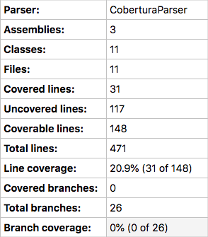
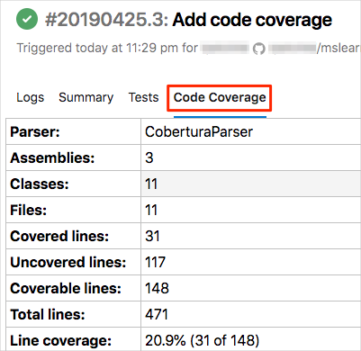

Much like unit testing, the tool you use for code coverage depends on the programming language and application framework you use.

When targeting .NET Core applications to run on Linux, [coverlet](https://github.com/tonerdo/coverlet?azure-portal=true) is a popular option. Coverlet is a cross platform code coverage library for .NET Core. Before we add code coverage to the pipeline, let's check in with the team.

Amita feels much better. She's seeing actual progress in catching bugs and in easily seeing test results. What's more, it hasn't taken long for Andy and Mara to implement the improvements. She, Andy and Mara talk a bit more about unit testing.

**Andy**: I like the idea of unit testing, but I've never found a good way to know when we're done, when we have complete coverage. Are there any good tools we can use with Azure Pipelines?

**Mara**: We can add in _code coverage_. That will tell us the percentage of our code that has unit tests. We can use a tool called Coverlet to collect coverage information when the tests run.

**Andy**: That's cool. Sounds like we can establish a baseline and improve over time.

**Mara**: That's right. Eventually we can even configure the build to fail if we don't meet a given threshold. That would help keep us honest. But for now, we can just see how much is covered.

**Andy**: Great. Getting reports on how much code is covered by unit tests will help us to identify code paths that aren't covered. We can increase the coverage gradually and that will help us from feeling overwhelmed by how much there is to do.

**Amita**: I'm really excited about the unit tests. I mostly do manual testing. I focus on the customer's perspective. I don't just look for bugs. I make sure the software does what it's specified to do, that the UI works and that the user has a good experience.

**Mara**: That perspective is so important and definitely needs a human being. Right now, Andy and I are working on automated tests &mdash; software that tests the software. We're concentrating on tests that execute as the software moves through the build pipeline.

That means the two types of tests we've already talked about. The unit tests test individual components and are really fast. Code coverage tells us how much of our code has associated unit tests.

**Andy**: We should also think about doing lint testing from the command line, before the build. Lint testing can help us catch bugs, programming errors and coding style problems really early.

**Amita**: What about regression tests?

**Mara**: I think of regression tests and unit tests as almost the same thing. Once we fix a bug, we should run the unit tests again. This ensures that our changes haven't broken any units that were already tested.

**Amita**: OK, so does that leave integration testing?

**Andy**: Integration testing is a bit different. We do integration testing after the build, on the server. While unit tests help you verify a single component like a function or method, integration testing verifies that multiple components work together. I don't think we're ready for integration tests quite yet. 

But some point we also need to think about security and compliance. We should work with the security team to figure out how we can test against their security policies.

**Mara**: Lots to do.

**Amita**: Thanks for the rundown! I'm off. Keep me posted.

**Andy**: Ready to do some code coverage?

**Mara**: Let's get started.

## How is code coverage done in .NET Core?

The way you collect code coverage depends on what programming language and frameworks you're using, as well as what code coverage tools are available.

Mara and Andy do some investigation around code coverage for .NET Core applications. Here's what they found.

* The unit test project requires the [coverlet.msbuild](https://www.nuget.org/packages/coverlet.msbuild?azure-portal=true) NuGet package.
    A reference to this package is already included in Tailspin.SpaceGame.Web.Tests.csproj.
* Visual Studio on Windows provides a way to perform code coverage.
* However, since the team is building on Linux, they can use [coverlet](https://github.com/tonerdo/coverlet?azure-portal=true), a cross-platform code coverage library for .NET Core.
* Code coverage results are written to an XML file so that they can be processed by another tool. Azure Pipelines supports [Cobertura](http://cobertura.github.io/cobertura?azure-portal=true) and [JaCoCo](https://www.eclemma.org/jacoco?azure-portal=true) coverage result formats. Mara and Andy decide to try Cobertura.
* To convert Cobertura coverage results to a format that's human-readable, they can use a tool called [ReportGenerator](https://github.com/danielpalme/ReportGenerator?azure-portal=true).
* ReportGenerator provides a number of formats, including HTML. The HTML formats create detailed reports for each class in your .NET project.
    Specifically, there's an HTML format called **HtmlInline_AzurePipelines** that provides a visual appearance that matches Azure Pipelines.

## Run code coverage locally

Before Mara and Andy write any pipeline code, they decide to try things manually to verify the process. Here, you'll follow along.

1. From Visual Studio Code, open the integrated terminal.
1. Run the following `dotnet tool install` command to install ReportGenerator.

    ```bash
    dotnet tool install --global dotnet-reportgenerator-globaltool --version 4.1.1
    ```

1. Run the following `dotnet test` command to run your unit tests and collect code coverage.

    ```bash
    dotnet test --no-build --configuration Release /p:CollectCoverage=true /p:CoverletOutputFormat=cobertura /p:CoverletOutput=./TestResults/Coverage/
    ```

    This command resembles the one you ran previously. The `/p:` flags tell coverlet which code coverage format to use and where to place the results.

1. Run the following `reportgenerator` command to convert the Cobertura file to HTML.

    ```bash
    reportgenerator -reports:./Tailspin.SpaceGame.Web.Tests/TestResults/Coverage/coverage.cobertura.xml -targetdir:./CodeCoverage -reporttypes:HtmlInline_AzurePipelines
    ```

    If `reportgenerator` isn't on your system path, you can use the full path, which is:

    * `$HOME/.dotnet/tools/reportgenerator` on Bash
    * `%USERPROFILE%\.dotnet\tools\reportgenerator` on PowerShell

    You see a number of HTML files appear in the **CodeCoverage** folder in the root of the project.
1. From Visual Studio Code, expand the **CodeCoverage** folder and right click **index.htm**. Then select **Reveal in Explorer** (**Reveal in Finder** on macOS).
1. From Windows Explorer (Finder on macOS), double click **index.htm** to open it in a web browser.

    You see a the coverage report summary.

    

1. Scroll to the bottom of the page to see a coverage breakdown by class type.

    

1. Click the link to ``TailSpin.SpaceGame.Web.LocalDocumentDBRepository`1`` to see further details.

    You see that the `GetItemsAsync` method is covered by unit tests, while the `CountItemsAsync` method has no coverage.

    

    This makes sense, as the `FetchOnlyRequestedGameRegion` test method calls the `GetItemsAsync` method but does not call the `CountItemsAsync` method. (See **DocumentDBRepository_GetItemsAsyncShould.cs** to review the test code.)

## Create a branch

Now that you're able to build a code coverage report locally, you're ready to add tasks to your build pipeline that perform the same tasks.

In this part, you create a branch named `code-coverage`, based off of the `unit-tests` branch, to hold your work. In practice, you would typically create this branch from the `master` branch.

1. From Visual Studio Code, open the integrated terminal.
1. From the terminal, run the following `git checkout` command to create a branch named `code-coverage`.

    ```bash
    git checkout -b code-coverage
    ```

## Add build tasks

Here, you'll add tasks to your build pipeline that measure code coverage.

1. From Visual Studio Code, modify **azure-pipelines.yml** like this.

    ```yml
    pool:
      vmImage: 'Ubuntu-16.04'
      demands:
        - npm

    variables:
      buildConfiguration: 'Release'
      wwwrootDir: 'Tailspin.SpaceGame.Web/wwwroot'
      dotnetSdkVersion: '2.1.505'

    steps:
    - task: DotNetCoreInstaller@0
      displayName: 'Use .NET Core SDK $(dotnetSdkVersion)'
      inputs:
        version: '$(dotnetSdkVersion)'

    - task: Npm@1
      displayName: 'Run npm install'
      inputs:
        verbose: false

    - script: './node_modules/.bin/node-sass $(wwwrootDir) --output $(wwwrootDir)'
      displayName: 'Compile Sass assets'

    - task: gulp@1
      displayName: 'Run gulp tasks'

    - script: 'echo "$(Build.DefinitionName), $(Build.BuildId), $(Build.BuildNumber)" > buildinfo.txt'
      displayName: 'Write build info'
      workingDirectory: $(wwwrootDir)

    - task: DotNetCoreCLI@2
      displayName: 'Restore project dependencies'
      inputs:
        command: 'restore'
        projects: '**/*.csproj'

    - task: DotNetCoreCLI@2
      displayName: 'Build the project - $(buildConfiguration)'
      inputs:
        command: 'build'
        arguments: '--no-restore --configuration $(buildConfiguration)'
        projects: '**/*.csproj'

    - task: DotNetCoreCLI@2
      displayName: 'Install ReportGenerator'
      inputs:
        command: custom
        custom: tool
        arguments: 'install --global dotnet-reportgenerator-globaltool'

    - task: DotNetCoreCLI@2
      displayName: 'Run unit tests - $(buildConfiguration)'
      inputs:
        command: 'test'
        arguments: '--no-build --configuration $(buildConfiguration) /p:CollectCoverage=true /p:CoverletOutputFormat=cobertura /p:CoverletOutput=$(Build.SourcesDirectory)/TestResults/Coverage/'
        publishTestResults: true
        projects: '**/*.Tests.csproj'

    - script: |
        reportgenerator -reports:$(Build.SourcesDirectory)/**/coverage.cobertura.xml -targetdir:$(Build.SourcesDirectory)/CodeCoverage -reporttypes:HtmlInline_AzurePipelines
      displayName: 'Create code coverage report'

    - task: PublishCodeCoverageResults@1
      displayName: 'Publish code coverage report'
      inputs:
        codeCoverageTool: 'cobertura'
        summaryFileLocation: '$(Build.SourcesDirectory)/**/coverage.cobertura.xml'

    - task: DotNetCoreCLI@2
      displayName: 'Publish the project - $(buildConfiguration)'
      inputs:
        command: 'publish'
        projects: '**/*.csproj'
        publishWebProjects: false
        arguments: '--no-build --configuration $(buildConfiguration) --output $(Build.ArtifactStagingDirectory)/$(buildConfiguration)'
        zipAfterPublish: true

    - task: PublishBuildArtifacts@1
      displayName: 'Publish Artifact: drop'
      condition: succeeded()
    ```

    This version builds upon your existing configuration. Here's a summary of what's new.

    | Azure Pipelines task           | Display name                           | Description                                                         |
    |--------------------------------|----------------------------------------|---------------------------------------------------------------------|
    | `DotNetCoreCLI@2`              | Install ReportGenerator                |  Installs the ReportGenerator tool                                  |
    | `DotNetCoreCLI@2`              | Run unit tests - $(buildConfiguration) | Runs unit tests and also collects code coverage in Cobertura format |
    | `script`                       | Create code coverage report            |  Converts Cobertura output to HTML                                  |
    | `PublishCodeCoverageResults@1` | Publish code coverage report           | Publishes the report to the pipeline                                |

## Push the branch to GitHub

Here you'll push your changes to GitHub and see the pipeline run. Recall that you're currently on the `code-coverage` branch.

1. From the integrated terminal, add **azure-pipelines.yml** to the index, commit the changes, and push the branch up to GitHub.

    ```bash
    git add azure-pipelines.yml
    git commit -m "Add code coverage"
    git push origin code-coverage
    ```

## Watch Azure Pipelines run the tests

Here you'll see the tests run in the pipeline and then visualize the results from Azure Test Plans.

1. From Azure DevOps, trace the build through each of the steps.
1. When the build finishes, click the **Code Coverage** tab.

    You see the same results as you did when you ran the tests locally.

    

    As an optional step, you can explore the results from Azure Pipelines.

## Add dashboard widget

In the previous part, you added the **Test Results Trend** widget to your dashboard. This lets others quickly review test result trends over time.

Here you'll add a second widget that summarizes code coverage.

1. From a new browser tab, navigate to [marketplace.visualstudio.com](https://marketplace.visualstudio.com?azure-portal=true)
1. Search for "code coverage".
1. Select **Code Coverage Widgets**.
1. Click **Get it free**.
1. Select your Azure DevOps organization from the drop-down box.
1. Click **Install**.
1. Navigate to the Azure DevOps tab.
1. Navigate to **Overview**, **Dashboards**
1. Click **Edit**
1. Search for **Code Coverage**. Then select **Code Coverage**.

    
1. Drag **Code Coverage** to the canvas.
1. Click the gear icon to configure the widget.
1. Keep all the settings at their default, except for:
    * Size: **2 x 1**
    * Build definition: (Select your pipeline)
    * Coverage measurement: **Lines**
1. Click **Save**.
1. Click **Done Editing**.

    The widget shows the percentage of code your unit tests cover.

    

You now have code coverage set up in your pipeline. Although your existing code coverage is low, you have a baseline that you can improve over time.

Later, you can configure coverlet to check whether your tests provide a minimum threshold of coverage. Your threshold might be 30%, 50%, or 80% coverage, depending on your requirements. The build will fail if less than this amount is covered by your tests.