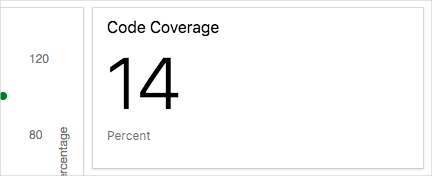

Talk track:

* Amita leaves, and Andy and Alice talk more about testing.
* Andy: I like the idea of unit testing, but how do we know when we're done? How do we know if we're covering everything?
* Alice: We don't have to cover everything right away, but we can add in _code coverage_ testing to see what percentage of our code has unit tests.
* Andy: That's cool. Sounds like we can establish a baseline and improve over time?
* Alice: That's right. Eventually we can even configure the build to fail if we don't meet a given threshold. That would help us reduce technical debt (TODO: we can explain why) and it helps keeps us honest. But for now, we just want to see how much is covered.

-----

## What is code coverage?

TODO: Lifted this from Docs. Perhaps boil this down and see what we want to include in the narrative or knowledge needed.

Code coverage helps you determine the proportion of your project's code that is actually being tested by tests such as unit tests. To increase your confidence of the code changes, and guard effectively against bugs, your tests should exercise - or cover - a large proportion of your code.

Reviewing the code coverage result helps to identify code path(s) that are not covered by the tests. This information is important to improve the test collateral over time by reducing the test debt.

## What tools are available?

Much like unit testing, the tool you use depends on the programming language and application framework you use.

When targeting .NET Core applications to run on Linux, [coverlet](https://github.com/tonerdo/coverlet?azure-portal=true) is a popular option. TODO: Perhaps say a bit more.

-----

## Create a branch

TODO: I'll provide a lead-in sentence. I also need to explain each step in greater detail.

1. From Visual Studio Code, open the integrated terminal.
1. From the terminal, run the following `git checkout` command to switch to the `master` branch.

    ```bash
    git checkout master
    ```

1. Run the following `git pull` command to bring in the latest changes from GitHub.

    ```bash
    git pull origin master
    ```

    This step is important because you merged your pull request of the `unit-tests` branch into `master`. You need to bring down the latest version of `master` that contains the merged changes.

1. Run the following `git checkout` command to create a branch named `code-coverage`.

    ```bash
    git checkout -b code-coverage
    ```

## Add build tasks

TODO: Explain the overall process first.

1. From Visual Studio Code, open **azure-pipelines.yml**.
1. Add this code to **azure-pipelines.yml** (TODO: Specify exactly where).

    ```yml
    - task: DotNetCoreCLI@2
      displayName: 'Install reportgenerator'
      inputs:
        command: custom
        custom: tool
        arguments: 'install -g dotnet-reportgenerator-globaltool'

    - script: |
        reportgenerator -reports:$(Build.SourcesDirectory)/**/coverage.cobertura.xml -targetdir:$(Build.SourcesDirectory)/CodeCoverage -reporttypes:HtmlInline_AzurePipelines
      displayName: 'Create code coverage report'
    ```

1. Add this code to **azure-pipelines.yml** (TODO: Specify exactly where).

    ```yml
    - task: PublishCodeCoverageResults@1
      displayName: 'Publish code coverage report'
      inputs:
        codeCoverageTool: 'cobertura'
        summaryFileLocation: '$(Build.SourcesDirectory)/**/coverage.cobertura.xml'
        reportDirectory: '$(Build.SourcesDirectory)/CodeCoverage'
    ```

1. In **templates/test.yml**, modify the `DotNetCoreCLI@2` task like this.

    ```yml
    parameters:
      buildConfiguration: 'Release'

    steps:
    - task: DotNetCoreCLI@2
      displayName: 'dotnet test ${{ parameters.buildConfiguration }}'
      inputs:
        command: 'test'
        arguments: '--configuration ${{ parameters.buildConfiguration }} /p:CollectCoverage=true /p:CoverletOutputFormat=cobertura'
        publishTestResults: true
        projects: '**/*.Tests.csproj'
        nobuild: true
    ```

    TODO: Explain what's different (the switches and whatnot.)

## Push the branch to GitHub

Here you'll push your changes to GitHub and see the pipeline run. Recall that you're currently on the `code-coverage` branch.

1. From the integrated terminal, add **azure-pipelines.yml** and **templates/test.yml** to the index, commit the changes, and push the branch up to GitHub.

    ```bash
    git add azure-pipelines.yml templates/test.yml
    git commit -m "Add code coverage"
    git push origin code-coverage
    ```

## Watch Azure Pipelines run the tests

Here you'll see the tests run in the pipeline and then visualize the results from Azure Test Plans.

<!-- TODO: Flesh this out a bit more. -->

1. From Azure DevOps, trace the build through each of the steps.
    **TODO**: Say something more here. Perhaps show a screenshot showing our new tasks.

1. Navigate to **Test Plans**, **Runs**.
1. Select the most recent run.
1. You see the tests continue to pass.
1. In the **Attachments** section, you see two files

    * The .trx file is ... (maybe explain this in the previous unit?)
    * The .coverage file holds the results of the code coverage run.

You can download this file and view in from Visual Studio. You can also use a free dashboard widget provided by the community.

## Add dashboard widget

TODO: Flesh this out a bit more.

TODO: Describe how you might discover this widget.
- Navigate to [marketplace.visualstudio.com](https://marketplace.visualstudio.com)
- Search for "code coverage".

1. From a new browser tab, navigate to [Code Coverage Widgets](https://marketplace.visualstudio.com/items?itemName=shanebdavis.code-coverage-dashboard-widgets&azure-portal=true).
1. Click **Get it free**.
1. Select your Azure DevOps organization from the drop-down.
1. Click **Install**.
1. Navigate to the Azure DevOps tab.
1. Navigate to **Overview**, **Dashboards**
1. Click **Edit**
1. Click **Add a widget**
1. Search for **Code Coverage**. Select **Code Coverage**.
1. Drag **Code Coverage** to the canvas.
1. Click the gear icon to configure the widget.
1. Keep all the settings at their default, except for:
    * Size: **2 x 1**
    * Build definition: (Select your pipeline)
    * Coverage measurement: **Lines**
1. Click **Save**.
1. Click **Done Editing**.

TODO: Describe what the widget does and what you can do with it.



Existing code coverage is low, but you have a baseline that you can improve over time.