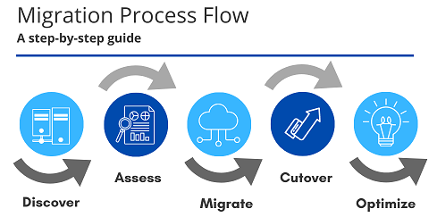

:::row:::
  :::column span="3":::
Azure SQL Managed Instance is a scalable cloud data service that provides the broadest SQL Server database engine compatibility with all the benefits of a fully managed platform as a service. Depending on your scenario, Azure SQL Managed Instance might offer more options for your database needs.
  :::column-end:::
  :::column:::
    :::image type="icon" source="../media/icon-service-managed-sql-instance.png" border="false":::
  :::column-end:::
:::row-end:::

## Features

Like Azure SQL Database, Azure SQL Managed Instance is a platform as a service (PaaS) database engine, which means that your company will be able to take advantage of the best features of moving your data to the cloud in a fully-managed environment. For example, your company will no longer need to purchase and manage expensive hardware, and you won't have to maintain the additional overhead of managing your on-premises infrastructure. On the other hand, your company will benefit from the quick provisioning and service scaling features of Azure, together with automated patching and version upgrades. In addition, you'll be able to rest assured that your data will always be there when you need it through built-in high availability features and a 99.99% uptime service level agreement (SLA). You'll also be able to protect your data with automated backups and a configurable backup retention period.

Azure SQL Database and Azure SQL Managed Instance offer many of the same features; however, Azure SQL Managed Instance provides several options that might not available to Azure SQL Database. For example, Tailwind Traders currently uses several on-premises servers running SQL Server, and they would like to migrate their existing databases to a SQL database running in the cloud. However, several of their databases use Cyrillic characters for collation. In this scenario, Tailwind Traders should migrate their databases to an Azure SQL Managed Instance, since Azure SQL Database only uses the default `SQL_Latin1_General_CP1_CI_AS` server collation.

> [!NOTE]
>
> For a detailed list of the differences between Azure SQL Database and Azure SQL Managed Instance, see [Features comparison: Azure SQL Database and Azure SQL Managed Instance](https://docs.microsoft.com/azure/azure-sql/database/features-comparison/?azure-portal=true).

## Migration

Azure SQL Managed Instance makes it easy to migrate your on-premises data on SQL Server to the cloud using the Azure Database Migration Service (DMS) or native backup and restore. After you have discovered all of the features that your company uses, you need to assess which on-premises SQL Server instances you can migrate to Azure SQL Managed Instance to see if you have any blocking issues. Once you have resolved any issues, you can migrate your data, then cutover from your on-premises SQL Server to your Azure SQL Managed Instance by changing the connection string in your applications.

> [!NOTE]
>
> For a detailed description of the migration process, see [Migration guide: SQL Server to SQL Managed Instance](https://docs.microsoft.com/azure/azure-sql/migration-guides/managed-instance/sql-server-to-managed-instance-guide)
