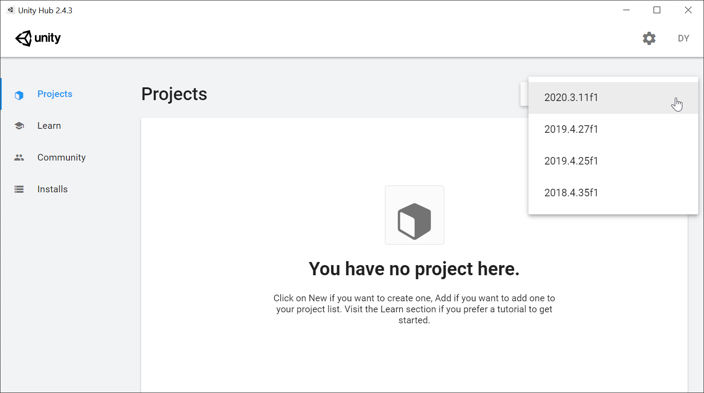

## Exercise - Configure Unity for Windows Mixed Reality

Before you can get started creating an immersive experience for Windows Mixed Reality, you must configure your Unity Project for Windows Mixed Reality development. Unity offers some behaviors specific to mixed reality that can be modified through project settings. Here you'll create a new Unity project and configure it for Windows Mixed Reality development.

## Create a new Unity project

1. Launch the **Unity Hub**, select the **Projects** tab, and click the **down arrow** next to the **New** button.

    

2. Select the Unity version specified in the module Prerequisites.

    

3. In the **Create a new project** window:

* Ensure **Templates** is set to **3D**
* Enter a suitable **Project Name**, for example, MRTK Tutorials
* Choose a suitable **Location** to store your project, for example, *D:\MixedRealityLearning*
* Click the **Create** button to create and launch your new Unity project

[!CAUTION]
> When working on Windows, there is a MAX_PATH limit of 255 characters. Unity is affected by these limits and may fail to compile if any file path is longer than 255 characters. Therefore, it is strongly recommended to store your Unity project as close to the root of the drive as possible.

Wait for Unity to create the project:

## Configure Unity Project for Windows Mixed Reality

## Switch the build platform

[!INCLUDE]
