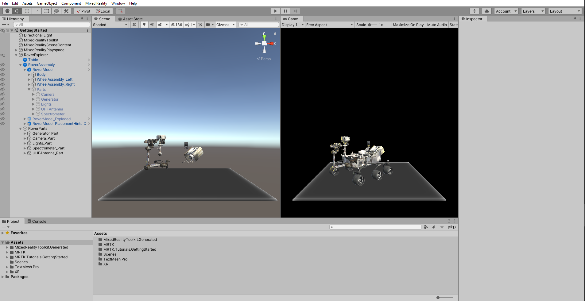
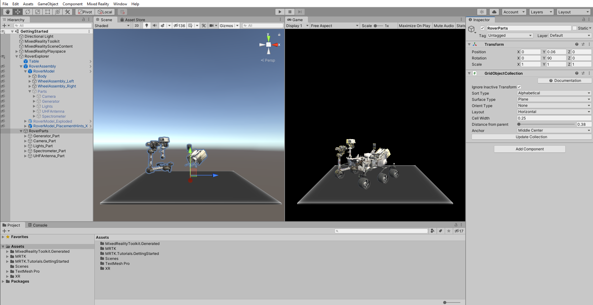

## Exercise: Organize and lay out objects with collections

The Mixed Reality Toolkit provides a set of tools and components to accelerate your Windows Mixed Reality app development. Grid Object Collection is one such component. Here you'll use Grid Object Collection to organize a set of game objects.

## Organize objects in a collection

1. In the Hierarchy window, right-click on the **RoverExplorer** object and select **Create Empty** to add an empty object as a child of the RoverExplorer, name the object **RoverParts**, and configure the **Transform** component as follows:

    * **Position**: X = 0, Y = 0.06, Z = 0
    * **Rotation**: X = 0, Y = 90, Z = 0
    * **Scale**: X = 1, Y = 1, Z = 1

    

2. In the Hierarchy window, select all the RoverExplorer > RoverAssembly > RoverModel > **Parts** child objects, right-click on them and select **Duplicate** to create a copy of each of the parts:

    

3. With the newly duplicated Parts child objects still selected, click-and-drag them on to the **RoverParts** object to make them child objects of the RoverParts object:

    

4. To make it easier to work with your scene, in the Hierarchy window, click the **eye** icon to the left of the object to toggle the **scene visibility** for the **RoverAssembly** object off. This hides the object in the Scene window without changing its in-game visibility:

    

5. In the Hierarchy window, clean up the RoverParts child objects' names by replacing the appended **(1)** with **_Part**:

    

6. In the Hierarchy window, select the **RoverParts** object, then in the Inspector window, click the **Add Component** button, and search for and select **GridObjectCollection** to add the GridObjectCollection component to the RoverParts object:

    

7. Configure the **GridObjectCollection** component values as follows:

    * **Sort Type**: Alphabetic
    * **Layout**: Horizontal
    * **Cell Width**: 0.25
    * **Distance from parent**: 0.38

    

Then click the **Update Collection** button to update the position of the RoverParts child objects.
