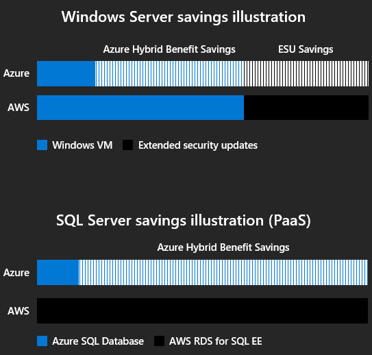
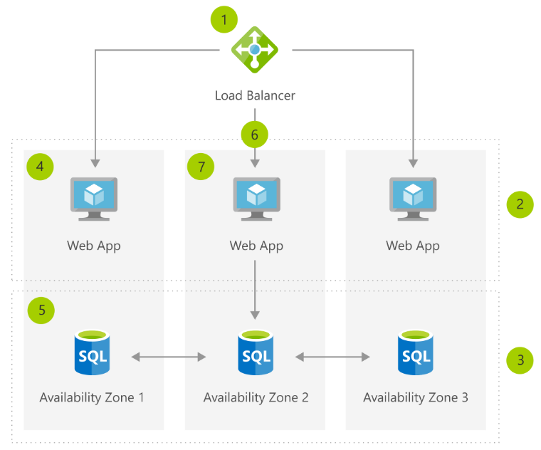
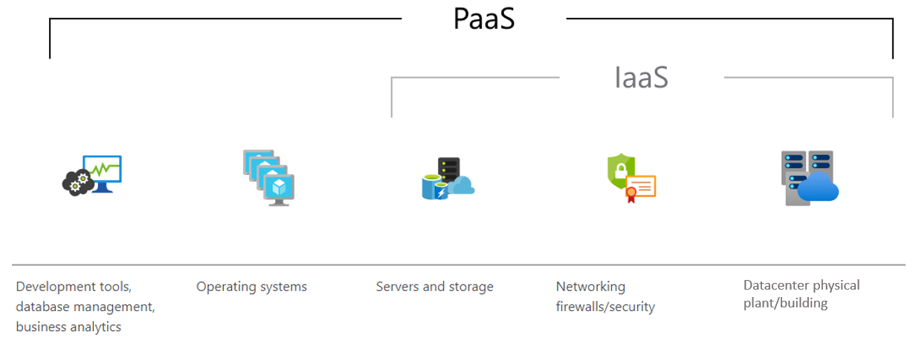

Many organizations are interested in moving to the cloud, but the benefits aren't always clear. Moving to the cloud is a fundamental shift in how systems are purchased, designed, deployed, and secured. As a solution architect for Tailwind Traders, you need to understand the cloud's benefits and align your business and technical goals to enjoy them.

The cloud delivers fundamental technology benefits that can help your enterprise execute on multiple goals:

- Optimize costs
- Build resilience and security
- Scale applications and workloads on demand
- Application innovation

## Optimize costs

Datacenters are expensive. The costs of real estate, power, servers, storage, networks, and operations staff affect a company's bottom line. When customers migrate to Azure, they convert upfront capital expenditures to operating expenditures that can be paid over time. Your cash flow is improved by only paying for what you need. You can also achieve cost savings and efficiency.

In a [Forrester study](https://azure.microsoft.com/resources/forrester-economic-impact-azure-iaas/?azure-portal=true), customers reported a 25 percent increase in productivity of IT staff, $10 million in savings from avoided hardware, software, and staff cost, and a 478 percent return on investments.

### Pay less with Azure

Azure customers with existing SQL Server or Windows Server licenses can reuse their licenses in the cloud with the Azure Hybrid Benefit for exclusive savings. You can be confident you're getting the best price because Azure costs five times less than Amazon Web Services (AWS) for Windows Server and SQL Server.

Azure Hybrid Benefit is a licensing benefit that helps you to significantly reduce the costs of running your workloads in the cloud. You can use it with your on-premises Windows Server and SQL Server licenses enabled with Software Assurance. Now this benefit applies to RedHat and SUSE Linux subscriptions, too.

## Build resilience and security

Resilience is a core tenet of Azure trusted cloud commitments, alongside compliance, security, privacy, and transparency. Microsoft is committed to providing a trusted set of cloud services so that you can confidently take advantage of the cloud's potential.

### High-availability network design

Unlike many other public cloud providers, data that traverses between Azure datacenters and regions doesn't go through the public internet. It stays in the Microsoft network. The reliability and performance of cloud services is determined in part by the network and because we have more datacenter regions than any of our competitors. The Microsoft network is also one of the largest in the world.

The Microsoft global wide-area network (WAN) plays an essential part in delivering a great cloud service experience. It offers near-perfect availability, high capacity, and the flexibility to respond to unpredictable demand spikes.

Azure traffic between Microsoft datacenters stays on the Microsoft network and doesn't flow over the internet. This includes all traffic between Microsoft services anywhere in the world. For example, within Azure, traffic between virtual machines, storage, and SQL communication traverses only the Microsoft network no matter the source and destination region. Intra-region traffic and cross-region traffic that travels from one virtual network to another stays on the Microsoft network, which gives us more control.

### Availability Zones

An [Availability Zone](https://docs.microsoft.com/azure/availability-zones/az-overview?azure-portal=true) is a high-availability offering that protects your applications and data from datacenter failures. Availability Zones are unique physical locations within an Azure region. Each zone is made up of one or more datacenters equipped with independent power, cooling, and networking.

To ensure resiliency, a minimum of three separate zones are located in all enabled regions. The physical separation of Availability Zones within a region protects applications and data from datacenter failures. Zone-redundant services replicate your applications and data across Availability Zones to protect from single points of failure. With Availability Zones, Azure offers an industry best 99.99 percent VM uptime service-level agreement (SLA). The full [Azure SLA](https://azure.microsoft.com/support/legal/sla/?azure-portal=true) explains the guaranteed availability of Azure as a whole.

### Maintenance and Service Health alerts

Azure has invested in improving zero-impact and low-impact update technologies, which includes hot patching, live migration, and in-place migration. The Azure operations teams deploy dozens of security and reliability patches to host infrastructure each year. Many patches are implemented with no customer impact or downtime.

### Machine learning-driven failure prediction

Microsoft uses predictive techniques to determine when a server might fail so that operations can migrate virtual machines away from failing servers. Machine learning and AI is used to collect and analyze data to learn the patterns that indicate whether a server might be imminently failing. We apply this capability to disk failures, memory failures, and other types of hardware failures.

### Azure Service Health alerts and status

Azure has a full-service health dashboard and fires alerts when issues happen. You can connect to the dashboard to receive information about the [status](https://status.azure.com/status/?azure-portal=true) of the Azure infrastructure and your services. You can access Azure Service Health in the Azure portal to get tailored information for your resources.

### Security

Azure provides a strong, secure foundation to strengthen your security posture across operations, technology, and partnerships. Microsoft invests $1 billion annually in cybersecurity and has more than 3,500 global security experts to monitor and secure the environment of Azure resources. The Microsoft Intelligent Security Graph uses trillions of signals from Microsoft services and systems around the globe to identify new and evolving threats.

These ongoing investments protect workloads across your hybrid environments with intelligent security services. Customers will have reduced costs and complexity with a highly secure cloud foundation managed by Microsoft. Azure also has more compliance certifications than any other cloud provider.

#### Azure Security Center

Microsoft uses many physical, infrastructure, and operational controls to help secure Azure, but there are other actions you need to take to help safeguard your workloads. Turn on Azure Security Center to strengthen your cloud security posture. Within [Azure Security Center](https://azure.microsoft.com/services/security-center/?azure-portal=true), use [Azure Defender](https://azure.microsoft.com/services/azure-defender/?azure-portal=true) to protect your hybrid cloud workloads.

#### Start with a secure foundation

Take advantage of multilayered security provided by Microsoft across physical datacenters, infrastructure, and operations in Azure. Gain from the state-of-the-art security delivered in Azure datacenters globally. Rely on a cloud that's built with customized hardware, has security controls integrated into the hardware and firmware components, and provides added protections against threats such as DDoS attacks.

#### Simplify security with built-in controls

Protect your workloads quickly with built-in controls and services in Azure across identity, data, networking, and apps. Get continuous protection with deeper insights from Azure Security Center. Extend protections to hybrid environments and easily integrate partner solutions in Azure.

#### Detect threats early with unique intelligence

Identify new threats and respond quickly with services that are informed by real-time global cybersecurity intelligence delivered at cloud scale. These actionable insights are developed by analyzing vast sources including 18 billion Bing web pages, 400 billion emails, 1 billion Windows device updates, and 450 billion monthly authentications. Using machine learning, behavioral analytics, and application-based intelligence, Microsoft data scientists analyze the flood of data in the Microsoft Intelligent Security Graph. The resulting insights inform services in Azure and help you detect threats faster.

## Scale applications and workloads on demand

Migrating to the cloud also allows for more flexibility and scalability and the ability to command growing or diminishing resources to capably meet business demands. When you plan for peak usage through on-premises systems, your servers are typically underutilized because you need more capacity than average to accommodate spikes when they occur. The cloud releases you from this model so that you can use a scale-when-you-need-it approach.

Increase agility with best-in-class Azure infrastructure that scales to your business needs. With almost limitless scale, customers can scale up or out by using [infrastructure as a service (IaaS)](https://azure.microsoft.com/overview/what-is-azure/iaas/?azure-portal=true) or [platform as a service (PaaS)](https://azure.microsoft.com/overview/what-is-paas/?azure-portal=true).

### Azure autoscale

Most Azure solutions can be manually scaled up or down. Many solutions also allow for the use of autoscale. Autoscale is a built-in feature of [Azure App Service](https://docs.microsoft.com/azure/azure-monitor/autoscale/autoscale-overview?azure-portal=true), [Azure Kubernetes Service](https://docs.microsoft.com/azure/aks/cluster-autoscaler?azure-portal=true), [Azure virtual machine scale sets](https://docs.microsoft.com/azure/virtual-machine-scale-sets/virtual-machine-scale-sets-autoscale-overview?azure-portal=true), and [Azure Cosmos DB](https://docs.microsoft.com/azure/cosmos-db/provision-throughput-autoscale?azure-portal=true).

Scaling helps applications perform their best when demand changes. Performance means different things for different applications. Some apps are CPU-bound while others are memory-bound. For example, you could have a web app that handles millions of requests during the day and none at night. Autoscale can scale your service by any of these rules or by a custom metric you define. An Azure administrator can scale other services such as the Azure SQL family of databases to increase the size or responsiveness.

### Increase performance

The benefits of migration can be immediate for performance. Azure is available in 60 regions worldwide, which is more than any other cloud provider. Azure has one of the largest global networks, with more than 130,000 miles of fiber on land and subsea. With more than 160 edge sites and pairing points and more than 200 [Azure ExpressRoute](https://azure.microsoft.com/services/expressroute?azure-portal=true) partners, Azure network speed and connectivity is unparalleled.

## Application innovation

Innovation can provide great business value by supporting current development efforts and visions for future products. The key to innovation is understanding customer needs so that you can create inventions that shape how they interact with your products. Intelligent cloud services like AI and machine learning make continuous innovation possible. They can help to advance new technical skills and expand business capabilities.
