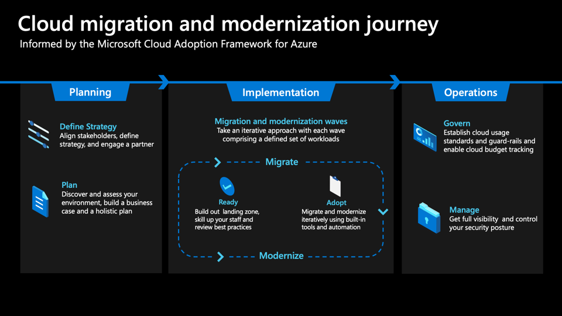
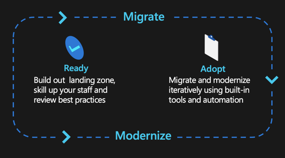
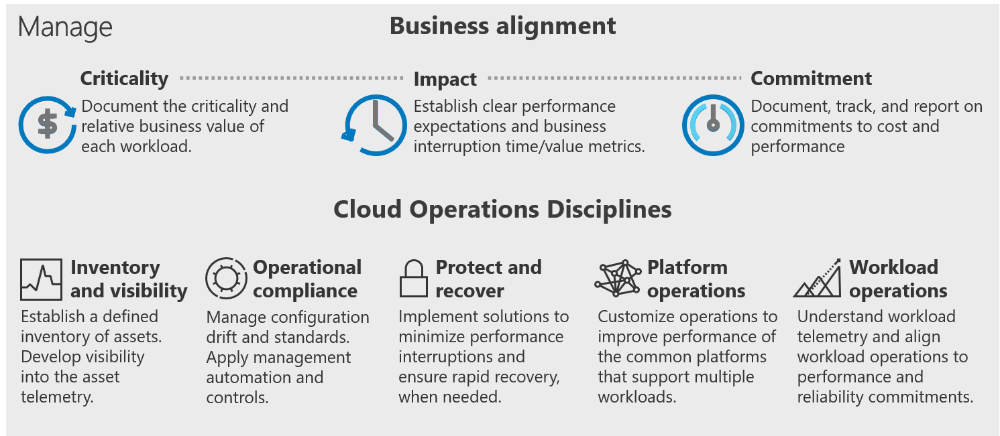
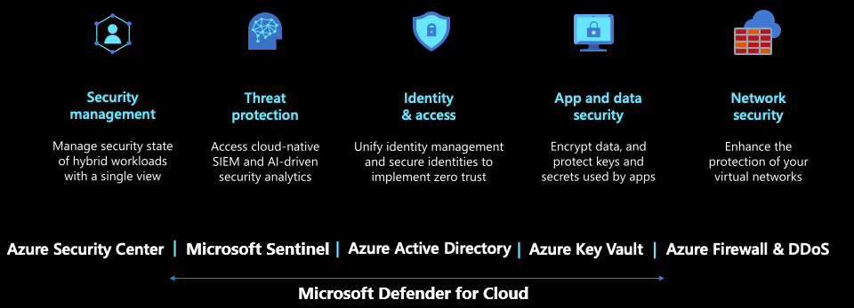
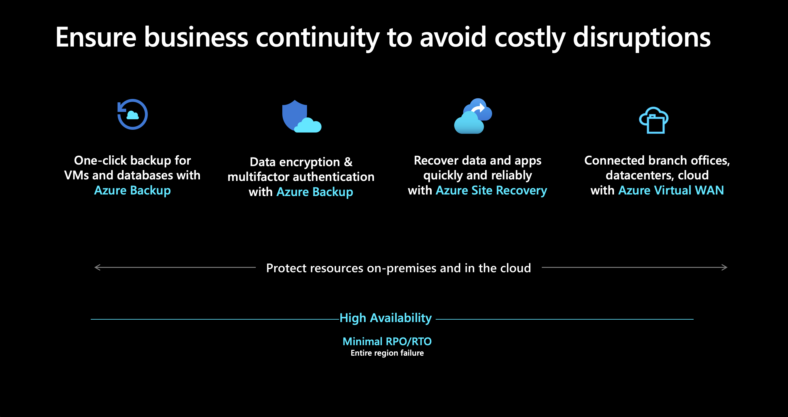

Cloud migration and modernization involves organizational change management spanning people, process, and technology. Taking a holistic approach will help you navigate the journey successfully and ensure that your organization realizes new benefits, including efficiency, agility, and scale, once your workload runs in the cloud.

The phases of your migration journey at Tailwind Traders include:

- Planning
- Implementation
- Operations

> [!IMPORTANT]
> The [Cloud Adoption Framework](/azure/cloud-adoption-framework/?azure-portal=true) is a collection of documentation, implementation guidance, best practices, and tools that are proven guidance from Microsoft designed to accelerate your cloud adoption journey.

## Planning

Planning will set the stage for a successful migration to the cloud. During planning, two activities must be completed:

- Define strategy
- Plan

### Define strategy

Defining the strategy is an important first step in any migration and modernization project. Defining the strategy can be broken down into three steps:

- Stakeholder alignment
- Define a strategy
- Engage a partner

#### Stakeholder alignment

To avoid common migration blockers, create a clear and concise business strategy for migration. Stakeholder alignment on motivations and expected business outcomes shape decisions made by the cloud adoption team. Involving key stakeholders will facilitate a smoother, faster migration that meets organizational goals by enlisting the broad support of a cross-functional team made up of IT, finance, and business owners.

- [Motivations](/azure/cloud-adoption-framework/strategy/motivations?azure-portal=true): The first step to strategic alignment is to gain agreement on the motivations that drive the migration effort. Start by understanding and categorizing motivations and common themes from various stakeholders across business and IT.
- [Business outcomes](/azure/cloud-adoption-framework/strategy/business-outcomes/?azure-portal=true): After motivations are aligned, it's possible to capture the desired business outcomes. This information provides clear metrics you can use to measure the overall transformation.

#### Define a strategy

Defining a strategy for a move the cloud is an important beginning steps in the process. With proper strategic planning done early, sets a guide for the migration and modernization of on-premises workloads to the cloud.

This is accomplished by creating a cloud strategy team. This team will be responsible for the planning of the move to Azure. They will defining motivations and business outcomes and then validates and maintains alignment between the business priorities and cloud adoption efforts.

#### Engage a partner

The migration and modernization process often requires a depp understanding of Azure in order to ensure a smooth an successful migration. Engaging a partner early in the process provides the ability to leverage their deep domain expertise both in the planning and execution of the move.

By engaging a partner in the planning process, potential pitfalls can be avoided in the migration and modernization journey as they will have the experience to drive the move forward along the correct path.

### Plan

Once a strategy is defined, it's time to start planning the move to the cloud. As with defining the strategy, planning can be broken down into three steps:

- Discover and assess
- Business Case
- Holistic plan

#### Discover and assess

Use discovery and assessment to improve technical alignment and create an action plan for executing your strategy. During this step, validate the business case using data about the current state environment. Then perform quantitative analysis and an in-depth qualitative assessment of the highest priority workloads.

You will need to discover and assess your apps, databases, and infrastructure. Build an inventory of your infrastructure, assess your on-premises environments, get right-sizing guidance, workload-level cost estimates, and performance metrics. [Azure Migrate](https://azure.microsoft.com/services/azure-migrate/?azure-portal=true) will be used to build this inventory. You can also gain insights into your dependencies, such as which web servers connect to your database servers.

#### Business Case

Making the business case for migration and modernization is likely to be an iterative conversation among stakeholders. In this first pass at building the business case, evaluate the initial high-level return from a potential cloud migration. The goal of this step is to ensure that all stakeholders align around one simple question: based on the available data, is the overall adoption of the cloud a wise business decision.

- [Building a cloud migration business case.](/azure/cloud-adoption-framework/strategy/cloud-migration-business-case?azure-portal=true) is a good starting point for developing a migration business case. Clarity on formulas and tools can aid in business justification.

At the highest level, the formula for business justification is simple. But the subtle data points required to populate the formula can be difficult to align. On a basic level, the business justification focuses on the return on investment (ROI) associated with the proposed technical change. The generic formula for ROI is:

#### Holistic plan

With this information in hand, your cloud migration CoE at Tailwind Traders can now build a holistic migration plan. Account for workload priorities, timelines, milestones, resources, and funding. Determine if each application will be **migrated** or **modernized**. Define your approach based on three considerations: migration triggers, business goals, and workload priorities. Migrate if you have time-sensitive triggers. Modernize for targeted and business-critical workloads that will see continued investment

Next, break up your overall plan into migration waves, each with a group of related workloads. Get buy-in from leadership and your new migration center of excellence.

## Implementation

Executing on the plan is where the act of moving to the cloud starts to unfold. Three main work-streams take place during the execution phase of an Azure migration:

- Building cloud skills
- Landing Zone
- Migration

### Migration and Modernization Waves

During the move to the cloud use a wave-based approach to execute a manageable set of workloads. **Migrate** and **Modernize** in waves with an iterative approach. Pick a manageable-sized cohort of workloads for each wave and perform the move using automated tools. Select the target cloud services to move your workloads into—like Azure IaaS for infrastructure or Azure App Service for web apps.

#### Building cloud skills

Existing employees can play a hands-on role in the migration and modernization effort, but additional skills might be required. In this step, find ways to develop those skills or use partners to add to those skills. Get your IT and app development teams up to speed on cloud technologies, migration tools, and operational processes. Upfront training investment helps you to scale your migration efforts more efficiently and set up your organization for success.

Ensure your teams are ready and skilled up on Azure fundamentals and workload-level considerations.  For example: If you are migrating virtual machines, your IT teams need to be well versed in Azure IaaS capabilities and how to operate them once they get here.  Same for databases and apps.

[Build a skills-readiness plan](/azure/cloud-adoption-framework/plan/adapt-roles-skills-processes?azure-portal=true). Quickly evaluate your existing skills to identify what other skills the team should develop.

#### Landing zone

To migrate your applications and create the new modernized versions, you will first need to set up a landing zone. A landing zone is an environment deployed to Azure, which is ready for hosting your workloads. Pre-configured landing zones include networking, identity, management, security, and governance elements that balance agility with organizational standards. By using landing zone best practices, you avoid governance issues during and after migration.

- [Choose a landing zone](/azure/cloud-adoption-framework/ready/landing-zone/?azure-portal=true): Find the right approach to deploying a landing zone based on your adoption pattern. Then deploy that standardized codebase.

- [Expand your landing zone](/azure/cloud-adoption-framework/ready/considerations/?azure-portal=true): Whatever your starting point, identify gaps in the deployed landing zone and add required components for resource organization, security, governance, compliance, and operations.

#### Migration & Modernization

The [Azure Migration and Modernization Program - AMMP](https://azure.microsoft.com/migration/migration-modernization-program/) at Microsoft has determined that projects with six to eight applications in a wave enjoy the most success. This approach enables teams to work in a focused manner thereby increasing the quality of migration and modernization and to make improvements along the way. This program will also help assess and plan which workloads can be modernized and planning out the process to successful accomplish it.

## Operations

[Operations management](/azure/cloud-adoption-framework/manage/?azure-portal=true) is another requirement to reach migration and modernization success. Moving individual workloads to the cloud without an understanding of ongoing enterprise operations is a risky decision. In parallel with the shift to the cloud, you should start planning for longer-term operations.

The preceding steps create actionable approaches to deliver on the Cloud Adoption Framework's Manage methodology.

### Governance

Governance is a key factor to the long-term success of any effort. Speed to complete the move and business impact is important. But speed without governance can be dangerous. Your organization needs to make decisions about governance that align to your adoption patterns and your governance and compliance needs.

- [Governance approach](/azure/cloud-adoption-framework/govern/?azure-portal=true): This methodology outlines a process for thinking about your corporate policy and processes. After determining your approach, you can build the disciplines required to enable governance across your enterprise cloud adoption efforts.

#### Azure Policy

[Azure policy](/azure/governance/policy/overview?azure-portal=true) is a important tool when implementing the policies of your business at Tailwind Traders. Azure Policy helps to enforce organizational standards and to assess compliance at-scale. Through its compliance dashboard, it provides an aggregated view to evaluate the overall state of the environment, with the ability to drill down to the per-resource, per-policy granularity. It also helps to bring your resources to compliance through bulk remediation for existing resources and automatic remediation for new resources.

### Manage

Putting the proper foundation down for moving to the cloud is critical. However, without continued management and maintenance of the environment is also important to keep things running smoothly. Migrating to the cloud and modernizing your workloads, also requires a shift when it comes to managing the cloud resources

#### Security

Once workloads have been moved into the cloud, Azure Defender can help manage security to help manage the security of these application. This protection can be provided at the network level using Azure Firewalls, the identity level in Azure Active Directory, or by sending alerts of particular actives with Azure Sentinel.

#### Business continuity

Business continuity is still important to Tailwind Traders after the migration and modernization process, both for applications that have been moved to the cloud as well as application that still exist on-premises. Insuring that Azure resources have backups in place and can be recovered when needed.

By moving their applications to Azure, Tailwind Traders is able to manage their their end-to-end business continuity solution both in the cloud and on-premises in an easy to deploy, cost-effect, secure, and scalable manner.

