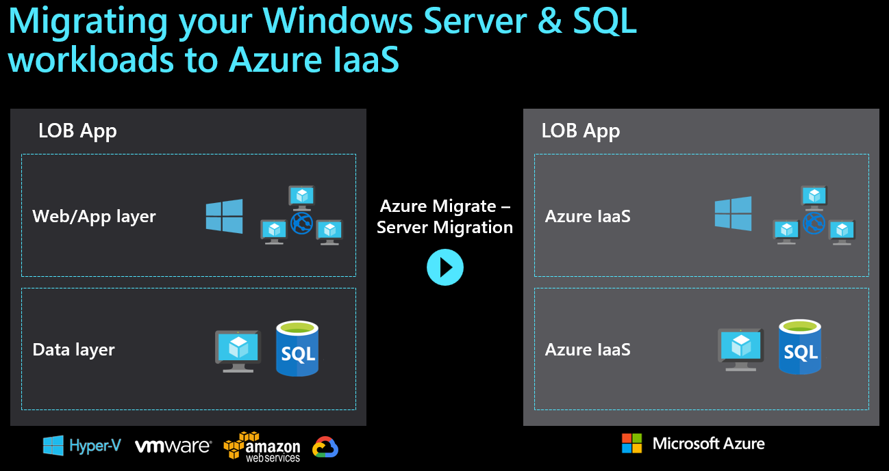
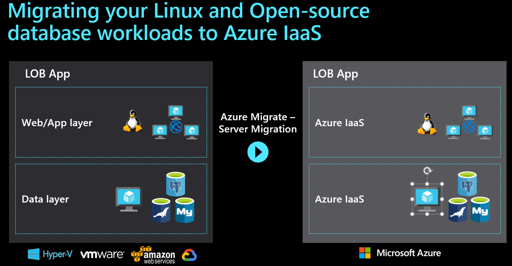
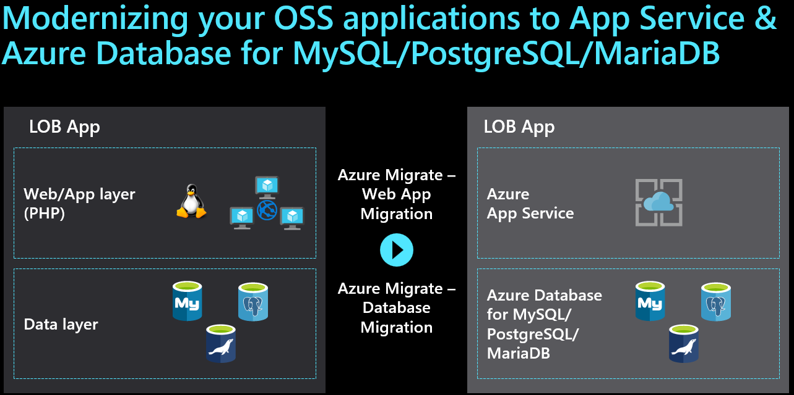
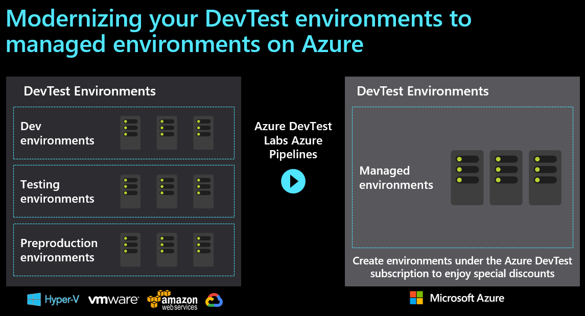

Azure provides access to a comprehensive set of cloud services. As developers and IT professionals, you can use these services to build, deploy, and manage applications on a range of tools and frameworks through a global network of datacenters. There are common migration projects that take place in most businesses.

Some of the common migration projects that Tailwind Traders will encounter include:

- Windows & SQL Server
- Linux & open-source databases
- DevTest
- VMware
- SAP
- Virtual Desktop Infrastructure (VDI)
  

> [!NOTE]
> Connect to the Cloud Adoption Framework for more information about all these migration [scenarios](https://docs.microsoft.com/azure/cloud-adoption-framework/scenarios/?azure-portal=true).

For all workloads, the decision to **migrate** or **modernize** will drive the solution that is chosen. When doing a **migration** the workload will be moved into an IaaS running on virtual machines (VM) in Azure. When using a **modernize** approach PaaS components will be used to deploy the application after changes are made to the code base or architecture.

## Windows & SQL Server

Azure is the cloud that knows SQL Server best. There are many options for the migration of these applications, including both a **migration** path or **modernization**.

### Migration

A typical application to be moved to Azure is a two-tier Windows .NET front-end application connected to SQL Server running on VMs. When migrating or **Rehost** these applications, they can be moved using [Azure Migrate](https://azure.microsoft.com/services/azure-migrate/?azure-portal=true) and will run just as they do today in the datacenter only now they are connected to a virtual network running in Azure.

**Deep dive on migration scenarios:**

- [Rehost](https://docs.microsoft.com/azure/cloud-adoption-framework/migrate/azure-best-practices/contoso-migration-rehost-vm/?azure-portal=true) an on-premises application on Azure VMs by using Azure Migrate
- Rehost an on-premises application with Azure VMs and [SQL Server Always On availability groups](https://docs.microsoft.com/azure/cloud-adoption-framework/migrate/azure-best-practices/contoso-migration-rehost-vm-sql-ag/?azure-portal=true)
- Rehost an on-premises application by migrating to Azure VMs and [Azure SQL Managed Instance](https://docs.microsoft.com/azure/cloud-adoption-framework/migrate/azure-best-practices/contoso-migration-rehost-vm-sql-managed-instance/?azure-portal=true)  

### Modernize

When modernizing an application, you will be using additional cloud provider services to optimize the cost, reliability, and performance. Your application can take advantage of PaaS products such as Azure App Service, Azure SQL Database Managed Instance, and containers. When looking to modernize, three different methods are leveraged:

- **Refactor**
- **Rearchitect**
- **Rebuild**

#### Refactor

The advantages of employing modernized services in this scenario include: lower cost and management, using your current application as-is or with some minor code or configuration changes, and connecting to new infrastructure services.

#### Rearchitect

The rearchitect strategy is also known as “redesigning” an application to modernize it—that is, to transform it with a modular architecture. Rearchitecting modifies or extends an existing application’s codebase to optimize it for a cloud platform and better scalability. Cloud provider services can be used directly as back-end services of modern apps, which are highly scalable and reliable. The advantages include: improving agility by applying innovative DevOps practices, bringing new Azure capabilities to existing apps, and cost-effectively meeting scalability requirements.

#### Rebuild

The rebuild strategy revises the existing application by aggressively adopting PaaS or even SaaS architecture. The advantages of this strategy include: building new applications using cloud-native technologies, faster development if your existing application is slowing you down, innovation opportunities that take advantage of advancements in technology like AI, blockchain, and IoT.

**Deep dive on migration scenarios:**

- Migrate an application to [Azure App Service](https://docs.microsoft.com/azure/cloud-adoption-framework/migrate/azure-best-practices/contoso-migration-refactor-web-app-sql/?azure-portal=true) and SQL Database
- Migrate [SQL Server databases](https://docs.microsoft.com/azure/cloud-adoption-framework/migrate/azure-best-practices/contoso-migration-sql-server-db-to-azure/?azure-portal=true) to Azure
- [Refactor](https://docs.microsoft.com/azure/cloud-adoption-framework/migrate/azure-best-practices/contoso-migration-refactor-web-app-sql-managed-instance/?azure-portal=true) an on-premises application to an Azure App Service web app and a SQL managed instance
- [Rebuild](https://docs.microsoft.com/azure/cloud-adoption-framework/migrate/azure-best-practices/contoso-migration-rebuild/?azure-portal=true) an on-premises application in Azure

## Linux & open-source databases

Azure has broad support for Linux and open-source databases. Tailwind Traders can quickly move on-premises Linux distributions to Azure. There is support for moving MySQL and PostgreSQL to fully managed Azure services, which help achieve minimal downtime and built-in HA, monitoring, and security. There are many options for the migration of these applications, including both a **migration** path or **modernization**.

### Migration

When migrating Linux and open-source applications to Azure, the experience is much like Windows. When you **Rehost** these applications, they can be moved using [Azure Migrate](https://azure.microsoft.com/services/azure-migrate/?azure-portal=true) and will run just as they do today in the datacenter only now they are connected to a virtual network running in Azure.

**Deep dive on migration scenarios:**

- Rehost an on-premises Linux application to [Azure VMs](https://docs.microsoft.com/azure/cloud-adoption-framework/migrate/azure-best-practices/contoso-migration-rehost-linux-vm/?azure-portal=true)
- Rehost an on-premises Linux application to [Azure VMs and Azure Database for MySQL](https://docs.microsoft.com/azure/cloud-adoption-framework/migrate/azure-best-practices/contoso-migration-rehost-linux-vm-mysql/?azure-portal=true)

### Modernize

Modernizing Linux and open-source applications will focus on the method selected based on your needs at Tailwind Traders. The key activities will be to replace VMs with PaaS services that match the needs of the workload. These could include using Azure App Services or Azure Database.

**Deep dive on migration scenarios:**

- [Refactor](https://docs.microsoft.com/azure/cloud-adoption-framework/migrate/azure-best-practices/contoso-migration-refactor-linux-app-service-mysql/?azure-portal=true) a Linux application by using Azure App Service, Traffic Manager, and Azure Database for MySQL
- [Migrate Java applications](https://docs.microsoft.com/azure/developer/java/migration/migration-overview?azure-portal=true) to Azure
- [Migrate open-source databases](https://docs.microsoft.com/azure/cloud-adoption-framework/migrate/azure-best-practices/contoso-migration-oss-db-to-azure/?azure-portal=true) to Azure
- [Migrate MySQL](https://docs.microsoft.com/azure/cloud-adoption-framework/migrate/azure-best-practices/contoso-migration-mysql-to-azure/?azure-portal=true) databases to Azure
- [Migrate PostgreSQL](https://docs.microsoft.com/azure/cloud-adoption-framework/migrate/azure-best-practices/contoso-migration-postgresql-to-azure/?azure-portal=true) databases to Azure
- [Migrate MariaDB](https://docs.microsoft.com/azure/cloud-adoption-framework/migrate/azure-best-practices/contoso-migration-mariadb-to-azure/?azure-portal=true) databases to Azure
  
## DevTest

Azure is a great choice for running DevTest workloads in the cloud. Tailwind Traders can provision fast, lean, and secure dev/test environments while saving substantially with the [Azure Dev/Test offer](https://azure.microsoft.com/offers/ms-azr-0023p/). There are a few options for the migration of DevTest VMs, including both a **migration** path or **modernization**.

### Migration

When migrating or **Rehost** your DevTest environment to Azure, they will run on VMs in the cloud. The VMs can be moved using [Azure Migrate](https://azure.microsoft.com/services/azure-migrate/?azure-portal=true) and will run just as they do today in the datacenter only now they are connected to a virtual network running in Azure.

**Deep dive on migration scenarios:**

Rehost an [on-premises dev/test environment](https://docs.microsoft.com/azure/cloud-adoption-framework/migrate/azure-best-practices/contoso-migration-devtest-to-iaas/?azure-portal=true) on Azure Virtual Machines via Azure Migrate.

### Modernize

Tailwind Traders can empower your team to quickly provision dev/test and pre-production environments to deliver quality products, applications, and services. Use purpose-built managed developer services like [Azure DevTest Labs](https://azure.microsoft.com/services/devtest-lab/?azure-portal=true).

- Migrate a dev/test environment to [Azure DevTest Labs](https://docs.microsoft.com/azure/cloud-adoption-framework/migrate/azure-best-practices/contoso-migration-devtest-to-labs/?azure-portal=true)

### Azure DevTest pricing

There are [discounted rates on Azure](https://azure.microsoft.com/pricing/dev-test?azure-portal=true) to support your ongoing development and testing:

- No Microsoft software charges on Virtual Machines
- Significant dev/test pricing discounts on a variety of other Azure services
- Access to Windows 10 Virtual Machines and Windows Virtual Desktop service

## VMware

Using [Azure VMware Solution](https://azure.microsoft.com/services/azure-vmware/?azure-portal=true) VMware workloads run natively on Azure. These workloads can be seamlessly moved from your datacenter to Azure and integrate your VMware environment with Azure. Tailwind Traders can keep managing your existing environments with the same VMware tools you already know while you modernize your applications with Azure native services.

> [!IMPORTANT]
> Azure VMware Solution is a Microsoft service, verified by VMware, that runs on Azure infrastructure.

Tailwind Traders can use Azure VMware Solution to create a private cloud in Azure with native access to VMware vCenter and other tools that are supported by VMware for workload migration. Move to Azure seamlessly using VMware’s HCX technology and continue to manage your environment using the same VMware tools you already know: vSphere Client, NSX-T, Power CLI, or any popular DevOps toolchain.

Once deployed to Azure VMware Solution, you can create vSphere VMs in the Azure portal via API calls or CLI, automate deployments, and enable single sign-on. Enhance your workloads with the full range of Azure compute, monitor, backup, database, IoT, and AI services. 

VMware VMs running on Azure VMware Solution are made accessible using [ExpressRoute](https://azure.microsoft.com/services/expressroute/?azure-portal=true), so services or users on-premises can access the VMs which have been migrated to Azure. These VMs will also have connectivity to other Azure Services such as Azure Databases, Azure Key Vault, and Azure Storage.

Learn more about [deploying Azure VMware Solutions](https://docs.microsoft.com/azure/cloud-adoption-framework/migrate/azure-best-practices/contoso-migration-vmware-to-azure/?azure-portal=true)

## SAP

Azure is SAP-certified to run your mission-critical SAP applications. Azure is the industry's most performant and scalable SAP cloud infrastructure, offering 192-gigabyte to 12-terabyte SAP HANA–certified virtual machines in more regions than any other public cloud provider.

A commissioned [Forrester Consulting TEI study](https://azure.microsoft.com/resources/sap-on-azure-forrester-tei/?azure-portal=true) showed that organizations can experience a three-year ROI of more than 100 percent after moving their legacy SAP infrastructure to Azure, with investment payback in nine months.

Learn more about running SAP on Azure:

- SAP on Azure [Implementation Guide](https://azure.microsoft.com/resources/sap-on-azure-implementation-guide/?azure-portal=true)
- eBook: [Migrating SAP applications](https://azure.microsoft.com/resources/migrating-sap-applications-to-azure/?azure-portal=true) to Azure
- SAP to Azure migration [methodology](https://azure.microsoft.com/resources/migration-methodologies-for-sap-on-azure/?azure-portal=true)

## Virtual Desktop Infrastructure (VDI)

Moving an organization's end-user desktops to the cloud is a common scenario in cloud migrations. Doing so helps improve employee productivity and accelerate the migration of various workloads to support the organization's user experience. In addition, there is a heavy focus on remote workers worldwide.

There are two options for VDI in Azure: one option is to move your current Remove Desktop Services VMs to Azure running in IaaS. Most will choose to modernize their VDI implementation where existing Citrix, VMware, or Remote Desktop Services farms are replaced with a platform as a service (PaaS) solution called [Windows Virtual Desktop](https://azure.microsoft.com/services/virtual-desktop/?azure-portal=true).

Tailwind Traders can set up Windows Virtual Desktop in minutes to enable secure remote work. Provide the familiarity and compatibility of Windows 10 with the new scalable multi-session experience for your end-users and save costs using the same Windows licenses. Along with managing the end-to-end Windows Virtual Desktop deployment alongside other Azure services within the Azure portal.

In this scenario, desktop images are either migrated to Azure, or new images are generated. Similarly, user profiles are either migrated to Azure or new profiles are created. For the most part, the client solution is enabled but largely unchanged by this migration effort.

Learn more about using [Windows Virtual Desktop](https://docs.microsoft.com/azure/cloud-adoption-framework/migrate/azure-best-practices/contoso-migration-rds-to-wvd/?azure-portal=true) in Azure to move an on-premises RDS environment to Azure.
