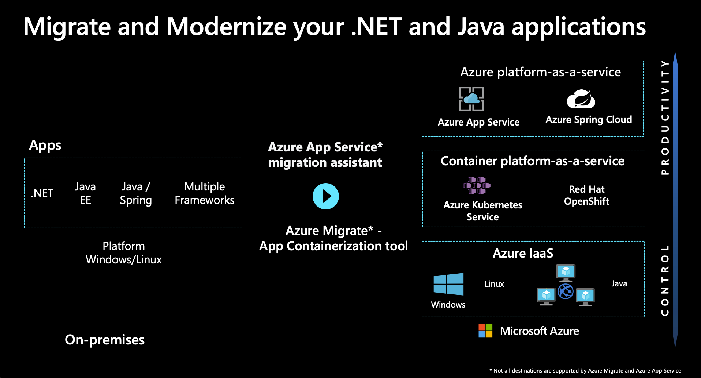
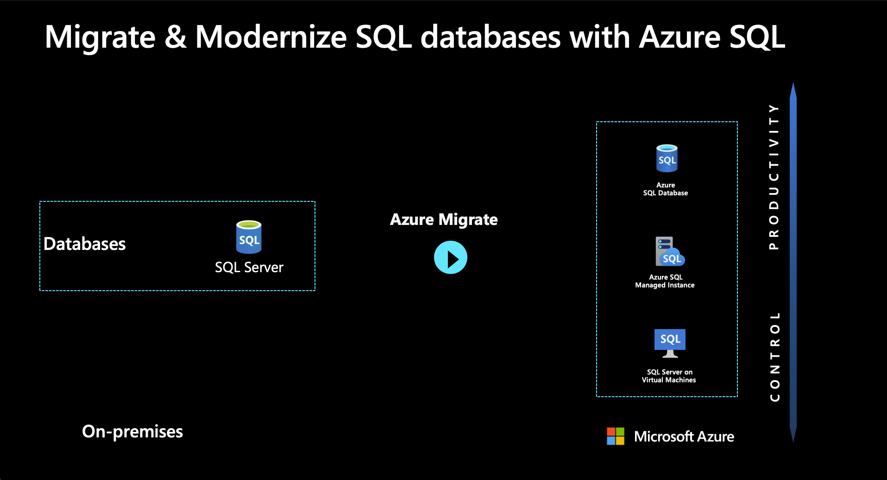
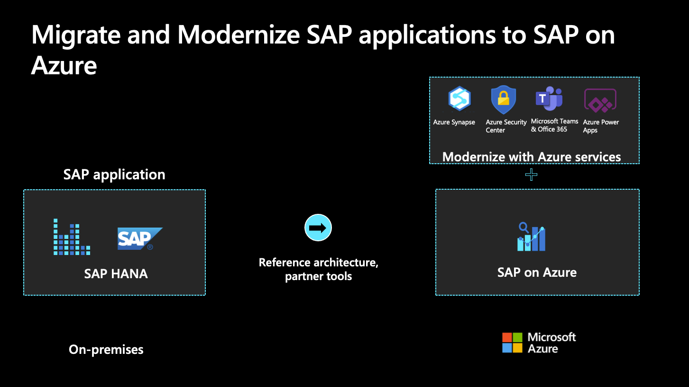
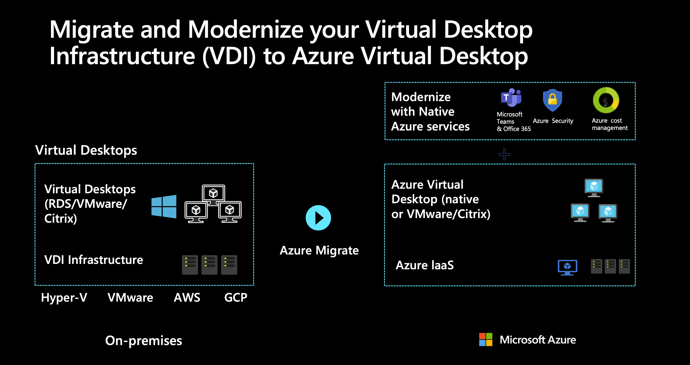
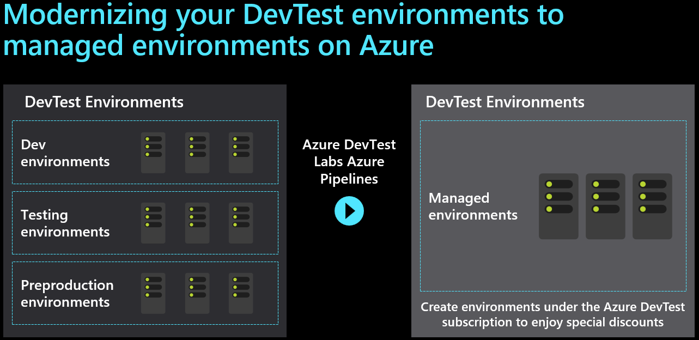

Azure provides access to a comprehensive set of cloud services. As developers and IT professionals, you can use these services to build, deploy, and manage applications on a range of tools and frameworks through a global network of datacenters. There are common migration and modernization projects that take place in most businesses.

Some of the common migration and modernization projects that Tailwind Traders will come across include:

- .NET and Java applications
- SQL Server
- Open-source databases
- Azure Infrastructure as a Service (IaaS)
- VMware
- SAP
- Virtual Desktop Infrastructure (VDI)
- DevTest

> [!NOTE]
> For more information about these migration and modernization [scenarios](https://docs.microsoft.com/azure/cloud-adoption-framework/scenarios/?azure-portal=true), connect to the Cloud Adoption Framework for Azure.

For all workloads, the decision to *migrate* or *modernize* will drive the solution that's chosen. When you do a migration, the workload will be moved into an infrastructure as a service (IaaS) platform running on virtual machines (VMs) in Azure. If you use a modernization approach, platform as a service (PaaS) components will be used to deploy the application after changes are made to the codebase or architecture.

## Migrate and modernize .NET and Java applications

Custom applications are a common workload to migrate and modernize on Azure. In the case of .NET and Java applications, modernization is the most common approach, however, sometimes a migration is still necessary.

### Migrate

when migrating a .NET or Java application it is actually more of a virtual machine migration. In this scenario your just taking the server the application is hosted on and rehosting that server as a virtual machine in Azure.

### Modernize

When you modernize an application, you'll use other cloud provider services to optimize the cost, reliability, and performance. Your application can take advantage of PaaS products like Azure App Service, Azure SQL Managed Instance, and containers.

The advantages of employing modernized services in this scenario include lower cost and management, by using your current application as is or with some minor code or configuration changes, and connecting to new infrastructure services.

One option you have when modernizing is redesigning an application to modernize it, that is, to transform it with a modular architecture. Redesigning modifies or extends an existing application's codebase to optimize it for a cloud platform and better scalability. Cloud provider services can be used directly as back-end services of modern apps, which are highly scalable and reliable. The advantages include improving agility by applying innovative DevOps practices, bringing new Azure capabilities to existing apps, and cost-effectively meeting scalability requirements.

A more aggressive approach to modernization is to build a new version of the existing application adopting PaaS or even SaaS architecture. The advantages of this strategy include: building new applications using cloud-native technologies, faster development if your existing application is slowing you down, innovation opportunities that take advantage of advancements in technology like AI, blockchain, and IoT.

**Deep dive on migration and modernization scenarios:**

- Migrate an application to [Azure App Service](/azure/cloud-adoption-framework/migrate/azure-best-practices/contoso-migration-refactor-web-app-sql/?azure-portal=true) and Azure SQL Database.
- Migrate [SQL Server databases](/azure/cloud-adoption-framework/migrate/azure-best-practices/contoso-migration-sql-server-db-to-azure/?azure-portal=true) to Azure.
- [Redesign](/azure/cloud-adoption-framework/migrate/azure-best-practices/contoso-migration-refactor-web-app-sql-managed-instance/?azure-portal=true) an on-premises application to an Azure App Service web app and an instance of SQL Managed Instance.
- [Build a new version](/azure/cloud-adoption-framework/migrate/azure-best-practices/contoso-migration-rebuild/?azure-portal=true) an on-premises application in Azure.
- Migrate an on-premises application with Azure Virtual Machines and [SQL Server Always On availability groups](/azure/cloud-adoption-framework/migrate/azure-best-practices/contoso-migration-rehost-vm-sql-ag/?azure-portal=true).

## Migrate and modernize SQL Server

Azure is the cloud that knows SQL Server best. There are many options for the migration and modernization of these applications, including both a migration path or modernization.

### SQl Server on a virtual machine

A typical reason for migrating SQL to Azure is a two-tier application is being moved, a Windows .NET front-end application connected to SQL Server running on VMs. When migrating these applications by simply moving the servers to Azure and hosting them using infrastructure as a service (IaaS), they can be moved using [Azure Migrate](https://azure.microsoft.com/services/azure-migrate/?azure-portal=true) and will run just as they do today in the data center only now they are connected to a virtual network running in Azure.

### SQL Server Managed Instance

Migrating to SQL Server Managed Instance is both a migration and a modernization in one. SQL Server managed instance is nearly identical to SQL Server on a VM in terms of the feature set available. However, it is a Platform as a Service (PaaS) offering in Azure. So, you get the benefits of a full SQL Server as well as the benefits of not having to worry about the backend infrastructure that SQL is hosted on.

### Azure SQL Server

You can also modernize your SQL Server by moving to an Azure SQL Database. Azure SQL provides you most of the database level features without the server level features. Due to this, moving to Azure SQL is a little more of a modernization.  Azure SQL Server also has elastics pools and automatic tuning. The move to Azure SQL is most common when you are also doing a modernization of your front end application to a PaaS service such as Azure App Service.

**Deep dive on migration scenarios:**

- [Migrate a server](https://docs.microsoft.com/azure/cloud-adoption-framework/migrate/azure-best-practices/contoso-migration-rehost-vm/?azure-portal=true) running an instance of SQL Server.
- Migrate SQL with Azure VMs and [SQL Server Always On availability groups](https://docs.microsoft.com/azure/cloud-adoption-framework/migrate/azure-best-practices/contoso-migration-rehost-vm-sql-ag/?azure-portal=true)
- Migrate an on-premises SQL Server by migrating to Azure VMs and [Azure SQL Managed Instance](https://docs.microsoft.com/azure/cloud-adoption-framework/migrate/azure-best-practices/contoso-migration-rehost-vm-sql-managed-instance/?azure-portal=true)  
- [Import a BACPAC File](https://docs.microsoft.com/sql/relational-databases/data-tier-applications/import-a-bacpac-file-to-create-a-new-user-database?view=sql-server-ver15) to migrate a database to Azure SQL

## Migrate and modernize open-source databases

Azure has broad support for open-source databases. There is support for moving MySQL and PostgreSQL to fully managed Azure services, which helps achieve minimal downtime and built-in high availability (HA), monitoring, and security. There are many options for the migration of these applications, including both a migration path and a modernization path.

### Migrate

When migrating Linux or Windows servers hosting an open-source database to Azure, the experience is much like migration a Windows SQL Server. When you host these databases on a virtual maine in Azure, they can be moved using [Azure Migrate](https://azure.microsoft.com/services/azure-migrate/?azure-portal=true) and will run just as they do today in the datacenter only now they are connected to a virtual network running in Azure.

### Modernize

Azure offers multiple managed database services for open-source databases. They include:
- Azure Database for PostgreSQL
- Azure Database for MySQL
- Azure Database for MariaDB

**Deep dive on migration and modernization scenarios:**

- Azure Database [Migration Guides](https://docs.microsoft.com/data-migration/?step=1)
- [Migrate MySQL to Azure Database for MySQL](https://docs.microsoft.com/en-us/azure/mysql/migrate/mysql-on-premises-azure-db/01-mysql-migration-guide-intro)
- [Migrate PostgreSQL to Azure Database for PostgreSQL](https://docs.microsoft.com/azure/postgresql/howto-migrate-using-dump-and-restore)
- [Migrate MariaDB to Azure Database for MaridDB](https://docs.microsoft.com/azure/mariadb/howto-migrate-dump-restore)
- Rehost an on-premises Linux application to [Azure VMs](https://docs.microsoft.com/azure/cloud-adoption-framework/migrate/azure-best-practices/contoso-migration-rehost-linux-vm/?azure-portal=true)
- Rehost an on-premises Linux application to [Azure VMs and Azure Database for MySQL](https://docs.microsoft.com/azure/cloud-adoption-framework/migrate/azure-best-practices/contoso-migration-rehost-linux-vm-mysql/?azure-portal=true)

## Migrate and Modernize your workloads to Azure IaaS

Azure has broad support for Linux and Windows virtual machines. Tailwind Traders can quickly move on-premises Linux distributions or version of Windows to Azure.

Modernizing Linux and open-source applications will focus on the method selected based on your needs at Tailwind Traders. The key activities will be to replace VMs with PaaS services that match the needs of the workload. These could include using Azure App Services or Azure Database.

**Deep dive on migration scenarios:**

- [Azure Migrate](https://azure.microsoft.com/services/azure-migrate/?azure-portal=true)
- [Backup Azure VMs in a Recovery Services vault](https://docs.microsoft.com/en-us/azure/backup/backup-azure-arm-vms-prepare)
- An overview of the [security options](https://docs.microsoft.com/en-us/azure/security/fundamentals/virtual-machines-overview) available for virtual machines in Azure
- Reduce the cost of virtual machines in Azure with [Azure advisor](https://docs.microsoft.com/en-us/azure/cost-management-billing/costs/tutorial-acm-opt-recommendations)

## Migrate and Modernize VMware

By using [Azure VMware Solution](https://azure.microsoft.com/services/azure-vmware/?azure-portal=true), VMware workloads run natively on Azure. These workloads can be seamlessly moved from your datacenter to Azure and integrate your VMware environment with Azure. Tailwind Traders can keep managing existing environments with the same VMware tools you already know while you modernize your applications with Azure native services.

> [!IMPORTANT]
> Azure VMware Solution is a Microsoft service, verified by VMware, that runs on Azure infrastructure.

Tailwind Traders can use Azure VMware Solution to create a private cloud in Azure with native access to VMware vCenter and other tools VMware supports for workload migration. Move to Azure seamlessly by using VMware's HCX technology and continue to manage your environment by using the same VMware tools you already know: vSphere Client, NSX-T, Power CLI, or any popular DevOps toolchain.

After you deploy Azure VMware Solution, you can create vSphere VMs in the Azure portal via API calls or CLI, automate deployments, and enable single sign-on. Enhance your workloads with the full range of Azure compute, monitor, backup, database, IoT, and AI services.

VMware VMs running on Azure VMware Solution are made accessible by using [Azure ExpressRoute](https://azure.microsoft.com/services/expressroute/?azure-portal=true), so services or users on-premises can access the VMs that were migrated to Azure. These VMs also have connectivity to Azure services like Azure database instances, Azure Key Vault, and Azure Storage.

Learn more about [deploying Azure VMware Solution](/azure/cloud-adoption-framework/migrate/azure-best-practices/contoso-migration-vmware-to-azure/?azure-portal=true).

## Migrate and modernize SAP

Azure is SAP-certified to run your mission-critical SAP applications. Azure is the industry's most effective and scalable SAP cloud infrastructure. Azure offers 192-gigabyte to 12-terabyte SAP HANA–certified virtual machines in more regions than any other public cloud provider.

A commissioned [Forrester Consulting TEI study](https://azure.microsoft.com/resources/sap-on-azure-forrester-tei/?azure-portal=true) showed that organizations can experience a three-year ROI of more than 100 percent after moving their legacy SAP infrastructure to Azure, with investment payback in nine months.

Learn more about running SAP on Azure:

- SAP on Azure [Implementation Guide](https://azure.microsoft.com/resources/sap-on-azure-implementation-guide/?azure-portal=true)
- eBook: [Migrating SAP applications](https://azure.microsoft.com/resources/migrating-sap-applications-to-azure/?azure-portal=true) to Azure
- SAP to Azure migration [methodology](https://azure.microsoft.com/resources/migration-methodologies-for-sap-on-azure/?azure-portal=true)

## Migrate and Modernize Virtual Desktop Infrastructure (VDI)

Moving an organization's end-user desktops to the cloud is a common scenario in moving to the cloud. Doing so helps improve employee productivity and accelerate the migration of various workloads to support the organization's user experience. There's also a heavy focus on remote workers worldwide.

# Migrate

The migration option for VDI is like other server migrations. That is to move your current Remove Desktop Services VMs to Azure running in IaaS. This can be done using [Azure Migrate](https://azure.microsoft.com/services/azure-migrate/?azure-portal=true) to move those virtual machines

# Modernize

To modernize VDI implementations, take existing Citrix, VMware, or Remote Desktop Services farms and replace them with a platform as a service (PaaS) solution called [Azure Virtual Desktop](https://azure.microsoft.com/services/virtual-desktop/?azure-portal=true).

Tailwind Traders can set up Azure Virtual Desktop in minutes to enable secure remote work. Provide the familiarity and compatibility of Windows 10 with the new scalable multisession experience for your users. You can also save costs by using the same Windows licenses. Manage the end-to-end Azure Virtual Desktop deployment alongside other Azure services within the Azure portal.

In this scenario, desktop images are either migrated to Azure or new images are generated. Similarly, user profiles are either migrated to Azure or new profiles are created. The client solution is enabled but largely unchanged by this migration effort.

Learn more about using [Azure Virtual Desktop](/azure/cloud-adoption-framework/migrate/azure-best-practices/contoso-migration-rds-to-wvd/?azure-portal=true) in Azure to move an on-premises Remote Desktop Services environment to Azure.

## DevTest

Azure is a great choice for running DevTest workloads in the cloud. Tailwind Traders can provision fast, lean, and secure dev/test environments while saving substantially with the [Azure Dev/Test offer](https://azure.microsoft.com/offers/ms-azr-0023p/). There are a few options for the migration of DevTest VMs, including both a **migration** path or **modernization**.

### Migration - DevTest

When migrating your DevTest environment to Azure, they will run on VMs in the cloud. The VMs can be moved using [Azure Migrate](https://azure.microsoft.com/services/azure-migrate/?azure-portal=true) and will run just as they do today in the datacenter only now they are connected to a virtual network running in Azure.

**Deep dive on migration scenarios:**

Migrate an [on-premises dev/test environment](https://docs.microsoft.com/azure/cloud-adoption-framework/migrate/azure-best-practices/contoso-migration-devtest-to-iaas/?azure-portal=true) on Azure Virtual Machines via Azure Migrate.

### Modernize - DevTest

Tailwind Traders might enable your team to quickly provision dev/test and pre-production environments to deliver quality products, applications, and services. Use purpose-built managed developer services like [Azure DevTest Labs](https://azure.microsoft.com/services/devtest-lab/?azure-portal=true).

- Migrate a dev/test environment to [Azure DevTest Labs](https://docs.microsoft.com/azure/cloud-adoption-framework/migrate/azure-best-practices/contoso-migration-devtest-to-labs/?azure-portal=true)

### Azure DevTest pricing

There are [discounted rates on Azure](https://azure.microsoft.com/pricing/dev-test?azure-portal=true) to support your ongoing development and testing:

- No Microsoft software charges on Virtual Machines
- Significant dev/test pricing discounts on a variety of other Azure services
- Access to Windows 10 Virtual Machines and Azure Virtual Desktop service