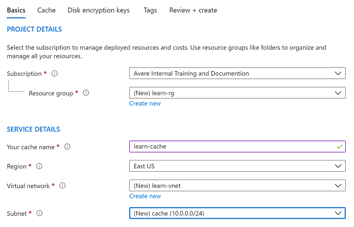
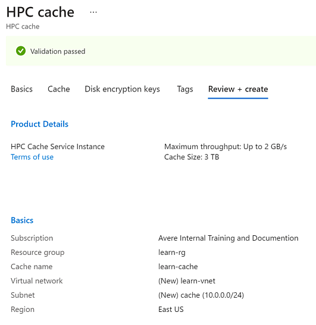

Azure HPC Cache is created in the Azure Portal. From the portal, type HPC in the search bar at the top. Click “HPC Caches” under the Services heading. Click the “New” button in the upper left or “Create hpc cache” button at the bottom to launch the HPC Cache creation wizard.

## Basics Page

On the Basics page, begin by selecting the Azure subscription where you want to run your HPC Cache. Assuming you set up a custom DNS server, select the resource group with that server.

Provide a name for your cache. There are restrictions for the characters that can be used in cache names. For example, spaces are not permitted so use a hyphen instead. A commonly-used convention is to enter company-location-cache for the name like microsoft-atlanta-cache.

- Choose an Azure region that is closest to your data. Azure HPC Cache is only available in specific regions.
- Select the virtual network where your custom DNS server is.
- Choose the dedicated subnet where your HPC cache will run.
- At the bottom of the page, click the “Next: Cache” button to move to the next page of the wizard.

## Cache Page

At the top of the Cache page, there’s a link where you can learn more about appropriately sizing your Azure HPC Cache. In summary, you want to choose a size that can store the working set of your data. For example, your storage may have 100 TB of data but your HPC workload only reads about 8 TB of data. In this case, you want to create an HPC Cache that can store at least 8 TB of data.

Begin by choosing a maximum throughput. Higher throughput values correspond to faster and more expensive resources.

The cache size is dependent on the maximum throughput. The greater the throughput, the greater the available cache sizes. In the previous example, we needed 8 TB of cache. To accommodate this workload, choose a cache size of 12 TB.

At the bottom of the page, click the “Next: Disk Encryption Keys” button to move to the next page of the wizard.

## Disk Encryption Keys

Azure HPC Cache data is encrypted with Microsoft-managed keys by default. If you would like to provide your own customer-managed keys, click the “Customer managed” radio button and provide a key vault, key, and version.

At the bottom of the page, click the “Next: Tags” button to move to the next page of the wizard.

## Tags

Tags help you label and manage your Azure resources. If you’re using tags to track department resource costs for example, you could add your custom tags here.

At the bottom of the page, click the “Next: Review + Create” button to move to the last page of the wizard.

## Review + Create

On this page, an automated validation check is performed. This check verifies that the information provided on the previous pages will create a valid cache. If the validation check fails, red circles will appear above the pages that need attention. If the validation check passes, the Create button becomes available.

Before creating your cache, review the information on this page. Confirm that the information has been entered correctly and understand the costs associated with using the cache. If changes need to be made, click on the page tabs at the top to return to those pages. Update the fields and return to the Review + Create page.

The create process takes over 20 minutes. When you’re ready to begin creating the cache and its corresponding resources, click the Create button.
